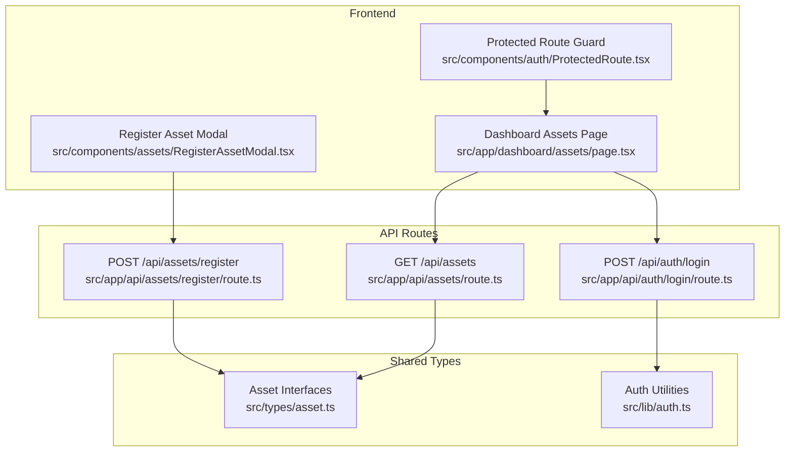
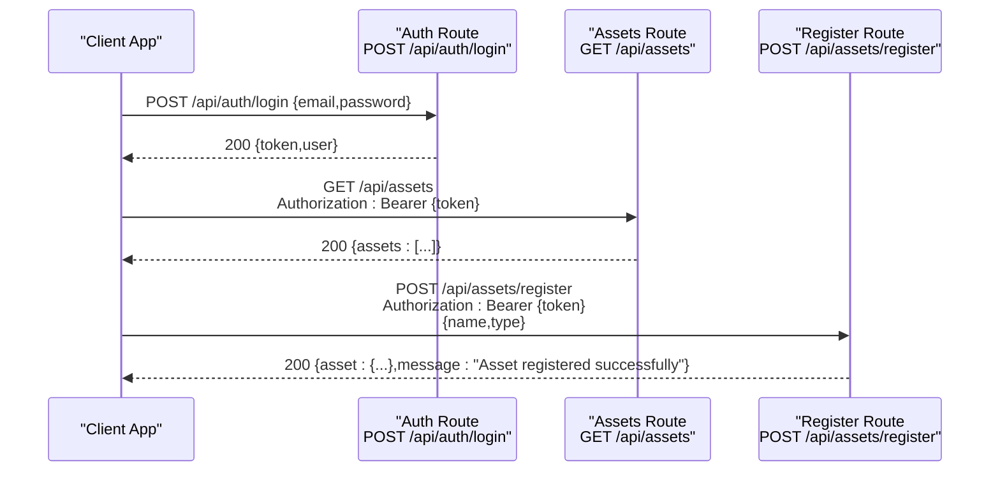
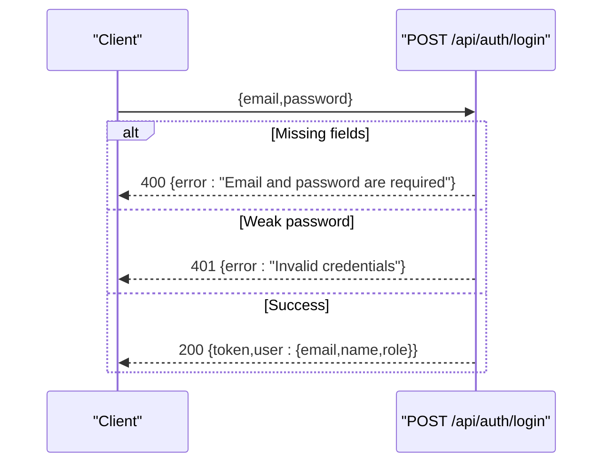
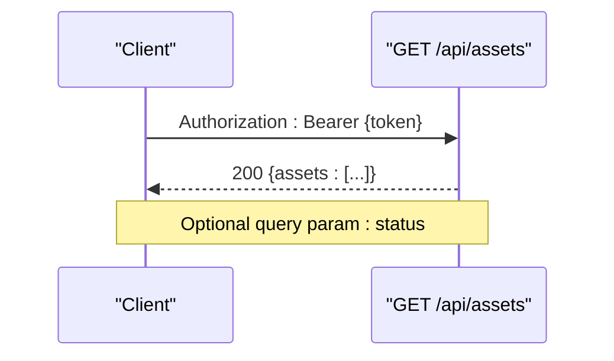
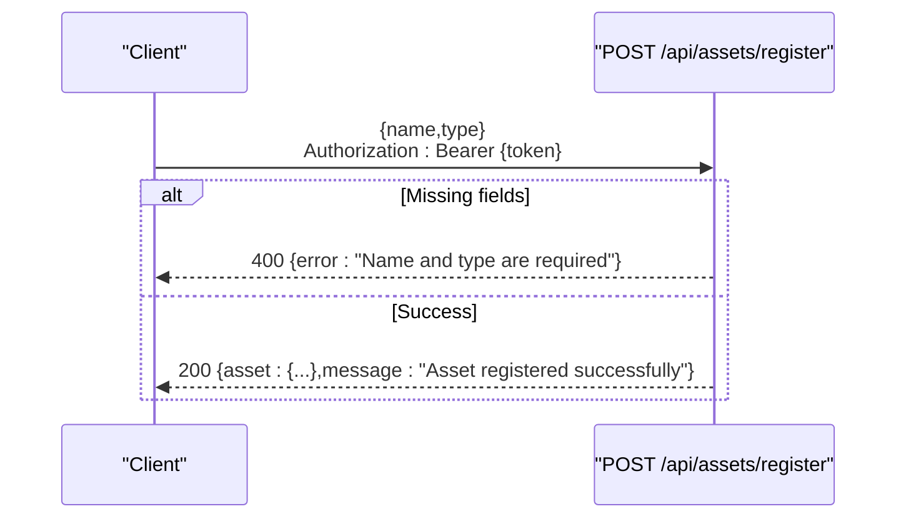
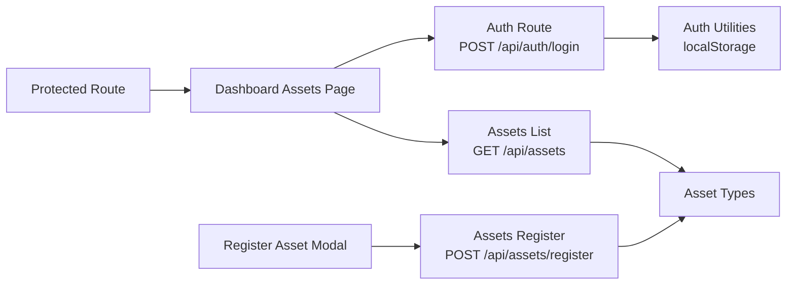

# API Reference

<cite>
**Referenced Files in This Document**
- [src/app/api/auth/login/route.ts](file://src/app/api/auth/login/route.ts)
- [src/app/api/assets/route.ts](file://src/app/api/assets/route.ts)
- [src/app/api/assets/register/route.ts](file://src/app/api/assets/register/route.ts)
- [src/lib/auth.ts](file://src/lib/auth.ts)
- [src/types/asset.ts](file://src/types/asset.ts)
- [src/app/dashboard/assets/page.tsx](file://src/app/dashboard/assets/page.tsx)
- [src/components/assets/RegisterAssetModal.tsx](file://src/components/assets/RegisterAssetModal.tsx)
- [src/components/auth/ProtectedRoute.tsx](file://src/components/auth/ProtectedRoute.tsx)
- [package.json](file://package.json)
- [tsconfig.json](file://tsconfig.json)
</cite>

## Table of Contents
1. [Introduction](#introduction)
2. [Project Structure](#project-structure)
3. [Core Components](#core-components)
4. [Architecture Overview](#architecture-overview)
5. [Detailed Component Analysis](#detailed-component-analysis)
6. [Dependency Analysis](#dependency-analysis)
7. [Performance Considerations](#performance-considerations)
8. [Troubleshooting Guide](#troubleshooting-guide)
9. [Conclusion](#conclusion)
10. [Appendices](#appendices)

## Introduction
This document provides a comprehensive API reference for ArmorTrack, focusing on authentication and asset management endpoints. It covers request/response schemas, authentication headers, error handling, and practical integration patterns. The API is implemented using Next.js App Router routes and TypeScript interfaces for strong typing.

## Project Structure
The API surface is organized under Next.js App Router conventions:
- Authentication: POST /api/auth/login
- Asset listing: GET /api/assets
- Asset registration: POST /api/assets/register

**Diagram sources**
- [src/app/api/auth/login/route.ts:1-49](file://src/app/api/auth/login/route.ts#L1-L49)
- [src/app/api/assets/route.ts:1-67](file://src/app/api/assets/route.ts#L1-L67)
- [src/app/api/assets/register/route.ts:1-37](file://src/app/api/assets/register/route.ts#L1-L37)
- [src/app/dashboard/assets/page.tsx:1-145](file://src/app/dashboard/assets/page.tsx#L1-L145)
- [src/components/assets/RegisterAssetModal.tsx:1-123](file://src/components/assets/RegisterAssetModal.tsx#L1-L123)
- [src/components/auth/ProtectedRoute.tsx:1-32](file://src/components/auth/ProtectedRoute.tsx#L1-L32)
- [src/types/asset.ts:1-14](file://src/types/asset.ts#L1-L14)
- [src/lib/auth.ts:1-37](file://src/lib/auth.ts#L1-L37)

**Section sources**
- [src/app/api/auth/login/route.ts:1-49](file://src/app/api/auth/login/route.ts#L1-L49)
- [src/app/api/assets/route.ts:1-67](file://src/app/api/assets/route.ts#L1-L67)
- [src/app/api/assets/register/route.ts:1-37](file://src/app/api/assets/register/route.ts#L1-L37)
- [src/app/dashboard/assets/page.tsx:1-145](file://src/app/dashboard/assets/page.tsx#L1-L145)
- [src/components/assets/RegisterAssetModal.tsx:1-123](file://src/components/assets/RegisterAssetModal.tsx#L1-L123)
- [src/components/auth/ProtectedRoute.tsx:1-32](file://src/components/auth/ProtectedRoute.tsx#L1-L32)
- [src/types/asset.ts:1-14](file://src/types/asset.ts#L1-L14)
- [src/lib/auth.ts:1-37](file://src/lib/auth.ts#L1-L37)

## Core Components
- Authentication API: Handles user login and returns a mock token with user metadata.
- Asset Management API: Provides asset listing with filtering and asset registration with validation.
- Shared Types: Strongly typed Asset and RegisterAssetInput interfaces.
- Frontend Integration: Dashboard page and modal demonstrate client-side usage with Authorization headers.

Key implementation references:
- Authentication route: [src/app/api/auth/login/route.ts:1-49](file://src/app/api/auth/login/route.ts#L1-L49)
- Asset listing route: [src/app/api/assets/route.ts:1-67](file://src/app/api/assets/route.ts#L1-L67)
- Asset registration route: [src/app/api/assets/register/route.ts:1-37](file://src/app/api/assets/register/route.ts#L1-L37)
- Asset types: [src/types/asset.ts:1-14](file://src/types/asset.ts#L1-L14)
- Auth utilities: [src/lib/auth.ts:1-37](file://src/lib/auth.ts#L1-L37)
- Dashboard integration: [src/app/dashboard/assets/page.tsx:1-145](file://src/app/dashboard/assets/page.tsx#L1-L145)
- Registration modal: [src/components/assets/RegisterAssetModal.tsx:1-123](file://src/components/assets/RegisterAssetModal.tsx#L1-L123)

**Section sources**
- [src/app/api/auth/login/route.ts:1-49](file://src/app/api/auth/login/route.ts#L1-L49)
- [src/app/api/assets/route.ts:1-67](file://src/app/api/assets/route.ts#L1-L67)
- [src/app/api/assets/register/route.ts:1-37](file://src/app/api/assets/register/route.ts#L1-L37)
- [src/types/asset.ts:1-14](file://src/types/asset.ts#L1-L14)
- [src/lib/auth.ts:1-37](file://src/lib/auth.ts#L1-L37)
- [src/app/dashboard/assets/page.tsx:1-145](file://src/app/dashboard/assets/page.tsx#L1-L145)
- [src/components/assets/RegisterAssetModal.tsx:1-123](file://src/components/assets/RegisterAssetModal.tsx#L1-L123)

## Architecture Overview
The API follows a straightforward request-response model with Next.js fetch handlers. Authentication uses a bearer token stored in local storage. Asset operations are protected by a client-side guard that redirects unauthenticated users to the login page.

**Diagram sources**
- [src/app/api/auth/login/route.ts:1-49](file://src/app/api/auth/login/route.ts#L1-L49)
- [src/app/api/assets/route.ts:1-67](file://src/app/api/assets/route.ts#L1-L67)
- [src/app/api/assets/register/route.ts:1-37](file://src/app/api/assets/register/route.ts#L1-L37)
- [src/app/dashboard/assets/page.tsx:15-34](file://src/app/dashboard/assets/page.tsx#L15-L34)
- [src/components/assets/RegisterAssetModal.tsx:16-51](file://src/components/assets/RegisterAssetModal.tsx#L16-L51)

## Detailed Component Analysis

### Authentication API
- Endpoint: POST /api/auth/login
- Purpose: Authenticate users and return a mock token along with user metadata.
- Request Schema (TypeScript):
  - email: string
  - password: string
- Response Schema (TypeScript):
  - token: string
  - user: { email: string, name: string, role: string }
- Authentication Requirements: None (login endpoint)
- Authorization Levels: Role determined by email pattern (ADMIN, AUDITOR, WAREHOUSE, TRANSPORTER, MANUFACTURER)
- Headers:
  - Content-Type: application/json
- Success Response: 200 OK
- Error Responses:
  - 400 Bad Request: Missing email or password
  - 401 Unauthorized: Invalid credentials (password length < 6)
  - 500 Internal Server Error: Unexpected errors

**Diagram sources**
- [src/app/api/auth/login/route.ts:3-47](file://src/app/api/auth/login/route.ts#L3-L47)

**Section sources**
- [src/app/api/auth/login/route.ts:1-49](file://src/app/api/auth/login/route.ts#L1-L49)
- [src/lib/auth.ts:1-37](file://src/lib/auth.ts#L1-L37)

### Asset Listing API
- Endpoint: GET /api/assets
- Purpose: Retrieve a paginated list of assets with optional filtering.
- Query Parameters:
  - status: string (optional) - Filters assets by status
- Response Schema (TypeScript):
  - assets: Asset[]
- Asset Interface (TypeScript):
  - id: string
  - name: string
  - type: string
  - status: "WAREHOUSE" | "IN_TRANSIT" | "DEPLOYED" | "MAINTENANCE_DUE"
  - currentCustodian: string
  - lastUpdated: string (ISO date)
- Authentication Requirements: Requires Authorization header
- Authorization Levels: Any authenticated user
- Headers:
  - Authorization: Bearer {token}
- Success Response: 200 OK
- Error Responses:
  - 500 Internal Server Error: Server-side failure

**Diagram sources**
- [src/app/api/assets/route.ts:48-66](file://src/app/api/assets/route.ts#L48-L66)
- [src/app/dashboard/assets/page.tsx:15-30](file://src/app/dashboard/assets/page.tsx#L15-L30)

**Section sources**
- [src/app/api/assets/route.ts:1-67](file://src/app/api/assets/route.ts#L1-L67)
- [src/types/asset.ts:1-14](file://src/types/asset.ts#L1-L14)
- [src/app/dashboard/assets/page.tsx:1-145](file://src/app/dashboard/assets/page.tsx#L1-L145)

### Asset Registration API
- Endpoint: POST /api/assets/register
- Purpose: Create a new asset with validation.
- Request Schema (TypeScript):
  - name: string
  - type: string
- Response Schema (TypeScript):
  - asset: Asset
  - message: string
- Asset Interface (TypeScript):
  - id: string
  - name: string
  - type: string
  - status: "WAREHOUSE" | "IN_TRANSIT" | "DEPLOYED" | "MAINTENANCE_DUE"
  - currentCustodian: string
  - lastUpdated: string (ISO date)
- Authentication Requirements: Requires Authorization header
- Authorization Levels: Any authenticated user
- Headers:
  - Content-Type: application/json
  - Authorization: Bearer {token}
- Success Response: 200 OK
- Error Responses:
  - 400 Bad Request: Missing name or type
  - 500 Internal Server Error: Server-side failure

**Diagram sources**
- [src/app/api/assets/register/route.ts:4-36](file://src/app/api/assets/register/route.ts#L4-L36)
- [src/components/assets/RegisterAssetModal.tsx:16-51](file://src/components/assets/RegisterAssetModal.tsx#L16-L51)

**Section sources**
- [src/app/api/assets/register/route.ts:1-37](file://src/app/api/assets/register/route.ts#L1-L37)
- [src/types/asset.ts:1-14](file://src/types/asset.ts#L1-L14)
- [src/components/assets/RegisterAssetModal.tsx:1-123](file://src/components/assets/RegisterAssetModal.tsx#L1-L123)

### Client-Side Integration Patterns
- Authentication Storage: Token and role persisted in localStorage via [src/lib/auth.ts:7-32](file://src/lib/auth.ts#L7-L32).
- Protected Routes: Unauthenticated users are redirected to /login using [src/components/auth/ProtectedRoute.tsx:7-17](file://src/components/auth/ProtectedRoute.tsx#L7-L17).
- Dashboard Usage:
  - Fetch assets with Authorization header: [src/app/dashboard/assets/page.tsx:15-30](file://src/app/dashboard/assets/page.tsx#L15-L30)
  - Search/filter locally by ID/name: [src/app/dashboard/assets/page.tsx:36-41](file://src/app/dashboard/assets/page.tsx#L36-L41)
- Registration Modal:
  - Sends POST with Authorization and JSON payload: [src/components/assets/RegisterAssetModal.tsx:20-31](file://src/components/assets/RegisterAssetModal.tsx#L20-L31)

**Section sources**
- [src/lib/auth.ts:1-37](file://src/lib/auth.ts#L1-L37)
- [src/components/auth/ProtectedRoute.tsx:1-32](file://src/components/auth/ProtectedRoute.tsx#L1-L32)
- [src/app/dashboard/assets/page.tsx:1-145](file://src/app/dashboard/assets/page.tsx#L1-L145)
- [src/components/assets/RegisterAssetModal.tsx:1-123](file://src/components/assets/RegisterAssetModal.tsx#L1-L123)

## Dependency Analysis
- API routes depend on shared TypeScript interfaces for type safety.
- Frontend components depend on auth utilities for token and role management.
- Next.js path aliases enable clean imports from @/ paths.

**Diagram sources**
- [src/app/api/auth/login/route.ts:1-49](file://src/app/api/auth/login/route.ts#L1-L49)
- [src/app/api/assets/route.ts:1-67](file://src/app/api/assets/route.ts#L1-L67)
- [src/app/api/assets/register/route.ts:1-37](file://src/app/api/assets/register/route.ts#L1-L37)
- [src/lib/auth.ts:1-37](file://src/lib/auth.ts#L1-L37)
- [src/types/asset.ts:1-14](file://src/types/asset.ts#L1-L14)
- [src/app/dashboard/assets/page.tsx:1-145](file://src/app/dashboard/assets/page.tsx#L1-L145)
- [src/components/assets/RegisterAssetModal.tsx:1-123](file://src/components/assets/RegisterAssetModal.tsx#L1-L123)
- [src/components/auth/ProtectedRoute.tsx:1-32](file://src/components/auth/ProtectedRoute.tsx#L1-L32)

**Section sources**
- [src/types/asset.ts:1-14](file://src/types/asset.ts#L1-L14)
- [src/lib/auth.ts:1-37](file://src/lib/auth.ts#L1-L37)
- [tsconfig.json:21-23](file://tsconfig.json#L21-L23)

## Performance Considerations
- Client-side filtering: The dashboard filters assets locally by ID and name to reduce API calls. See [src/app/dashboard/assets/page.tsx:36-41](file://src/app/dashboard/assets/page.tsx#L36-L41).
- Minimal network requests: Assets are fetched once on mount and refreshed after registration. See [src/app/dashboard/assets/page.tsx:32-34](file://src/app/dashboard/assets/page.tsx#L32-L34) and [src/components/assets/RegisterAssetModal.tsx:45-46](file://src/components/assets/RegisterAssetModal.tsx#L45-L46).
- Local storage caching: Tokens and roles are cached in localStorage to avoid repeated authentication prompts. See [src/lib/auth.ts:7-32](file://src/lib/auth.ts#L7-L32).

[No sources needed since this section provides general guidance]

## Troubleshooting Guide
- Authentication failures:
  - Ensure Authorization header is present for protected endpoints. See [src/app/dashboard/assets/page.tsx:18-22](file://src/app/dashboard/assets/page.tsx#L18-L22) and [src/components/assets/RegisterAssetModal.tsx:22-27](file://src/components/assets/RegisterAssetModal.tsx#L22-L27).
  - Verify token storage and retrieval. See [src/lib/auth.ts:7-22](file://src/lib/auth.ts#L7-L22).
- Asset listing issues:
  - Confirm query parameter usage for filtering. See [src/app/api/assets/route.ts:50-57](file://src/app/api/assets/route.ts#L50-L57).
  - Check for server-side errors returning 500. See [src/app/api/assets/route.ts:60-65](file://src/app/api/assets/route.ts#L60-L65).
- Registration errors:
  - Validate required fields (name, type). See [src/app/api/assets/register/route.ts:9-14](file://src/app/api/assets/register/route.ts#L9-L14).
  - Inspect error messages for missing fields or server failures. See [src/app/api/assets/register/route.ts:30-35](file://src/app/api/assets/register/route.ts#L30-L35) and [src/components/assets/RegisterAssetModal.tsx:33-35](file://src/components/assets/RegisterAssetModal.tsx#L33-L35).

**Section sources**
- [src/app/dashboard/assets/page.tsx:15-30](file://src/app/dashboard/assets/page.tsx#L15-L30)
- [src/components/assets/RegisterAssetModal.tsx:16-51](file://src/components/assets/RegisterAssetModal.tsx#L16-L51)
- [src/app/api/assets/route.ts:48-66](file://src/app/api/assets/route.ts#L48-L66)
- [src/app/api/assets/register/route.ts:4-36](file://src/app/api/assets/register/route.ts#L4-L36)
- [src/lib/auth.ts:7-32](file://src/lib/auth.ts#L7-L32)

## Conclusion
ArmorTrack’s API provides a focused set of endpoints for authentication and asset management, with clear request/response schemas and robust client-side integration patterns. The use of TypeScript interfaces ensures type safety, while localStorage-based auth utilities streamline client-side token management. Future enhancements could include rate limiting, pagination, and stricter validation rules.

[No sources needed since this section summarizes without analyzing specific files]

## Appendices

### API Versioning Strategy
- Current state: No explicit versioning scheme is implemented in the repository.
- Recommendation: Adopt a path-based versioning strategy (e.g., /api/v1/auth/login) to support future breaking changes and backward compatibility.

[No sources needed since this section provides general guidance]

### Backward Compatibility and Deprecation Policies
- Current state: No deprecation notices or compatibility guarantees are present.
- Recommendation: Introduce a deprecation policy with warning headers and migration timelines for future endpoint changes.

[No sources needed since this section provides general guidance]

### Testing Approaches
- Unit testing: Validate route handlers with mock requests and assertions on status codes and response bodies.
- Integration testing: Simulate client flows using Authorization headers and verify successful CRUD operations.
- End-to-end testing: Automate login, asset listing, and registration flows to ensure end-to-end reliability.

[No sources needed since this section provides general guidance]

### Rate Limiting Considerations
- Current state: No rate limiting is implemented.
- Recommendation: Implement rate limiting at the route level or via middleware to prevent abuse and ensure fair usage.

[No sources needed since this section provides general guidance]

### Practical Integration Examples
- Login flow:
  - Send POST /api/auth/login with { email, password }.
  - Store token and role from response.
  - Use token in subsequent requests with Authorization: Bearer {token}.
- Asset listing:
  - GET /api/assets with Authorization header.
  - Optionally filter by status query parameter.
- Asset registration:
  - POST /api/assets/register with { name, type } and Authorization header.

References:
- Authentication route: [src/app/api/auth/login/route.ts:3-47](file://src/app/api/auth/login/route.ts#L3-L47)
- Asset listing route: [src/app/api/assets/route.ts:48-66](file://src/app/api/assets/route.ts#L48-L66)
- Asset registration route: [src/app/api/assets/register/route.ts:4-36](file://src/app/api/assets/register/route.ts#L4-L36)
- Dashboard usage: [src/app/dashboard/assets/page.tsx:15-30](file://src/app/dashboard/assets/page.tsx#L15-L30)
- Registration modal usage: [src/components/assets/RegisterAssetModal.tsx:16-51](file://src/components/assets/RegisterAssetModal.tsx#L16-L51)

**Section sources**
- [src/app/api/auth/login/route.ts:1-49](file://src/app/api/auth/login/route.ts#L1-L49)
- [src/app/api/assets/route.ts:1-67](file://src/app/api/assets/route.ts#L1-L67)
- [src/app/api/assets/register/route.ts:1-37](file://src/app/api/assets/register/route.ts#L1-L37)
- [src/app/dashboard/assets/page.tsx:1-145](file://src/app/dashboard/assets/page.tsx#L1-L145)
- [src/components/assets/RegisterAssetModal.tsx:1-123](file://src/components/assets/RegisterAssetModal.tsx#L1-L123)