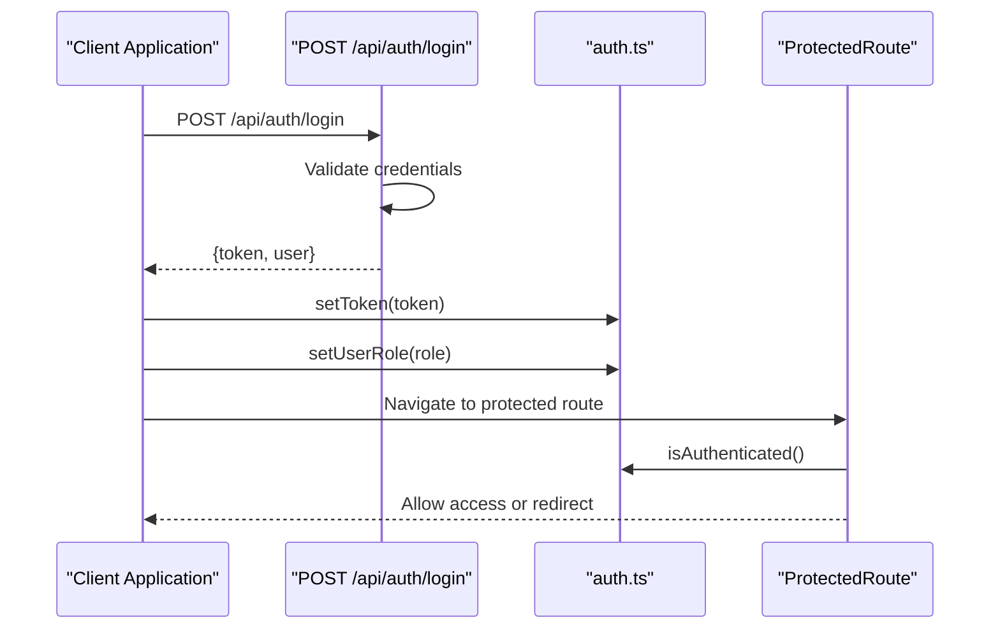
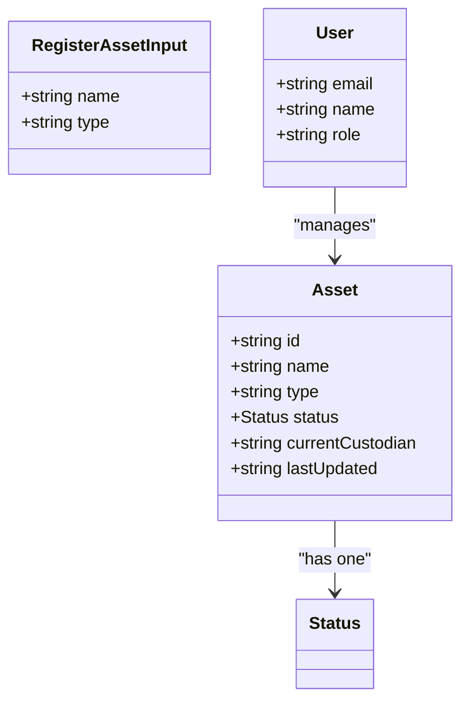
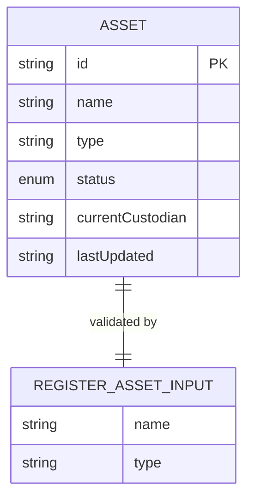
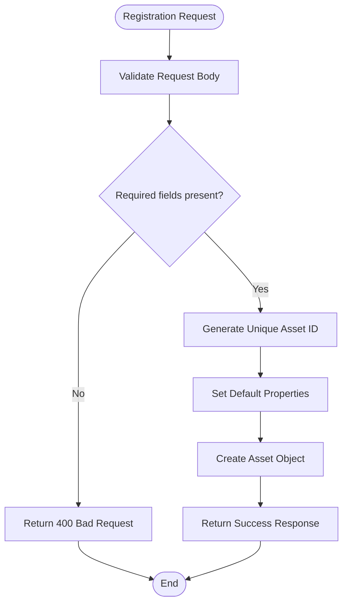
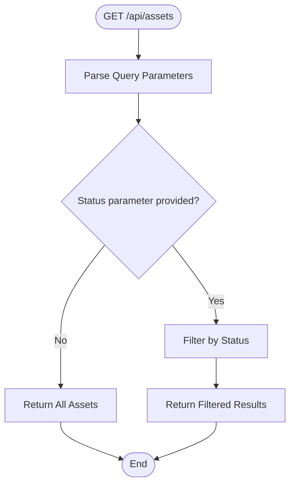
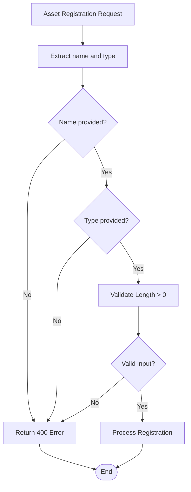
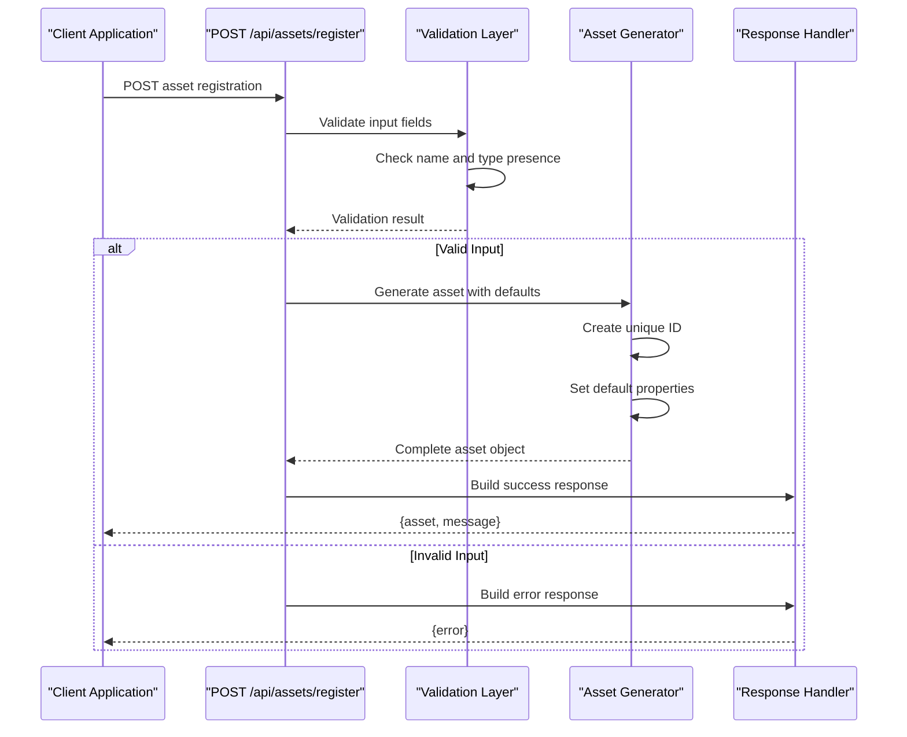
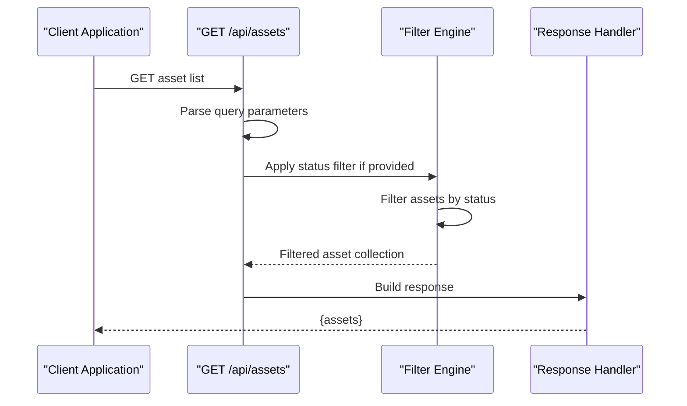
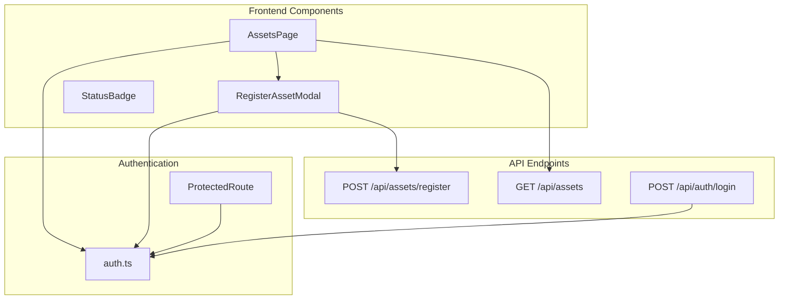
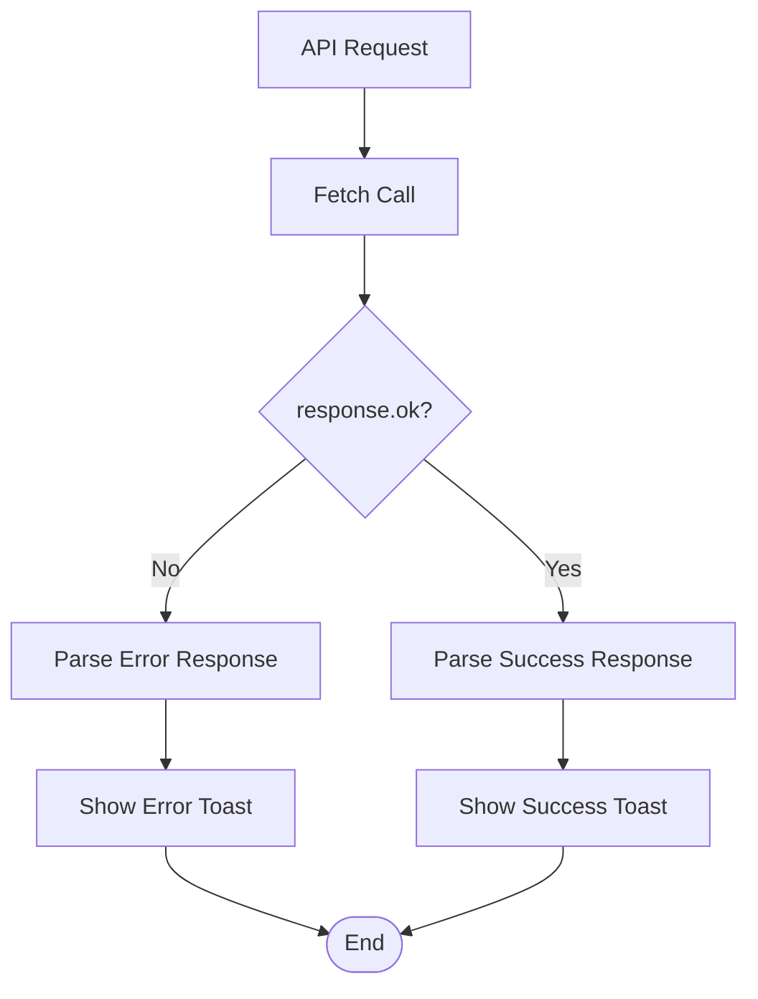

# Asset Management API

<cite>
**Referenced Files in This Document**
- [route.ts](file://src/app/api/assets/register/route.ts)
- [route.ts](file://src/app/api/assets/route.ts)
- [asset.ts](file://src/types/asset.ts)
- [auth.ts](file://src/lib/auth.ts)
- [ProtectedRoute.tsx](file://src/components/auth/ProtectedRoute.tsx)
- [RegisterAssetModal.tsx](file://src/components/assets/RegisterAssetModal.tsx)
- [page.tsx](file://src/app/dashboard/assets/page.tsx)
- [route.ts](file://src/app/api/auth/login/route.ts)
- [page.tsx](file://src/app/login/page.tsx)
- [StatusBadge.tsx](file://src/components/assets/StatusBadge.tsx)
</cite>

## Table of Contents
1. [Introduction](#introduction)
2. [Authentication & Authorization](#authentication--authorization)
3. [Asset Data Model](#asset-data-model)
4. [POST /api/assets/register](#post-apiassetsregister)
5. [GET /api/assets](#get-apiassets)
6. [Request/Response Schemas](#requestresponse-schemas)
7. [Business Logic & Validation](#business-logic--validation)
8. [API Workflows](#api-workflows)
9. [Error Handling](#error-handling)
10. [Performance Considerations](#performance-considerations)
11. [Security Considerations](#security-considerations)
12. [Troubleshooting Guide](#troubleshooting-guide)
13. [Conclusion](#conclusion)

## Introduction

The Asset Management API provides endpoints for registering and managing military assets within the ArmorTrack system. This RESTful API follows Next.js App Router conventions and implements a mock backend service for demonstration purposes.

The system manages various types of military equipment including weapons, vehicles, communication devices, surveillance equipment, and protective gear. Assets are tracked through different lifecycle stages from warehouse storage to deployment and maintenance.

## Authentication & Authorization

### Authentication Flow

The application uses a bearer token authentication system with role-based access control:



**Diagram sources**
- [route.ts:1-49](file://src/app/api/auth/login/route.ts#L1-L49)
- [auth.ts:1-37](file://src/lib/auth.ts#L1-L37)
- [ProtectedRoute.tsx:1-32](file://src/components/auth/ProtectedRoute.tsx#L1-L32)

### Token Management

The authentication system manages tokens and user roles through localStorage:

- **Token Storage**: `localStorage.auth_token`
- **Role Storage**: `localStorage.user_role`
- **Token Retrieval**: `getToken()` function
- **Role Retrieval**: `getUserRole()` function

### Authorization Levels

The system defines four user roles with different capabilities:

| Role | Description | Access Level |
|------|-------------|--------------|
| ADMIN | System administrators | Full access to all endpoints |
| AUDITOR | Financial and compliance auditors | Read-only access to asset data |
| WAREHOUSE | Warehouse personnel | Asset registration and status updates |
| TRANSPORTER | Transportation personnel | Asset movement tracking |
| MANUFACTURER | Equipment manufacturers | Equipment specification management |

**Section sources**
- [route.ts:27-32](file://src/app/api/auth/login/route.ts#L27-L32)
- [auth.ts:1-37](file://src/lib/auth.ts#L1-L37)
- [ProtectedRoute.tsx:1-32](file://src/components/auth/ProtectedRoute.tsx#L1-L32)

## Asset Data Model

### Core Asset Schema

The asset data model defines the structure for all military equipment:



**Diagram sources**
- [asset.ts:1-14](file://src/types/asset.ts#L1-L14)

### Asset Status Enumerations

The system tracks assets through four distinct lifecycle states:

| Status | Color | Description | UI Badge |
|--------|-------|-------------|----------|
| `WAREHOUSE` | Gray | Stored in warehouse facilities | `badge-ghost` |
| `IN_TRANSIT` | Yellow | Being transported between locations | `badge-warning` |
| `DEPLOYED` | Blue | Currently in field operations | `badge-info` |
| `MAINTENANCE_DUE` | Red | Requires maintenance or repair | `badge-error` |

### Asset Registration Schema



**Diagram sources**
- [asset.ts:1-14](file://src/types/asset.ts#L1-L14)

**Section sources**
- [asset.ts:1-14](file://src/types/asset.ts#L1-L14)
- [StatusBadge.tsx:1-23](file://src/components/assets/StatusBadge.tsx#L1-L23)

## POST /api/assets/register

### Endpoint Purpose

The asset registration endpoint creates new asset records in the system with automatic initialization of standard properties.

### Request Format

**Headers:**
- `Content-Type: application/json`
- `Authorization: Bearer {token}`

**Request Body:**
```typescript
interface RegisterAssetInput {
  name: string;
  type: string;
}
```

**Required Fields:**
- `name`: String representing the asset's official designation
- `type`: String specifying the asset category

### Response Format

**Success Response (200):**
```typescript
interface RegisterAssetResponse {
  asset: Asset;
  message: string;
}
```

**Error Responses:**
- `400 Bad Request`: Missing required fields
- `500 Internal Server Error`: Registration failure

### Business Logic

The registration process follows these steps:



**Diagram sources**
- [route.ts:1-37](file://src/app/api/assets/register/route.ts#L1-L37)

### Default Property Values

Newly registered assets automatically receive these default values:

| Property | Default Value | Description |
|----------|---------------|-------------|
| `id` | `AST-{4-digit-number}` | Unique asset identifier |
| `status` | `WAREHOUSE` | Initial asset state |
| `currentCustodian` | `Warehouse A` | Default storage facility |
| `lastUpdated` | Current timestamp | Creation timestamp |

### Practical Examples

**Successful Registration:**
```javascript
// Request
{
  "name": "M4 Carbine Rifle",
  "type": "Weapon System"
}

// Response
{
  "asset": {
    "id": "AST-1234",
    "name": "M4 Carbine Rifle", 
    "type": "Weapon System",
    "status": "WAREHOUSE",
    "currentCustodian": "Warehouse A",
    "lastUpdated": "2024-01-15T10:30:00Z"
  },
  "message": "Asset registered successfully"
}
```

**Validation Error:**
```javascript
// Request (missing fields)
{
  "name": "M4 Carbine Rifle"
  // Missing "type" field
}

// Response
{
  "error": "Name and type are required"
}
```

**Section sources**
- [route.ts:1-37](file://src/app/api/assets/register/route.ts#L1-L37)
- [asset.ts:10-14](file://src/types/asset.ts#L10-L14)

## GET /api/assets

### Endpoint Purpose

The asset listing endpoint retrieves all registered assets with optional filtering capabilities.

### Query Parameters

| Parameter | Type | Description | Example |
|-----------|------|-------------|---------|
| `status` | String | Filter assets by status | `?status=WAREHOUSE` |
| `search` | String | Search by asset name or ID | `?search=rifle` |

### Response Format

**Success Response (200):**
```typescript
interface AssetListResponse {
  assets: Asset[];
}
```

**Error Response:**
- `500 Internal Server Error`: Failed to fetch assets

### Filtering Logic

The endpoint supports status-based filtering:



**Diagram sources**
- [route.ts:1-67](file://src/app/api/assets/route.ts#L1-L67)

### Mock Data Implementation

The system uses predefined mock assets for demonstration:

| Asset ID | Name | Type | Status | Custodian |
|----------|------|------|--------|-----------|
| AST-001 | M4 Carbine Rifle | Weapon System | WAREHOUSE | Warehouse A |
| AST-002 | Humvee H1 | Vehicle | IN_TRANSIT | Transport Unit 5 |
| AST-003 | Radio Set AN/PRC-152 | Communication Device | DEPLOYED | Field Unit Alpha |
| AST-004 | Night Vision Goggles | Surveillance Equipment | WAREHOUSE | Warehouse B |
| AST-005 | Body Armor Plate Carrier | Protective Gear | MAINTENANCE_DUE | Maintenance Bay 2 |

### Practical Examples

**All Assets:**
```javascript
// Request
GET /api/assets

// Response
{
  "assets": [
    {
      "id": "AST-001",
      "name": "M4 Carbine Rifle",
      "type": "Weapon System",
      "status": "WAREHOUSE",
      "currentCustodian": "Warehouse A",
      "lastUpdated": "2024-01-15T10:30:00Z"
    }
  ]
}
```

**Filtered by Status:**
```javascript
// Request
GET /api/assets?status=WAREHOUSE

// Response
{
  "assets": [
    {
      "id": "AST-001",
      "name": "M4 Carbine Rifle",
      "type": "Weapon System",
      "status": "WAREHOUSE",
      "currentCustodian": "Warehouse A",
      "lastUpdated": "2024-01-15T10:30:00Z"
    }
  ]
}
```

**Section sources**
- [route.ts:1-67](file://src/app/api/assets/route.ts#L1-L67)

## Request/Response Schemas

### TypeScript Interfaces

```typescript
// Core Asset Interface
interface Asset {
  id: string;
  name: string;
  type: string;
  status: 'WAREHOUSE' | 'IN_TRANSIT' | 'DEPLOYED' | 'MAINTENANCE_DUE';
  currentCustodian: string;
  lastUpdated: string;
}

// Registration Input Interface
interface RegisterAssetInput {
  name: string;
  type: string;
}

// Authentication Interfaces
interface User {
  email: string;
  name: string;
  role: string;
}

// Response Interfaces
interface RegisterAssetResponse {
  asset: Asset;
  message: string;
}

interface AssetListResponse {
  assets: Asset[];
}
```

### HTTP Status Codes

| Status Code | Reason | Response Body |
|-------------|--------|---------------|
| 200 | Success | Successful operation response |
| 400 | Bad Request | Validation errors |
| 401 | Unauthorized | Invalid or missing authentication |
| 403 | Forbidden | Insufficient permissions |
| 500 | Internal Server Error | Server-side failures |

### Content-Type Headers

- **Request**: `application/json`
- **Response**: `application/json`

**Section sources**
- [asset.ts:1-14](file://src/types/asset.ts#L1-L14)

## Business Logic & Validation

### Input Validation Rules

The asset registration endpoint enforces strict validation:



**Diagram sources**
- [route.ts:1-37](file://src/app/api/assets/register/route.ts#L1-L37)

### Asset Generation Logic

The system generates assets with these business rules:

1. **Unique ID Generation**: Random 4-digit suffix appended to "AST-" prefix
2. **Default Status**: All new assets start in WAREHOUSE status
3. **Timestamp Management**: Automatic ISO 8601 timestamp recording
4. **Custodian Assignment**: Default warehouse assignment for new assets

### Error Handling Patterns

Common error scenarios and their handling:

| Scenario | HTTP Status | Error Message | Resolution |
|----------|-------------|---------------|------------|
| Missing fields | 400 | "Name and type are required" | Provide both name and type |
| Invalid JSON | 400 | "Invalid JSON" | Send valid JSON payload |
| Server error | 500 | "Failed to register asset" | Retry operation later |
| Authentication | 401 | "Unauthorized" | Provide valid bearer token |

**Section sources**
- [route.ts:1-37](file://src/app/api/assets/register/route.ts#L1-L37)
- [route.ts:1-67](file://src/app/api/assets/route.ts#L1-L67)

## API Workflows

### Asset Registration Workflow



**Diagram sources**
- [route.ts:1-37](file://src/app/api/assets/register/route.ts#L1-L37)

### Asset Listing Workflow



**Diagram sources**
- [route.ts:1-67](file://src/app/api/assets/route.ts#L1-L67)

### Frontend Integration

The frontend components integrate with the API through these patterns:



**Diagram sources**
- [page.tsx:1-145](file://src/app/dashboard/assets/page.tsx#L1-L145)
- [RegisterAssetModal.tsx:1-123](file://src/components/assets/RegisterAssetModal.tsx#L1-L123)
- [auth.ts:1-37](file://src/lib/auth.ts#L1-L37)
- [ProtectedRoute.tsx:1-32](file://src/components/auth/ProtectedRoute.tsx#L1-L32)

**Section sources**
- [page.tsx:1-145](file://src/app/dashboard/assets/page.tsx#L1-L145)
- [RegisterAssetModal.tsx:1-123](file://src/components/assets/RegisterAssetModal.tsx#L1-L123)

## Error Handling

### Common Error Scenarios

| Error Type | HTTP Status | Error Response | Cause |
|------------|-------------|----------------|-------|
| Validation Error | 400 | `{ error: 'Name and type are required' }` | Missing required fields |
| Authentication Error | 401 | `{ error: 'Invalid credentials' }` | Weak password (<6 chars) |
| Server Error | 500 | `{ error: 'Failed to register asset' }` | Internal processing failure |
| Resource Not Found | 404 | `{ error: 'Asset not found' }` | Non-existent asset ID |

### Error Response Format

All error responses follow a consistent JSON format:

```typescript
interface ErrorResponse {
  error: string;
}
```

### Client-Side Error Handling

The frontend implements comprehensive error handling:



**Diagram sources**
- [RegisterAssetModal.tsx:16-51](file://src/components/assets/RegisterAssetModal.tsx#L16-L51)
- [page.tsx:15-30](file://src/app/dashboard/assets/page.tsx#L15-L30)

**Section sources**
- [RegisterAssetModal.tsx:1-123](file://src/components/assets/RegisterAssetModal.tsx#L1-L123)
- [page.tsx:1-145](file://src/app/dashboard/assets/page.tsx#L1-L145)

## Performance Considerations

### Current Limitations

The mock implementation has several performance characteristics:

1. **Memory Storage**: Assets stored in memory arrays
2. **No Pagination**: All assets returned in single response
3. **Client-Side Filtering**: Frontend handles search operations
4. **No Caching**: Fresh data fetched on each request

### Optimization Recommendations

For production deployment, consider these improvements:

| Area | Current | Recommended |
|------|---------|-------------|
| Data Storage | Memory arrays | Database with indexing |
| Pagination | No pagination | Page size limits (10-100) |
| Search | Client-side | Server-side indexed search |
| Caching | No caching | Redis cache for frequent queries |
| Rate Limiting | None | IP-based rate limiting |
| Background Jobs | None | Async processing for large uploads |

### Scalability Factors

- **Asset Count**: Current mock has 5 assets
- **Concurrent Users**: Designed for small team usage
- **Data Volume**: Scales linearly with asset count
- **Network Calls**: Minimal overhead for current implementation

## Security Considerations

### Authentication Security

The current implementation uses mock authentication:

- **Token Storage**: Browser localStorage (not secure)
- **Token Expiration**: No expiration handling
- **Password Security**: Plain text validation (demo only)
- **Role Management**: Client-side role setting

### Production Security Requirements

Recommended security enhancements:

1. **Token Management**: Secure HTTP-only cookies
2. **Password Hashing**: bcrypt with salt
3. **JWT Validation**: Proper signature verification
4. **Rate Limiting**: Prevent brute force attacks
5. **Input Sanitization**: Prevent injection attacks
6. **CORS Configuration**: Restrict cross-origin requests
7. **Audit Logging**: Track all asset operations

### Authorization Controls

Implement role-based access controls:

- **ADMIN**: Full CRUD operations on all assets
- **AUDITOR**: Read-only access to asset data
- **WAREHOUSE**: Asset registration and status updates
- **TRANSPORTER**: Movement tracking and status updates
- **MANUFACTURER**: Equipment specification management

## Troubleshooting Guide

### Common Issues and Solutions

**Issue**: "Name and type are required" error
- **Cause**: Missing required fields in request body
- **Solution**: Ensure both name and type are provided
- **Example**: `{ "name": "Rifle", "type": "Weapon System" }`

**Issue**: "Failed to register asset" error  
- **Cause**: Server-side processing failure
- **Solution**: Check server logs, retry operation
- **Prevention**: Validate input before sending request

**Issue**: Authentication failures
- **Cause**: Invalid or expired tokens
- **Solution**: Re-authenticate and obtain new token
- **Prevention**: Implement token refresh mechanism

**Issue**: CORS errors in development
- **Cause**: Cross-origin request restrictions
- **Solution**: Configure appropriate CORS headers
- **Prevention**: Use development proxy servers

### Debugging Tips

1. **Enable Network Logging**: Monitor API requests in browser dev tools
2. **Check Token Storage**: Verify auth_token exists in localStorage
3. **Validate JSON**: Ensure proper JSON formatting in requests
4. **Test Endpoints**: Use curl or Postman for direct testing
5. **Monitor Console**: Check for JavaScript errors in frontend

### Development Environment Setup

```bash
# Start development server
npm run dev

# Test asset registration
curl -X POST http://localhost:3000/api/assets/register \
  -H "Content-Type: application/json" \
  -H "Authorization: Bearer YOUR_TOKEN" \
  -d '{"name":"Test Rifle","type":"Weapon System"}'

# Test asset listing
curl http://localhost:3000/api/assets?status=WAREHOUSE
```

**Section sources**
- [route.ts:1-37](file://src/app/api/assets/register/route.ts#L1-L37)
- [route.ts:1-67](file://src/app/api/assets/route.ts#L1-L67)

## Conclusion

The Asset Management API provides a solid foundation for military asset tracking with clear endpoints for registration and listing operations. The system demonstrates modern Next.js patterns with TypeScript interfaces and follows RESTful conventions.

Key strengths of the implementation include:

- **Clear Data Models**: Well-defined TypeScript interfaces
- **Consistent Error Handling**: Standardized error response format
- **Authentication Integration**: Bearer token system with role-based access
- **Mock Implementation**: Demonstrates complete workflow without external dependencies

Areas for enhancement in production deployments include database integration, comprehensive validation, rate limiting, and robust security measures. The current mock implementation serves as an excellent foundation for building a production-ready asset management system.

The modular design allows for easy extension of functionality while maintaining clean separation of concerns between API endpoints, data models, and frontend components.