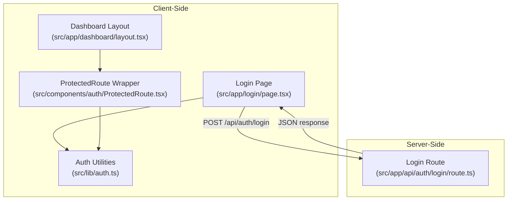
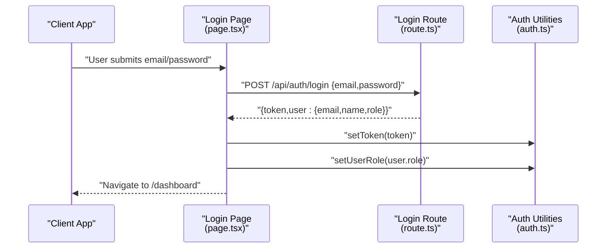
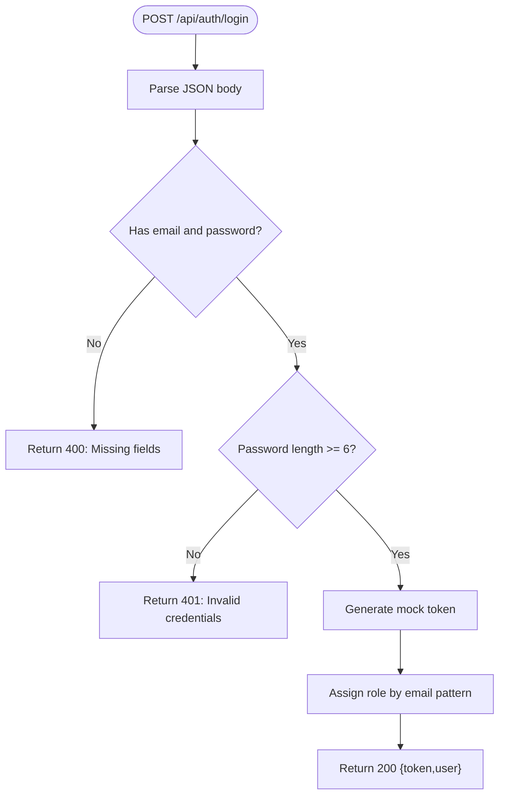
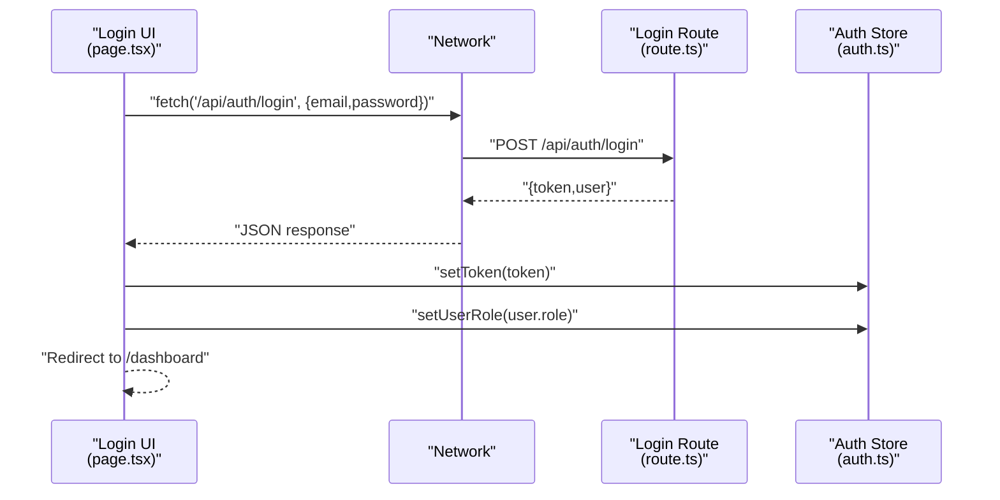
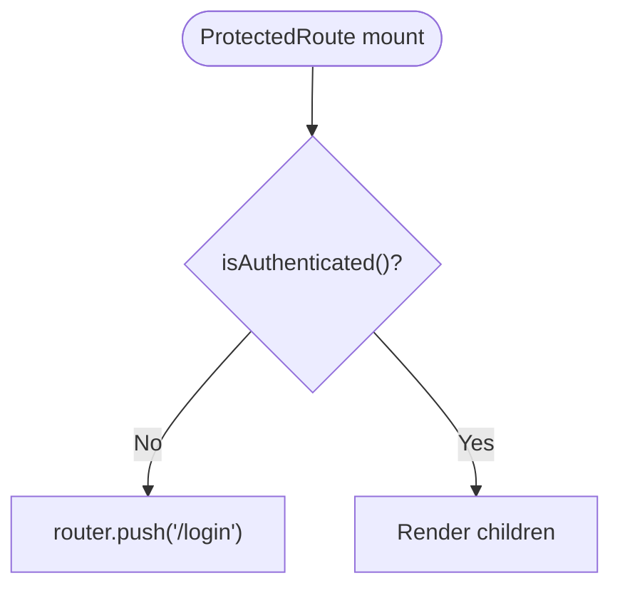
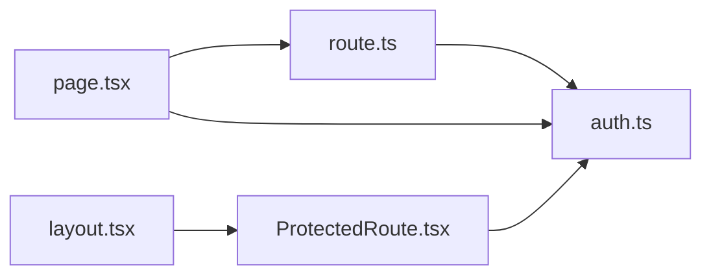

# Authentication API

<cite>
**Referenced Files in This Document**
- [route.ts](file://src/app/api/auth/login/route.ts)
- [auth.ts](file://src/lib/auth.ts)
- [page.tsx](file://src/app/login/page.tsx)
- [ProtectedRoute.tsx](file://src/components/auth/ProtectedRoute.tsx)
- [layout.tsx](file://src/app/dashboard/layout.tsx)
- [package.json](file://package.json)
</cite>

## Table of Contents
1. [Introduction](#introduction)
2. [Project Structure](#project-structure)
3. [Core Components](#core-components)
4. [Architecture Overview](#architecture-overview)
5. [Detailed Component Analysis](#detailed-component-analysis)
6. [Dependency Analysis](#dependency-analysis)
7. [Performance Considerations](#performance-considerations)
8. [Troubleshooting Guide](#troubleshooting-guide)
9. [Conclusion](#conclusion)

## Introduction
This document provides comprehensive API documentation for the Authentication endpoints, focusing on the POST /api/auth/login endpoint. It covers request/response schemas, authentication flow, token generation, user role assignment, error handling, and client-side integration. It also includes practical examples and security considerations for building robust authentication flows.

## Project Structure
The authentication system spans a Next.js API route, a client-side login page, and a shared authentication utility library. Protected routes are enforced via a client-side wrapper component.

**Diagram sources**
- [route.ts:1-49](file://src/app/api/auth/login/route.ts#L1-L49)
- [auth.ts:1-37](file://src/lib/auth.ts#L1-L37)
- [page.tsx:1-139](file://src/app/login/page.tsx#L1-L139)
- [ProtectedRoute.tsx:1-32](file://src/components/auth/ProtectedRoute.tsx#L1-L32)
- [layout.tsx:1-20](file://src/app/dashboard/layout.tsx#L1-L20)

**Section sources**
- [route.ts:1-49](file://src/app/api/auth/login/route.ts#L1-L49)
- [auth.ts:1-37](file://src/lib/auth.ts#L1-L37)
- [page.tsx:1-139](file://src/app/login/page.tsx#L1-L139)
- [ProtectedRoute.tsx:1-32](file://src/components/auth/ProtectedRoute.tsx#L1-L32)
- [layout.tsx:1-20](file://src/app/dashboard/layout.tsx#L1-L20)

## Core Components
- Login API route: Handles POST requests to /api/auth/login, validates input, performs mock authentication, generates a mock token, assigns a role based on email, and returns a structured JSON response.
- Client-side login page: Submits credentials to the login route, parses the response, stores the token and user role, and navigates to the dashboard.
- Authentication utilities: Provides functions to manage tokens and roles in localStorage and to check authentication state.
- Protected route wrapper: Guards dashboard pages by checking authentication state and redirecting unauthenticated users to the login page.

**Section sources**
- [route.ts:1-49](file://src/app/api/auth/login/route.ts#L1-L49)
- [page.tsx:1-139](file://src/app/login/page.tsx#L1-L139)
- [auth.ts:1-37](file://src/lib/auth.ts#L1-L37)
- [ProtectedRoute.tsx:1-32](file://src/components/auth/ProtectedRoute.tsx#L1-L32)

## Architecture Overview
The authentication flow is a client-server interaction where the client posts credentials to the server, receives a token and user profile, and persists them locally for subsequent protected requests.

**Diagram sources**
- [page.tsx:16-45](file://src/app/login/page.tsx#L16-L45)
- [route.ts:3-48](file://src/app/api/auth/login/route.ts#L3-L48)
- [auth.ts:7-32](file://src/lib/auth.ts#L7-L32)

## Detailed Component Analysis

### POST /api/auth/login
- Endpoint: POST /api/auth/login
- Purpose: Authenticate a user with email and password, returning a token and user profile with role.
- Request body schema:
  - email: string (required)
  - password: string (required)
- Successful response schema:
  - token: string
  - user: object
    - email: string
    - name: string (derived from email local part)
    - role: string (ADMIN, AUDITOR, WAREHOUSE, TRANSPORTER, MANUFACTURER)
- Error response schema:
  - error: string

Behavior highlights:
- Validation: Returns 400 if either email or password is missing.
- Authentication: Returns 401 if password length is less than 6.
- Token generation: Produces a mock token string (in production, replace with a real signed JWT).
- Role assignment: Determines role based on email substring matching.

**Diagram sources**
- [route.ts:3-48](file://src/app/api/auth/login/route.ts#L3-L48)

**Section sources**
- [route.ts:1-49](file://src/app/api/auth/login/route.ts#L1-L49)

### Client-Side Login Flow
- The login page constructs the request payload, sends it to the backend, handles errors, and on success:
  - Stores the token in localStorage via setToken
  - Stores the user role via setUserRole
  - Navigates to the dashboard
- Error handling displays user-friendly messages using toast notifications.

**Diagram sources**
- [page.tsx:16-45](file://src/app/login/page.tsx#L16-L45)
- [route.ts:3-48](file://src/app/api/auth/login/route.ts#L3-L48)
- [auth.ts:7-32](file://src/lib/auth.ts#L7-L32)

**Section sources**
- [page.tsx:1-139](file://src/app/login/page.tsx#L1-L139)
- [auth.ts:1-37](file://src/lib/auth.ts#L1-L37)

### Protected Routes
- The ProtectedRoute component checks authentication state and redirects unauthenticated users to /login.
- It renders a loading indicator while verifying authentication.

**Diagram sources**
- [ProtectedRoute.tsx:7-17](file://src/components/auth/ProtectedRoute.tsx#L7-L17)
- [auth.ts:34-36](file://src/lib/auth.ts#L34-L36)

**Section sources**
- [ProtectedRoute.tsx:1-32](file://src/components/auth/ProtectedRoute.tsx#L1-L32)
- [auth.ts:1-37](file://src/lib/auth.ts#L1-L37)
- [layout.tsx:1-20](file://src/app/dashboard/layout.tsx#L1-L20)

## Dependency Analysis
- The login route depends on Next.js server runtime for request/response handling.
- The client-side login page depends on the login route and the auth utilities.
- Protected routes depend on the auth utilities to enforce access control.

**Diagram sources**
- [page.tsx:1-139](file://src/app/login/page.tsx#L1-L139)
- [route.ts:1-49](file://src/app/api/auth/login/route.ts#L1-L49)
- [auth.ts:1-37](file://src/lib/auth.ts#L1-L37)
- [ProtectedRoute.tsx:1-32](file://src/components/auth/ProtectedRoute.tsx#L1-L32)
- [layout.tsx:1-20](file://src/app/dashboard/layout.tsx#L1-L20)

**Section sources**
- [package.json:11-19](file://package.json#L11-L19)

## Performance Considerations
- Token generation in the login route currently uses a mock token. Replace with a cryptographically secure JWT library to avoid performance bottlenecks and security risks.
- Avoid heavy synchronous operations in the login route; keep validation and token creation lightweight.
- On the client, minimize localStorage writes and reads; batch updates when possible.

[No sources needed since this section provides general guidance]

## Troubleshooting Guide
Common issues and resolutions:
- Invalid credentials (401): Ensure the password meets the minimum length requirement.
- Missing fields (400): Verify both email and password are present in the request body.
- Internal server error (500): Inspect server logs for exceptions thrown during request processing.
- Not redirected to dashboard: Confirm the client successfully stored the token and role and that ProtectedRoute is wrapping the dashboard layout.

Debugging techniques:
- Log request payloads and responses on the client to confirm shape and content.
- Use browser developer tools to inspect network requests and localStorage entries.
- Temporarily enable server-side logging to capture unexpected errors.

**Section sources**
- [route.ts:8-22](file://src/app/api/auth/login/route.ts#L8-L22)
- [page.tsx:30-42](file://src/app/login/page.tsx#L30-L42)

## Conclusion
The authentication system provides a clear, extensible foundation for login, token management, and protected routing. The current implementation uses mock tokens and simple role assignment suitable for demos. For production, integrate a secure JWT library, implement robust validation and error handling, and add token expiration and refresh mechanisms as needed.