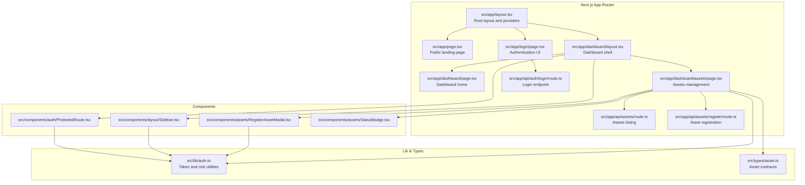
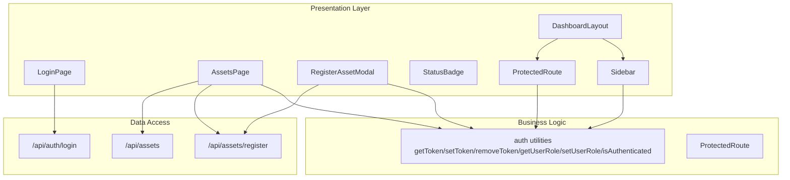
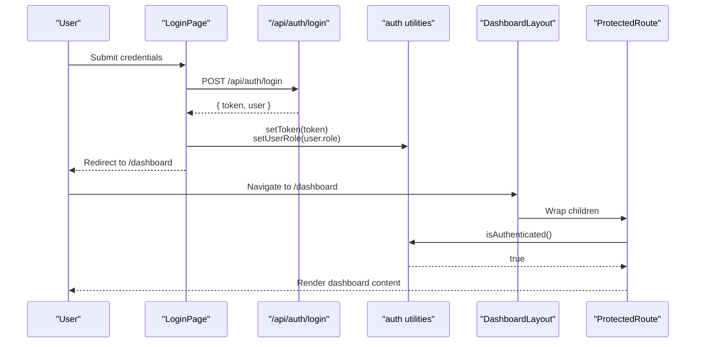
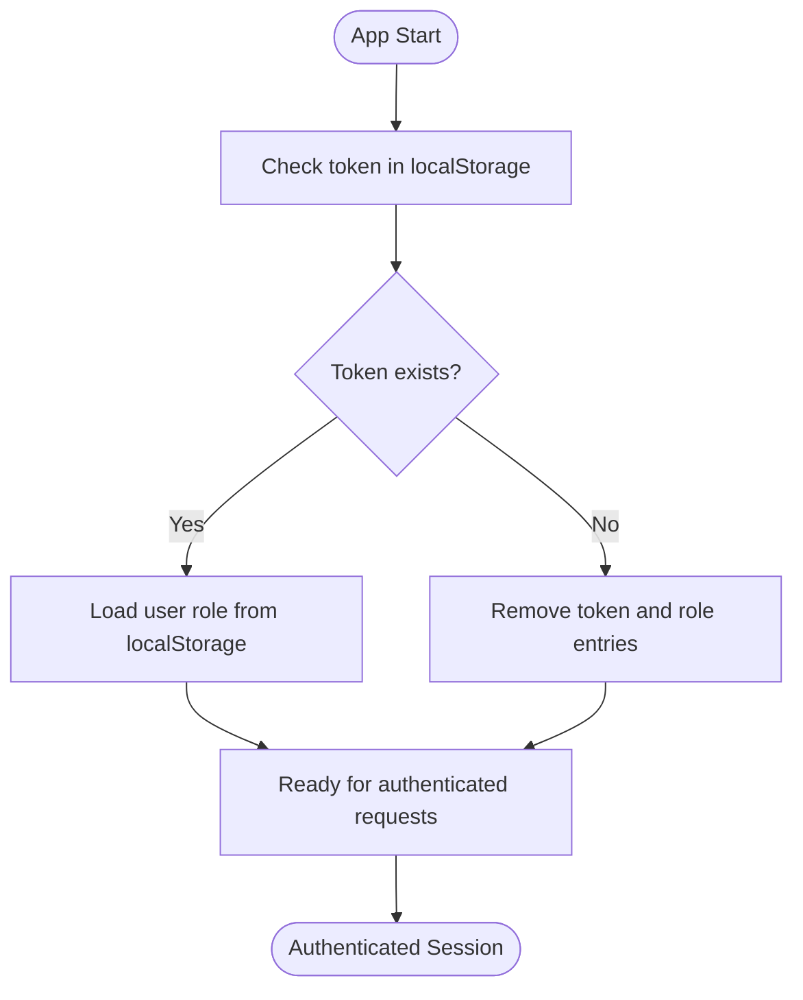
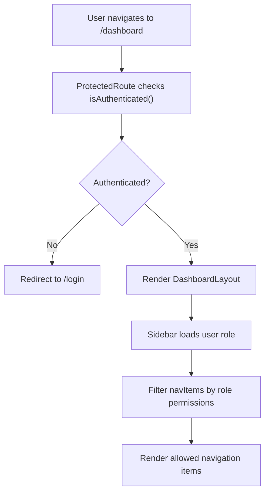
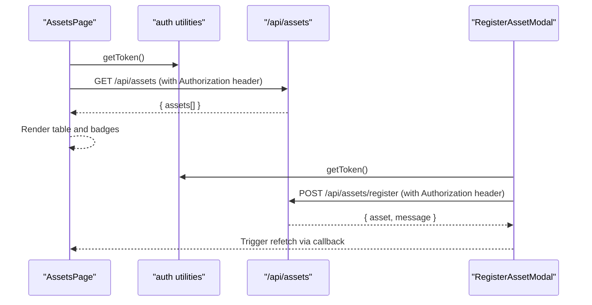
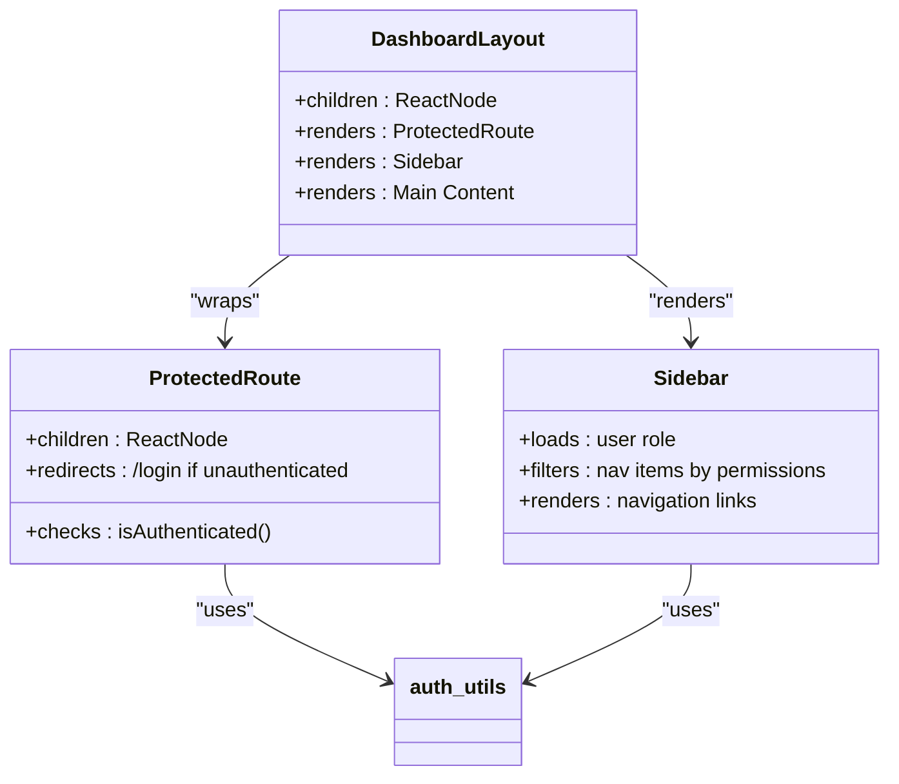
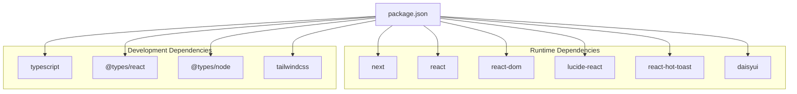

# Architecture Overview

<cite>
**Referenced Files in This Document**
- [README.md](file://README.md)
- [package.json](file://package.json)
- [tsconfig.json](file://tsconfig.json)
- [next.config.ts](file://next.config.ts)
- [src/app/layout.tsx](file://src/app/layout.tsx)
- [src/app/page.tsx](file://src/app/page.tsx)
- [src/app/login/page.tsx](file://src/app/login/page.tsx)
- [src/app/dashboard/layout.tsx](file://src/app/dashboard/layout.tsx)
- [src/app/dashboard/page.tsx](file://src/app/dashboard/page.tsx)
- [src/app/dashboard/assets/page.tsx](file://src/app/dashboard/assets/page.tsx)
- [src/app/api/auth/login/route.ts](file://src/app/api/auth/login/route.ts)
- [src/app/api/assets/route.ts](file://src/app/api/assets/route.ts)
- [src/app/api/assets/register/route.ts](file://src/app/api/assets/register/route.ts)
- [src/lib/auth.ts](file://src/lib/auth.ts)
- [src/components/auth/ProtectedRoute.tsx](file://src/components/auth/ProtectedRoute.tsx)
- [src/components/layout/Sidebar.tsx](file://src/components/layout/Sidebar.tsx)
- [src/components/assets/RegisterAssetModal.tsx](file://src/components/assets/RegisterAssetModal.tsx)
- [src/components/assets/StatusBadge.tsx](file://src/components/assets/StatusBadge.tsx)
- [src/types/asset.ts](file://src/types/asset.ts)
</cite>

## Table of Contents
1. [Introduction](#introduction)
2. [Project Structure](#project-structure)
3. [Core Components](#core-components)
4. [Architecture Overview](#architecture-overview)
5. [Detailed Component Analysis](#detailed-component-analysis)
6. [Dependency Analysis](#dependency-analysis)
7. [Performance Considerations](#performance-considerations)
8. [Troubleshooting Guide](#troubleshooting-guide)
9. [Conclusion](#conclusion)

## Introduction
ArmorTrack is a Next.js application implementing a military-grade asset management system. It follows a modern App Router architecture with a clear separation between presentation, business logic, and data access layers. The system emphasizes TypeScript type safety, role-based access control, and a cohesive UI built with Tailwind CSS and DaisyUI.

Key architectural goals:
- Layered architecture with distinct responsibilities
- Strong typing via TypeScript interfaces
- Token-based authentication with local storage persistence
- Role-based navigation and permissions
- Mock API endpoints simulating backend services
- Responsive, accessible UI components

## Project Structure
The project adheres to Next.js App Router conventions with a modular structure:
- src/app: Route handlers, pages, and layouts
- src/components: Reusable UI components organized by domain
- src/lib: Shared utilities and business logic helpers
- src/types: Strictly typed data contracts
- Public assets and global styles under src/app

**Diagram sources**
- [src/app/layout.tsx:1-49](file://src/app/layout.tsx#L1-L49)
- [src/app/page.tsx](file://src/app/page.tsx)
- [src/app/login/page.tsx:1-139](file://src/app/login/page.tsx#L1-L139)
- [src/app/dashboard/layout.tsx:1-20](file://src/app/dashboard/layout.tsx#L1-L20)
- [src/app/dashboard/page.tsx](file://src/app/dashboard/page.tsx)
- [src/app/dashboard/assets/page.tsx:1-145](file://src/app/dashboard/assets/page.tsx#L1-L145)
- [src/app/api/auth/login/route.ts:1-49](file://src/app/api/auth/login/route.ts#L1-L49)
- [src/app/api/assets/route.ts:1-67](file://src/app/api/assets/route.ts#L1-L67)
- [src/app/api/assets/register/route.ts:1-37](file://src/app/api/assets/register/route.ts#L1-L37)
- [src/components/auth/ProtectedRoute.tsx:1-32](file://src/components/auth/ProtectedRoute.tsx#L1-L32)
- [src/components/layout/Sidebar.tsx:1-90](file://src/components/layout/Sidebar.tsx#L1-L90)
- [src/components/assets/RegisterAssetModal.tsx:1-123](file://src/components/assets/RegisterAssetModal.tsx#L1-L123)
- [src/components/assets/StatusBadge.tsx:1-23](file://src/components/assets/StatusBadge.tsx#L1-L23)
- [src/lib/auth.ts:1-37](file://src/lib/auth.ts#L1-L37)
- [src/types/asset.ts:1-14](file://src/types/asset.ts#L1-L14)

**Section sources**
- [README.md:1-37](file://README.md#L1-L37)
- [package.json:1-31](file://package.json#L1-L31)
- [tsconfig.json:1-35](file://tsconfig.json#L1-L35)
- [next.config.ts:1-8](file://next.config.ts#L1-L8)

## Core Components
This section outlines the primary building blocks and their responsibilities:

- Presentation Layer (React Components)
  - LoginPage: Handles user authentication form submission and redirects upon success.
  - AssetsPage: Displays asset inventory, search, and triggers modals for registration.
  - RegisterAssetModal: Encapsulates asset registration form and submission.
  - StatusBadge: Renders status indicators with semantic styling.
  - Sidebar: Provides role-aware navigation and branding.
  - DashboardLayout: Wraps protected routes and renders sidebar and main content area.

- Business Logic Layer (Utilities)
  - ProtectedRoute: Guards routes by checking token presence and redirecting unauthenticated users.
  - auth utilities: Token retrieval, storage, removal, and role management.

- Data Access Patterns
  - API route handlers: Implement GET/POST endpoints for assets and login.
  - Frontend fetch calls: Use Authorization headers and handle responses.

- Types and Contracts
  - Asset and RegisterAssetInput interfaces define shape of data exchanged between UI and API.

**Section sources**
- [src/app/login/page.tsx:1-139](file://src/app/login/page.tsx#L1-L139)
- [src/app/dashboard/assets/page.tsx:1-145](file://src/app/dashboard/assets/page.tsx#L1-L145)
- [src/components/assets/RegisterAssetModal.tsx:1-123](file://src/components/assets/RegisterAssetModal.tsx#L1-L123)
- [src/components/assets/StatusBadge.tsx:1-23](file://src/components/assets/StatusBadge.tsx#L1-L23)
- [src/components/layout/Sidebar.tsx:1-90](file://src/components/layout/Sidebar.tsx#L1-L90)
- [src/app/dashboard/layout.tsx:1-20](file://src/app/dashboard/layout.tsx#L1-L20)
- [src/components/auth/ProtectedRoute.tsx:1-32](file://src/components/auth/ProtectedRoute.tsx#L1-L32)
- [src/lib/auth.ts:1-37](file://src/lib/auth.ts#L1-L37)
- [src/app/api/assets/route.ts:1-67](file://src/app/api/assets/route.ts#L1-L67)
- [src/app/api/auth/login/route.ts:1-49](file://src/app/api/auth/login/route.ts#L1-L49)
- [src/app/api/assets/register/route.ts:1-37](file://src/app/api/assets/register/route.ts#L1-L37)
- [src/types/asset.ts:1-14](file://src/types/asset.ts#L1-L14)

## Architecture Overview
The system employs a layered architecture:

- Presentation Layer
  - React components render UI and orchestrate user interactions.
  - Components are client-side and rely on shared utilities for authentication and data fetching.

- Business Logic Layer
  - Authentication utilities encapsulate token and role management.
  - ProtectedRoute enforces access control at the routing level.

- Data Access Layer
  - API routes simulate backend services and return mock data.
  - Frontend components call these endpoints with appropriate headers.

System boundaries:
- Frontend components: src/app and src/components
- Mock API endpoints: src/app/api/*
- Shared utilities: src/lib
- Type contracts: src/types

**Diagram sources**
- [src/app/login/page.tsx:1-139](file://src/app/login/page.tsx#L1-L139)
- [src/app/dashboard/assets/page.tsx:1-145](file://src/app/dashboard/assets/page.tsx#L1-L145)
- [src/components/assets/RegisterAssetModal.tsx:1-123](file://src/components/assets/RegisterAssetModal.tsx#L1-L123)
- [src/components/assets/StatusBadge.tsx:1-23](file://src/components/assets/StatusBadge.tsx#L1-L23)
- [src/components/layout/Sidebar.tsx:1-90](file://src/components/layout/Sidebar.tsx#L1-L90)
- [src/app/dashboard/layout.tsx:1-20](file://src/app/dashboard/layout.tsx#L1-L20)
- [src/components/auth/ProtectedRoute.tsx:1-32](file://src/components/auth/ProtectedRoute.tsx#L1-L32)
- [src/lib/auth.ts:1-37](file://src/lib/auth.ts#L1-L37)
- [src/app/api/auth/login/route.ts:1-49](file://src/app/api/auth/login/route.ts#L1-L49)
- [src/app/api/assets/route.ts:1-67](file://src/app/api/assets/route.ts#L1-L67)
- [src/app/api/assets/register/route.ts:1-37](file://src/app/api/assets/register/route.ts#L1-L37)

## Detailed Component Analysis

### Authentication Flow Architecture
The authentication flow spans UI, utilities, and API endpoints:

**Diagram sources**
- [src/app/login/page.tsx:16-45](file://src/app/login/page.tsx#L16-L45)
- [src/app/api/auth/login/route.ts:3-41](file://src/app/api/auth/login/route.ts#L3-L41)
- [src/lib/auth.ts:7-36](file://src/lib/auth.ts#L7-L36)
- [src/app/dashboard/layout.tsx:9-17](file://src/app/dashboard/layout.tsx#L9-L17)
- [src/components/auth/ProtectedRoute.tsx:7-17](file://src/components/auth/ProtectedRoute.tsx#L7-L17)

**Section sources**
- [src/app/login/page.tsx:1-139](file://src/app/login/page.tsx#L1-L139)
- [src/app/api/auth/login/route.ts:1-49](file://src/app/api/auth/login/route.ts#L1-L49)
- [src/lib/auth.ts:1-37](file://src/lib/auth.ts#L1-L37)
- [src/components/auth/ProtectedRoute.tsx:1-32](file://src/components/auth/ProtectedRoute.tsx#L1-L32)
- [src/app/dashboard/layout.tsx:1-20](file://src/app/dashboard/layout.tsx#L1-L20)

### Token Management System
Token lifecycle:
- Storage: Local storage keys for auth token and user role.
- Retrieval: Utility functions abstract access to tokens.
- Removal: Cleanup on logout to prevent stale state.

**Diagram sources**
- [src/lib/auth.ts:7-36](file://src/lib/auth.ts#L7-L36)

**Section sources**
- [src/lib/auth.ts:1-37](file://src/lib/auth.ts#L1-L37)

### Role-Based Access Control Implementation
RBAC is enforced at two levels:
- UI Navigation: Sidebar filters visible links based on user role.
- Route Protection: ProtectedRoute ensures only authenticated users can access protected areas.

**Diagram sources**
- [src/components/auth/ProtectedRoute.tsx:7-17](file://src/components/auth/ProtectedRoute.tsx#L7-L17)
- [src/components/layout/Sidebar.tsx:33-36](file://src/components/layout/Sidebar.tsx#L33-L36)
- [src/lib/auth.ts:24-32](file://src/lib/auth.ts#L24-L32)

**Section sources**
- [src/components/layout/Sidebar.tsx:16-36](file://src/components/layout/Sidebar.tsx#L16-L36)
- [src/components/auth/ProtectedRoute.tsx:1-32](file://src/components/auth/ProtectedRoute.tsx#L1-L32)
- [src/lib/auth.ts:1-37](file://src/lib/auth.ts#L1-L37)

### Data Flow: From Authentication to Asset Management UI
End-to-end data flow:

**Diagram sources**
- [src/app/dashboard/assets/page.tsx:15-34](file://src/app/dashboard/assets/page.tsx#L15-L34)
- [src/lib/auth.ts:7-10](file://src/lib/auth.ts#L7-L10)
- [src/app/api/assets/route.ts:48-59](file://src/app/api/assets/route.ts#L48-L59)
- [src/components/assets/RegisterAssetModal.tsx:16-51](file://src/components/assets/RegisterAssetModal.tsx#L16-L51)
- [src/app/api/assets/register/route.ts:4-29](file://src/app/api/assets/register/route.ts#L4-L29)

**Section sources**
- [src/app/dashboard/assets/page.tsx:1-145](file://src/app/dashboard/assets/page.tsx#L1-L145)
- [src/components/assets/RegisterAssetModal.tsx:1-123](file://src/components/assets/RegisterAssetModal.tsx#L1-L123)
- [src/app/api/assets/route.ts:1-67](file://src/app/api/assets/route.ts#L1-L67)
- [src/app/api/assets/register/route.ts:1-37](file://src/app/api/assets/register/route.ts#L1-L37)
- [src/lib/auth.ts:1-37](file://src/lib/auth.ts#L1-L37)

### Component Relationships: DashboardLayout, ProtectedRoute, and Sidebar
DashboardLayout composes ProtectedRoute and Sidebar to provide a secure, navigable shell:

**Diagram sources**
- [src/app/dashboard/layout.tsx:4-18](file://src/app/dashboard/layout.tsx#L4-L18)
- [src/components/auth/ProtectedRoute.tsx:7-31](file://src/components/auth/ProtectedRoute.tsx#L7-L31)
- [src/components/layout/Sidebar.tsx:33-78](file://src/components/layout/Sidebar.tsx#L33-L78)
- [src/lib/auth.ts:24-32](file://src/lib/auth.ts#L24-L32)

**Section sources**
- [src/app/dashboard/layout.tsx:1-20](file://src/app/dashboard/layout.tsx#L1-L20)
- [src/components/auth/ProtectedRoute.tsx:1-32](file://src/components/auth/ProtectedRoute.tsx#L1-L32)
- [src/components/layout/Sidebar.tsx:1-90](file://src/components/layout/Sidebar.tsx#L1-L90)
- [src/lib/auth.ts:1-37](file://src/lib/auth.ts#L1-L37)

## Dependency Analysis
External dependencies and internal module relationships:

**Diagram sources**
- [package.json:11-29](file://package.json#L11-L29)

**Section sources**
- [package.json:1-31](file://package.json#L1-L31)

## Performance Considerations
- Client-side rendering and static fonts improve initial load characteristics.
- Toast notifications are configured for minimal duration to reduce UI overhead.
- Component-level loading states prevent unnecessary re-renders during data fetches.
- Mock APIs avoid network latency but should be replaced with optimized backend services in production.
- Consider implementing caching strategies for asset lists and pagination for large datasets.

## Troubleshooting Guide
Common issues and resolutions:
- Authentication failures: Verify token storage and role persistence after login.
- Navigation errors: Ensure ProtectedRoute is wrapping protected pages and roles match expected permissions.
- API errors: Confirm Authorization headers are present and mock endpoints are reachable.
- UI state issues: Check modal closures and refetch callbacks to keep views synchronized.

**Section sources**
- [src/app/login/page.tsx:30-44](file://src/app/login/page.tsx#L30-L44)
- [src/components/auth/ProtectedRoute.tsx:11-17](file://src/components/auth/ProtectedRoute.tsx#L11-L17)
- [src/components/assets/RegisterAssetModal.tsx:42-45](file://src/components/assets/RegisterAssetModal.tsx#L42-L45)
- [src/app/api/assets/route.ts:48-66](file://src/app/api/assets/route.ts#L48-L66)

## Conclusion
ArmorTrack demonstrates a clean, layered architecture leveraging Next.js App Router, TypeScript, and modular components. The system’s RBAC and token management provide robust access control, while mock endpoints enable rapid iteration. Future enhancements should focus on integrating a real backend, adding caching, and expanding role permissions to support broader operational needs.