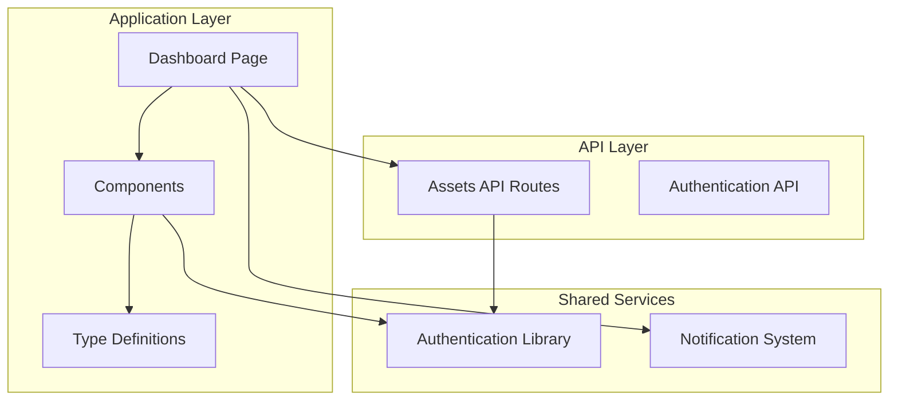
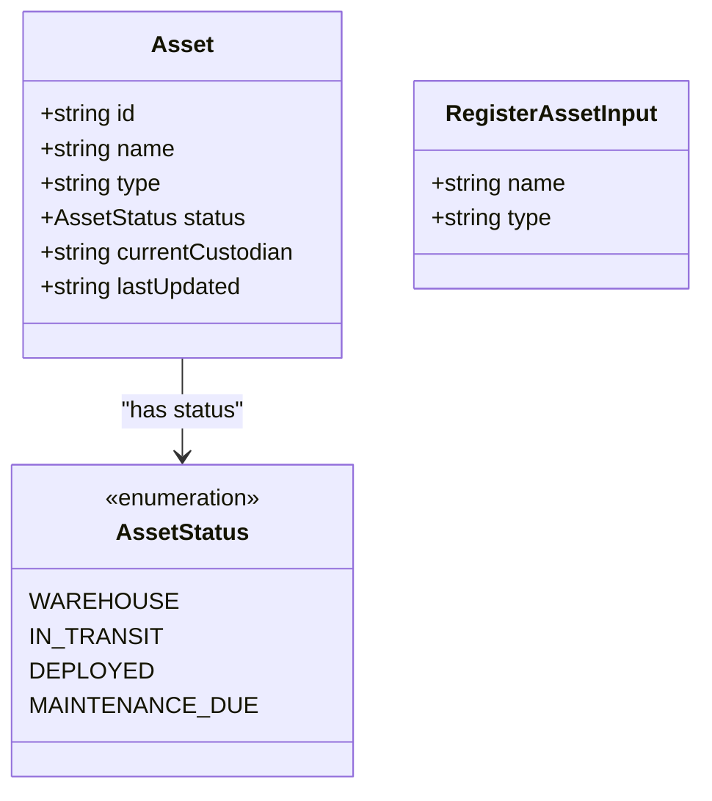
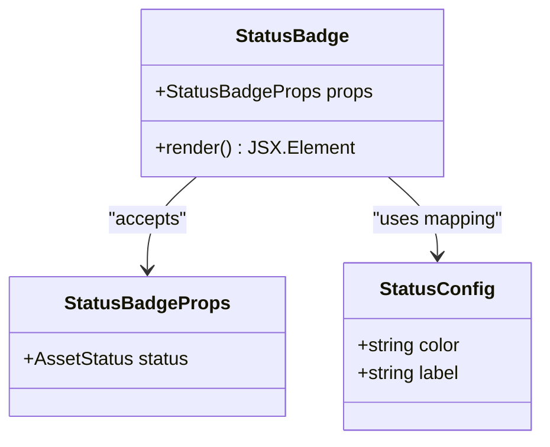
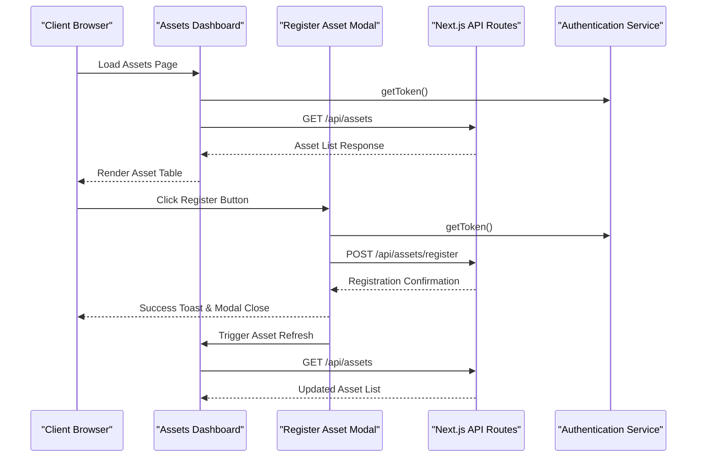
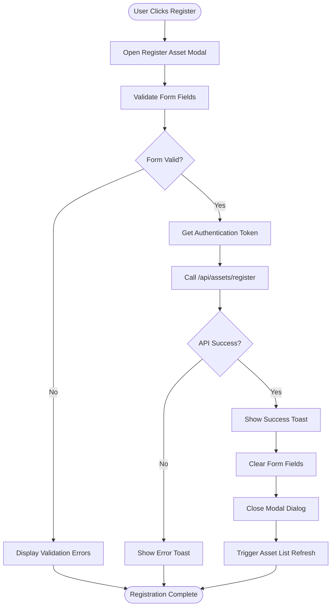
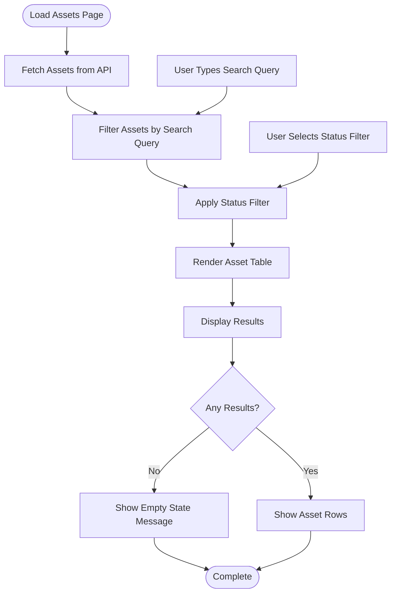
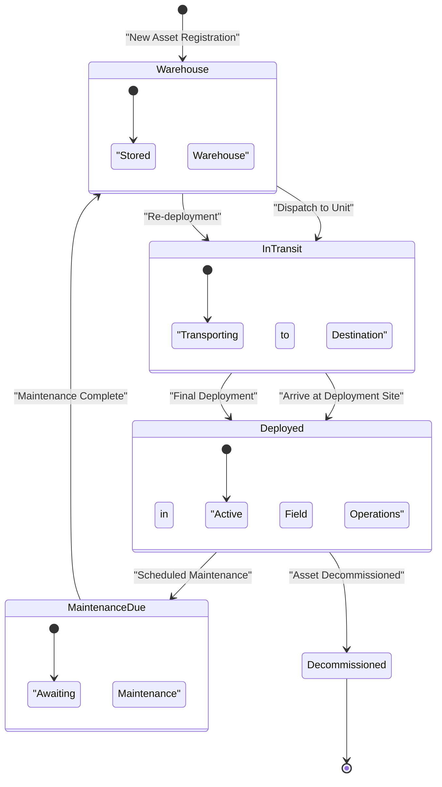
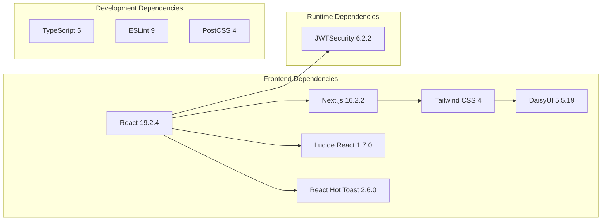
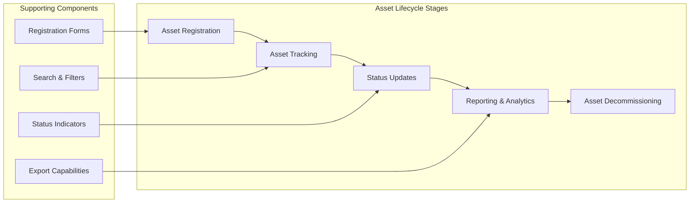

# Asset Management System

<cite>
**Referenced Files in This Document**
- [asset.ts](file://src/types/asset.ts)
- [RegisterAssetModal.tsx](file://src/components/assets/RegisterAssetModal.tsx)
- [StatusBadge.tsx](file://src/components/assets/StatusBadge.tsx)
- [assets-page.tsx](file://src/app/dashboard/assets/page.tsx)
- [assets-route.ts](file://src/app/api/assets/route.ts)
- [register-route.ts](file://src/app/api/assets/register/route.ts)
- [auth.ts](file://src/lib/auth.ts)
- [layout.tsx](file://src/app/layout.tsx)
- [package.json](file://package.json)
</cite>

## Table of Contents
1. [Introduction](#introduction)
2. [Project Structure](#project-structure)
3. [Core Components](#core-components)
4. [Architecture Overview](#architecture-overview)
5. [Detailed Component Analysis](#detailed-component-analysis)
6. [Dependency Analysis](#dependency-analysis)
7. [Performance Considerations](#performance-considerations)
8. [Troubleshooting Guide](#troubleshooting-guide)
9. [Conclusion](#conclusion)
10. [Appendices](#appendices)

## Introduction
The Asset Management System is a Next.js application designed for tracking and managing military assets. It provides a complete asset lifecycle solution from registration through tracking to decommissioning, with real-time status monitoring and comprehensive reporting capabilities. The system follows modern React patterns with TypeScript for type safety and includes a robust mock API layer for demonstration purposes.

## Project Structure
The application follows a modular Next.js structure with clear separation of concerns:

**Diagram sources**
- [assets-page.tsx:1-145](file://src/app/dashboard/assets/page.tsx#L1-L145)
- [assets-route.ts:1-67](file://src/app/api/assets/route.ts#L1-L67)
- [register-route.ts:1-37](file://src/app/api/assets/register/route.ts#L1-L37)

**Section sources**
- [assets-page.tsx:1-145](file://src/app/dashboard/assets/page.tsx#L1-L145)
- [layout.tsx:1-49](file://src/app/layout.tsx#L1-L49)

## Core Components

### Asset TypeScript Interface
The Asset interface defines the core data structure for all assets in the system:

**Diagram sources**
- [asset.ts:1-14](file://src/types/asset.ts#L1-L14)

**Section sources**
- [asset.ts:1-14](file://src/types/asset.ts#L1-L14)

### Status Badge Component
The StatusBadge component provides visual indicators for asset status with color-coded styling:

**Diagram sources**
- [StatusBadge.tsx:1-23](file://src/components/assets/StatusBadge.tsx#L1-L23)

**Section sources**
- [StatusBadge.tsx:1-23](file://src/components/assets/StatusBadge.tsx#L1-L23)

## Architecture Overview

The system follows a client-server architecture with Next.js API routes serving as the backend:

**Diagram sources**
- [assets-page.tsx:15-34](file://src/app/dashboard/assets/page.tsx#L15-L34)
- [RegisterAssetModal.tsx:16-51](file://src/components/assets/RegisterAssetModal.tsx#L16-L51)
- [assets-route.ts:48-66](file://src/app/api/assets/route.ts#L48-L66)
- [register-route.ts:4-36](file://src/app/api/assets/register/route.ts#L4-L36)

## Detailed Component Analysis

### Asset Registration Workflow

The registration process involves a modal-based form with comprehensive validation:

**Diagram sources**
- [RegisterAssetModal.tsx:16-51](file://src/components/assets/RegisterAssetModal.tsx#L16-L51)
- [register-route.ts:9-14](file://src/app/api/assets/register/route.ts#L9-L14)

**Section sources**
- [RegisterAssetModal.tsx:1-123](file://src/components/assets/RegisterAssetModal.tsx#L1-L123)
- [register-route.ts:1-37](file://src/app/api/assets/register/route.ts#L1-L37)

### Asset Listing and Filtering

The dashboard provides comprehensive asset management with search and filtering capabilities:

**Diagram sources**
- [assets-page.tsx:36-41](file://src/app/dashboard/assets/page.tsx#L36-L41)
- [assets-route.ts:50-57](file://src/app/api/assets/route.ts#L50-L57)

**Section sources**
- [assets-page.tsx:1-145](file://src/app/dashboard/assets/page.tsx#L1-L145)
- [assets-route.ts:1-67](file://src/app/api/assets/route.ts#L1-L67)

### Status Tracking System

The status tracking system provides visual indicators for asset lifecycle stages:

**Diagram sources**
- [StatusBadge.tsx:7-12](file://src/components/assets/StatusBadge.tsx#L7-L12)
- [asset.ts:5](file://src/types/asset.ts#L5)

**Section sources**
- [StatusBadge.tsx:1-23](file://src/components/assets/StatusBadge.tsx#L1-L23)
- [asset.ts:1-14](file://src/types/asset.ts#L1-L14)

## Dependency Analysis

The system maintains clean separation of concerns through strategic dependency management:

**Diagram sources**
- [package.json:11-30](file://package.json#L11-L30)

**Section sources**
- [package.json:1-31](file://package.json#L1-L31)

## Performance Considerations

### Client-Side Optimization
- **Lazy Loading**: Components are loaded on-demand through Next.js dynamic imports
- **State Management**: Efficient React state updates minimize re-renders
- **Image Optimization**: Next.js automatic image optimization reduces bandwidth
- **Code Splitting**: Route-based code splitting improves initial load times

### API Performance
- **Mock Data Caching**: Local caching reduces API calls during development
- **Pagination Ready**: API structure supports pagination for large datasets
- **Filter Optimization**: Server-side filtering reduces payload sizes
- **Connection Pooling**: Reusable fetch clients prevent connection overhead

### Memory Management
- **Component Cleanup**: Proper cleanup of event listeners and timers
- **Image Preloading**: Strategic preloading of frequently accessed assets
- **State Pruning**: Automatic pruning of unused state in modals and forms

## Troubleshooting Guide

### Common Issues and Solutions

#### Authentication Problems
- **Issue**: Assets page shows unauthorized access
- **Solution**: Verify JWT token storage in localStorage
- **Prevention**: Implement automatic token refresh mechanisms

#### API Connectivity Issues
- **Issue**: Asset registration fails with network errors
- **Solution**: Check CORS configuration and token validity
- **Debugging**: Monitor network tab for failed requests

#### UI Rendering Problems
- **Issue**: Status badges not displaying correctly
- **Solution**: Verify status values match enumeration types
- **Validation**: Ensure status values are properly typed

#### Performance Issues
- **Issue**: Slow asset loading times
- **Solution**: Implement virtual scrolling for large lists
- **Optimization**: Add debounced search functionality

**Section sources**
- [auth.ts:7-10](file://src/lib/auth.ts#L7-L10)
- [RegisterAssetModal.tsx:33-35](file://src/components/assets/RegisterAssetModal.tsx#L33-L35)

## Conclusion

The Asset Management System provides a comprehensive foundation for military asset tracking with modern React patterns and TypeScript type safety. The system successfully implements the complete asset lifecycle from registration to decommissioning, with intuitive user interfaces and robust API endpoints.

Key strengths include:
- **Type Safety**: Comprehensive TypeScript implementation prevents runtime errors
- **Modular Architecture**: Clean separation of concerns enables easy maintenance
- **Visual Design**: Military-themed UI with status indicators enhances usability
- **Extensibility**: Well-structured codebase supports future enhancements

Future enhancements could include:
- Real database integration with migration support
- Advanced reporting and analytics dashboards
- Mobile-responsive design improvements
- Enhanced audit trail functionality
- Multi-unit asset transfer capabilities

## Appendices

### Asset Lifecycle Management

The system supports complete asset lifecycle management through coordinated components:

### API Endpoint Reference

| Endpoint | Method | Description | Request Body | Response |
|----------|--------|-------------|--------------|----------|
| `/api/assets` | GET | Retrieve all assets | None | `{ assets: Asset[] }` |
| `/api/assets/register` | POST | Register new asset | `{ name: string, type: string }` | `{ asset: Asset, message: string }` |

### Extension Guidelines

To extend the asset system with new properties:

1. **Update Type Definitions**: Modify the Asset interface in `src/types/asset.ts`
2. **Update Form Components**: Extend RegisterAssetModal with new input fields
3. **Update API Endpoints**: Modify both API routes to handle new fields
4. **Update UI Components**: Add new columns to the asset table
5. **Add Validation**: Implement validation rules for new properties
6. **Update Status Logic**: Modify status tracking if new properties affect workflow

### Best Practices for Custom Workflows

- **Consistent Naming**: Follow established naming conventions for new components
- **Type Safety**: Always update TypeScript interfaces alongside implementation
- **Error Handling**: Implement comprehensive error handling for all API calls
- **User Feedback**: Provide clear success/error notifications for all operations
- **Accessibility**: Ensure all components meet accessibility standards
- **Testing**: Write unit tests for new functionality before deployment