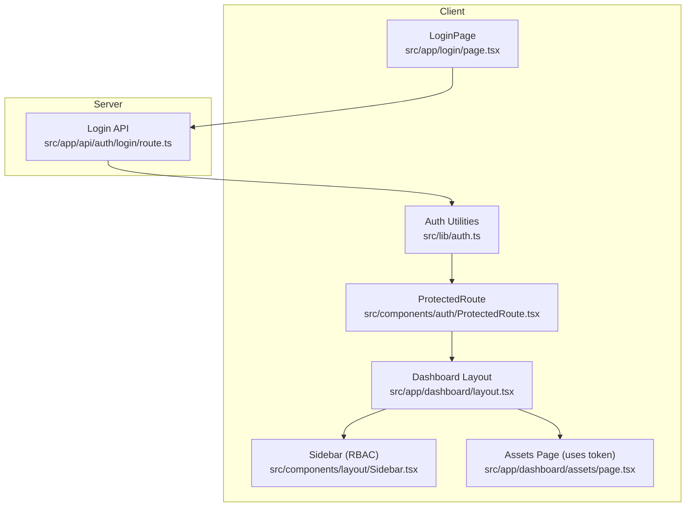
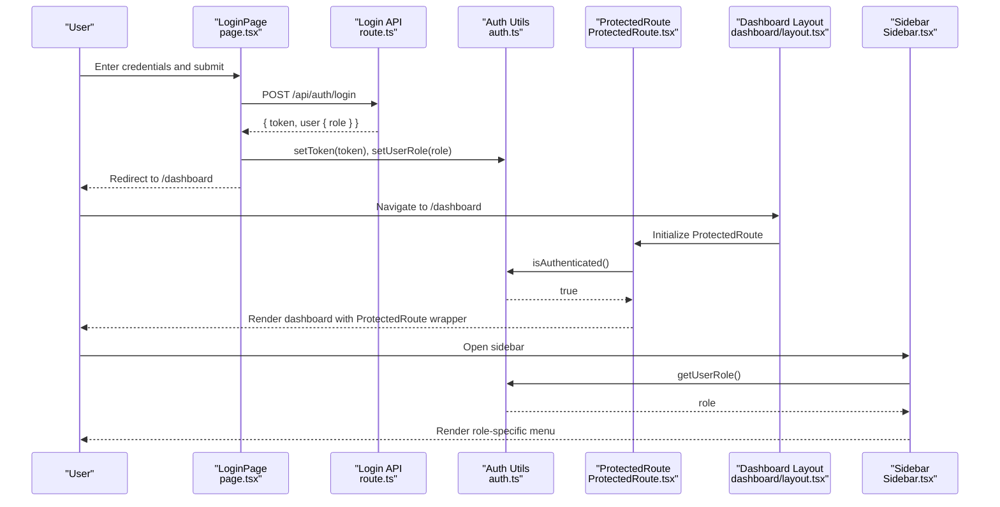
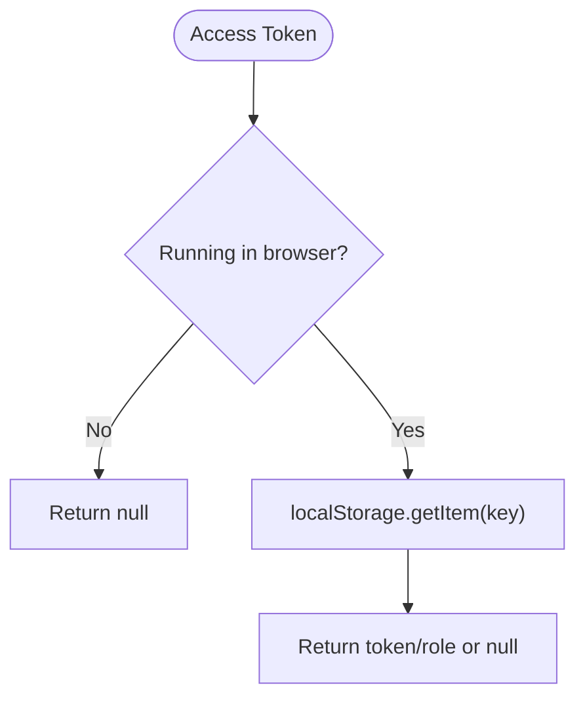
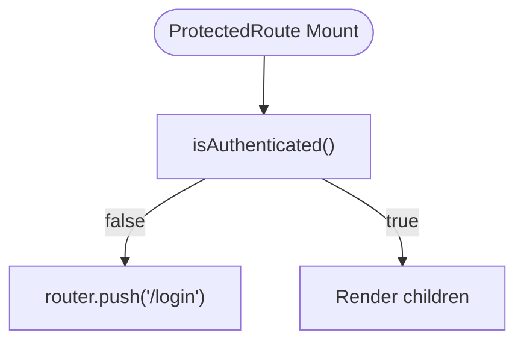
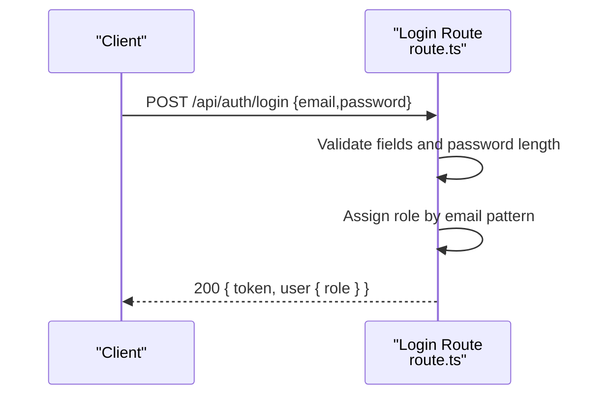
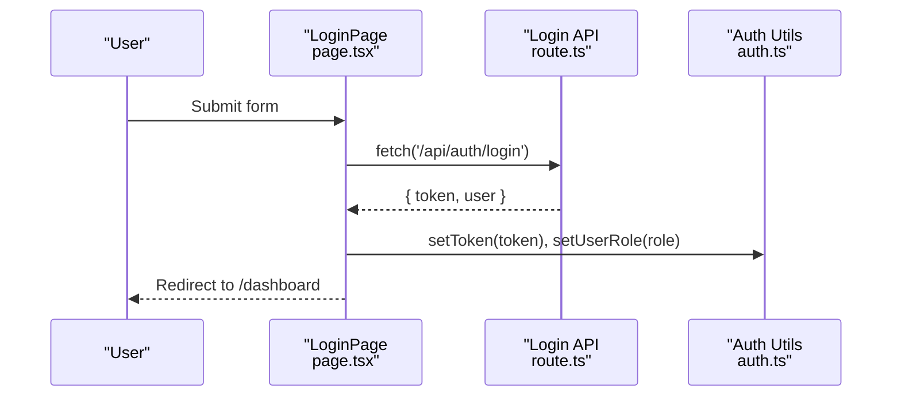
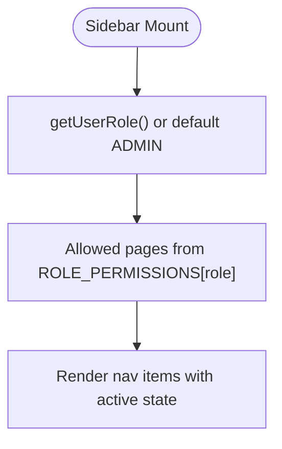
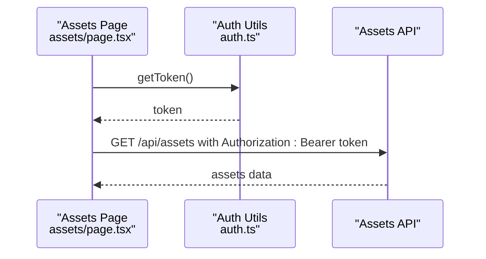
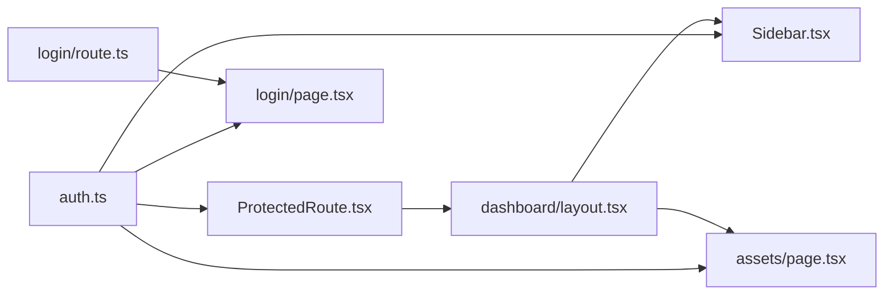

# Authentication & Authorization

<cite>
**Referenced Files in This Document**
- [auth.ts](file://src/lib/auth.ts)
- [ProtectedRoute.tsx](file://src/components/auth/ProtectedRoute.tsx)
- [login/route.ts](file://src/app/api/auth/login/route.ts)
- [login/page.tsx](file://src/app/login/page.tsx)
- [dashboard/layout.tsx](file://src/app/dashboard/layout.tsx)
- [Sidebar.tsx](file://src/components/layout/Sidebar.tsx)
- [assets/page.tsx](file://src/app/dashboard/assets/page.tsx)
- [asset.ts](file://src/types/asset.ts)
- [layout.tsx](file://src/app/layout.tsx)
</cite>

## Table of Contents
1. [Introduction](#introduction)
2. [Project Structure](#project-structure)
3. [Core Components](#core-components)
4. [Architecture Overview](#architecture-overview)
5. [Detailed Component Analysis](#detailed-component-analysis)
6. [Dependency Analysis](#dependency-analysis)
7. [Performance Considerations](#performance-considerations)
8. [Troubleshooting Guide](#troubleshooting-guide)
9. [Conclusion](#conclusion)
10. [Appendices](#appendices)

## Introduction
This document explains the authentication and authorization system in the ArmorTrack application. It covers the multi-role user model (Admin, Auditor, Warehouse, Transporter, Manufacturer), JWT token-based login flow, token storage via localStorage, protected routing, and role-based navigation. It also documents state management, automatic redirection on missing tokens, and secure handling practices. Practical examples demonstrate integrating authentication in components and API routes, along with permission enforcement and error handling.

## Project Structure
The authentication and authorization logic spans client-side utilities, UI protections, and server-side login endpoints. Key areas:
- Client token and role utilities: src/lib/auth.ts
- Route protection wrapper: src/components/auth/ProtectedRoute.tsx
- Login API route: src/app/api/auth/login/route.ts
- Login page: src/app/login/page.tsx
- Dashboard layout wrapping protected routes: src/app/dashboard/layout.tsx
- Role-based navigation sidebar: src/components/layout/Sidebar.tsx
- Example protected page using token in requests: src/app/dashboard/assets/page.tsx
- Shared asset types: src/types/asset.ts
- Root layout and global toast provider: src/app/layout.tsx

**Diagram sources**
- [login/page.tsx:1-139](file://src/app/login/page.tsx#L1-L139)
- [ProtectedRoute.tsx:1-32](file://src/components/auth/ProtectedRoute.tsx#L1-L32)
- [dashboard/layout.tsx:1-20](file://src/app/dashboard/layout.tsx#L1-L20)
- [Sidebar.tsx:1-90](file://src/components/layout/Sidebar.tsx#L1-L90)
- [assets/page.tsx:1-145](file://src/app/dashboard/assets/page.tsx#L1-L145)
- [auth.ts:1-37](file://src/lib/auth.ts#L1-L37)
- [login/route.ts:1-49](file://src/app/api/auth/login/route.ts#L1-L49)

**Section sources**
- [auth.ts:1-37](file://src/lib/auth.ts#L1-L37)
- [ProtectedRoute.tsx:1-32](file://src/components/auth/ProtectedRoute.tsx#L1-L32)
- [login/route.ts:1-49](file://src/app/api/auth/login/route.ts#L1-L49)
- [login/page.tsx:1-139](file://src/app/login/page.tsx#L1-L139)
- [dashboard/layout.tsx:1-20](file://src/app/dashboard/layout.tsx#L1-L20)
- [Sidebar.tsx:1-90](file://src/components/layout/Sidebar.tsx#L1-L90)
- [assets/page.tsx:1-145](file://src/app/dashboard/assets/page.tsx#L1-L145)
- [layout.tsx:1-49](file://src/app/layout.tsx#L1-L49)

## Core Components
- Token and role utilities:
  - Retrieve, set, and remove tokens from localStorage
  - Store and retrieve user role
  - Check authentication state
- ProtectedRoute wrapper:
  - Guards pages by verifying token presence
  - Redirects unauthenticated users to the login page
- Login API:
  - Validates credentials
  - Assigns role based on email pattern
  - Returns a mock token and user info
- Login page:
  - Submits credentials to the login API
  - Stores token and role, navigates to dashboard
- Dashboard layout:
  - Wraps child routes with ProtectedRoute
- Sidebar:
  - Renders navigation items based on user role permissions
- Assets page:
  - Uses stored token in Authorization header for protected requests

**Section sources**
- [auth.ts:1-37](file://src/lib/auth.ts#L1-L37)
- [ProtectedRoute.tsx:1-32](file://src/components/auth/ProtectedRoute.tsx#L1-L32)
- [login/route.ts:1-49](file://src/app/api/auth/login/route.ts#L1-L49)
- [login/page.tsx:1-139](file://src/app/login/page.tsx#L1-L139)
- [dashboard/layout.tsx:1-20](file://src/app/dashboard/layout.tsx#L1-L20)
- [Sidebar.tsx:1-90](file://src/components/layout/Sidebar.tsx#L1-L90)
- [assets/page.tsx:1-145](file://src/app/dashboard/assets/page.tsx#L1-L145)

## Architecture Overview
The system uses a client-side token stored in localStorage and a simple mock JWT returned by the login endpoint. ProtectedRoute ensures only authenticated users can access protected pages. Role-based navigation is enforced client-side by the sidebar using stored role information. Requests from protected pages include the token in the Authorization header.

**Diagram sources**
- [login/page.tsx:16-45](file://src/app/login/page.tsx#L16-L45)
- [login/route.ts:3-41](file://src/app/api/auth/login/route.ts#L3-L41)
- [auth.ts:7-36](file://src/lib/auth.ts#L7-L36)
- [ProtectedRoute.tsx:11-17](file://src/components/auth/ProtectedRoute.tsx#L11-L17)
- [dashboard/layout.tsx:10-17](file://src/app/dashboard/layout.tsx#L10-L17)
- [Sidebar.tsx:35-36](file://src/components/layout/Sidebar.tsx#L35-L36)

## Detailed Component Analysis

### Authentication State and Token Storage
- Token storage:
  - Token is stored under the key "auth_token"
  - Role is stored under "user_role"
  - Additional cleanup removes "dismissed_alerts" during logout
- Token retrieval and checks:
  - getToken/getUserRole return null in SSR contexts
  - isAuthenticated checks for token presence
- Secure handling:
  - Token is stored in localStorage
  - No token refresh mechanism is implemented in the current code

**Diagram sources**
- [auth.ts:7-36](file://src/lib/auth.ts#L7-L36)

**Section sources**
- [auth.ts:1-37](file://src/lib/auth.ts#L1-L37)

### ProtectedRoute Implementation
- Purpose:
  - Guard pages behind authentication
- Behavior:
  - On mount, checks isAuthenticated()
  - If false, redirects to /login
  - If true, renders children after removing the "checking" state
- UX:
  - Displays a spinner while checking authentication

**Diagram sources**
- [ProtectedRoute.tsx:11-17](file://src/components/auth/ProtectedRoute.tsx#L11-L17)

**Section sources**
- [ProtectedRoute.tsx:1-32](file://src/components/auth/ProtectedRoute.tsx#L1-L32)

### Login API and Credential Validation
- Request:
  - Expects email and password in request body
- Validation:
  - Rejects missing fields with 400
  - Rejects short passwords with 401
- Role assignment:
  - Determines role based on email substring patterns
- Response:
  - Returns a mock JWT token and user object
- Notes:
  - Current implementation uses mock tokens and role logic for demonstration

**Diagram sources**
- [login/route.ts:3-41](file://src/app/api/auth/login/route.ts#L3-L41)

**Section sources**
- [login/route.ts:1-49](file://src/app/api/auth/login/route.ts#L1-L49)

### Login Page Integration
- Behavior:
  - Submits credentials to the login API
  - On success, stores token and role, shows success toast, navigates to /dashboard
  - On failure, displays error toast and updates UI state
- Security considerations:
  - Token is stored in localStorage
  - No token refresh or expiration handling is present

**Diagram sources**
- [login/page.tsx:16-45](file://src/app/login/page.tsx#L16-L45)
- [login/route.ts:3-41](file://src/app/api/auth/login/route.ts#L3-L41)
- [auth.ts:12-32](file://src/lib/auth.ts#L12-L32)

**Section sources**
- [login/page.tsx:1-139](file://src/app/login/page.tsx#L1-L139)

### Role-Based Navigation (Sidebar)
- Permissions mapping:
  - Roles map to sets of allowed pages
- Rendering:
  - Sidebar filters nav items based on allowed pages derived from stored role
  - Active item highlighting uses current pathname
- Extensibility:
  - Add/remove permissions by updating the mapping

**Diagram sources**
- [Sidebar.tsx:35-36](file://src/components/layout/Sidebar.tsx#L35-L36)
- [Sidebar.tsx:58-77](file://src/components/layout/Sidebar.tsx#L58-L77)

**Section sources**
- [Sidebar.tsx:1-90](file://src/components/layout/Sidebar.tsx#L1-L90)

### Protected Page Using Token (Assets Page)
- Fetching protected data:
  - Retrieves token from localStorage
  - Sends Authorization: Bearer token header
- Error handling:
  - Catches errors during fetch and logs them
- Notes:
  - This demonstrates how protected pages can consume the token

**Diagram sources**
- [assets/page.tsx:17-22](file://src/app/dashboard/assets/page.tsx#L17-L22)
- [auth.ts:7-10](file://src/lib/auth.ts#L7-L10)

**Section sources**
- [assets/page.tsx:1-145](file://src/app/dashboard/assets/page.tsx#L1-L145)
- [asset.ts:1-14](file://src/types/asset.ts#L1-L14)

### Dashboard Layout Protection
- Wrapping:
  - Dashboard layout wraps its children in ProtectedRoute
- Effect:
  - Ensures all dashboard pages are protected by default

**Section sources**
- [dashboard/layout.tsx:1-20](file://src/app/dashboard/layout.tsx#L1-L20)

### Logout and Automatic Cleanup
- Removal:
  - removeToken clears "auth_token", "user_role", and "dismissed_alerts"
- Integration:
  - Call removeToken on logout actions to clear state
- Recommendation:
  - Trigger a hard redirect to clear client state

**Section sources**
- [auth.ts:17-22](file://src/lib/auth.ts#L17-L22)

## Dependency Analysis
- ProtectedRoute depends on:
  - isAuthenticated from auth utilities
  - Next.js router for navigation
- LoginPage depends on:
  - Login API route
  - Auth utilities to persist token and role
- Sidebar depends on:
  - Auth utilities to read role
  - Next.js router for active state
- Assets page depends on:
  - Auth utilities to read token
  - Asset types for payload shape

**Diagram sources**
- [auth.ts:1-37](file://src/lib/auth.ts#L1-L37)
- [ProtectedRoute.tsx:1-32](file://src/components/auth/ProtectedRoute.tsx#L1-L32)
- [login/page.tsx:1-139](file://src/app/login/page.tsx#L1-L139)
- [login/route.ts:1-49](file://src/app/api/auth/login/route.ts#L1-L49)
- [dashboard/layout.tsx:1-20](file://src/app/dashboard/layout.tsx#L1-L20)
- [Sidebar.tsx:1-90](file://src/components/layout/Sidebar.tsx#L1-L90)
- [assets/page.tsx:1-145](file://src/app/dashboard/assets/page.tsx#L1-L145)

**Section sources**
- [auth.ts:1-37](file://src/lib/auth.ts#L1-L37)
- [ProtectedRoute.tsx:1-32](file://src/components/auth/ProtectedRoute.tsx#L1-L32)
- [login/page.tsx:1-139](file://src/app/login/page.tsx#L1-L139)
- [login/route.ts:1-49](file://src/app/api/auth/login/route.ts#L1-L49)
- [dashboard/layout.tsx:1-20](file://src/app/dashboard/layout.tsx#L1-L20)
- [Sidebar.tsx:1-90](file://src/components/layout/Sidebar.tsx#L1-L90)
- [assets/page.tsx:1-145](file://src/app/dashboard/assets/page.tsx#L1-L145)

## Performance Considerations
- LocalStorage access is synchronous and lightweight; keep payloads small.
- Avoid frequent re-renders by memoizing role and token reads.
- Debounce or batch UI updates when many protected pages are mounted.

## Troubleshooting Guide
Common issues and resolutions:
- Redirect loop to login:
  - Cause: Missing or cleared token
  - Fix: Ensure setToken is called after successful login; verify localStorage persistence
- Unauthorized requests:
  - Cause: Missing Authorization header
  - Fix: Use getToken in protected pages and attach Authorization: Bearer token
- Role mismatch in navigation:
  - Cause: Incorrect role stored
  - Fix: Verify setUserRole is called with correct role from login response
- SSR hydration warnings:
  - Cause: Direct localStorage access on server
  - Fix: Guard with typeof window check (already handled in auth utilities)

**Section sources**
- [auth.ts:7-36](file://src/lib/auth.ts#L7-L36)
- [login/page.tsx:34-35](file://src/app/login/page.tsx#L34-L35)
- [assets/page.tsx:17-22](file://src/app/dashboard/assets/page.tsx#L17-L22)
- [ProtectedRoute.tsx:11-17](file://src/components/auth/ProtectedRoute.tsx#L11-L17)

## Conclusion
The system implements a straightforward, client-side authentication and authorization model with:
- Token storage in localStorage
- ProtectedRoute for route-level protection
- Role-based navigation in the sidebar
- A mock login flow returning a token and assigning roles
To enhance security, consider adding token refresh, secure cookie storage, CSRF protection, and backend validation of tokens for protected APIs.

## Appendices

### Multi-Role Model
- Roles and permissions mapping:
  - ADMIN: assets, batches, map, custody, maintenance
  - AUDITOR: audit
  - WAREHOUSE: assets, batches, custody
  - MANUFACTURER: assets
  - TRANSPORTER: none (placeholder)

**Section sources**
- [Sidebar.tsx:16-22](file://src/components/layout/Sidebar.tsx#L16-L22)

### Practical Examples

- Role-based navigation:
  - Use getUserRole and ROLE_PERMISSIONS to filter sidebar items
  - Reference: [Sidebar.tsx:35-77](file://src/components/layout/Sidebar.tsx#L35-L77)

- Permission checking in components:
  - Read role and conditionally render UI elements
  - Reference: [Sidebar.tsx:35-77](file://src/components/layout/Sidebar.tsx#L35-L77)

- Access control enforcement:
  - Wrap pages with ProtectedRoute to block unauthenticated users
  - Reference: [ProtectedRoute.tsx:7-31](file://src/components/auth/ProtectedRoute.tsx#L7-L31)

- Authentication integration in API routes:
  - For server-side routes, validate Authorization header and decode/verify token
  - Current client-side token usage example:
    - [assets/page.tsx:17-22](file://src/app/dashboard/assets/page.tsx#L17-L22)

- Secure token handling practices:
  - Store tokens securely (consider HttpOnly cookies)
  - Implement token refresh and expiration checks
  - Sanitize inputs and validate credentials rigorously
  - Reference: [auth.ts:7-36](file://src/lib/auth.ts#L7-L36), [login/route.ts:8-22](file://src/app/api/auth/login/route.ts#L8-L22)