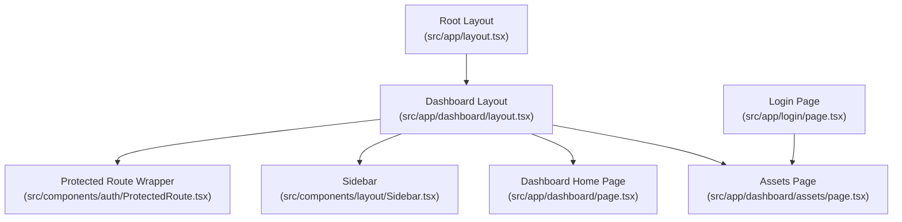
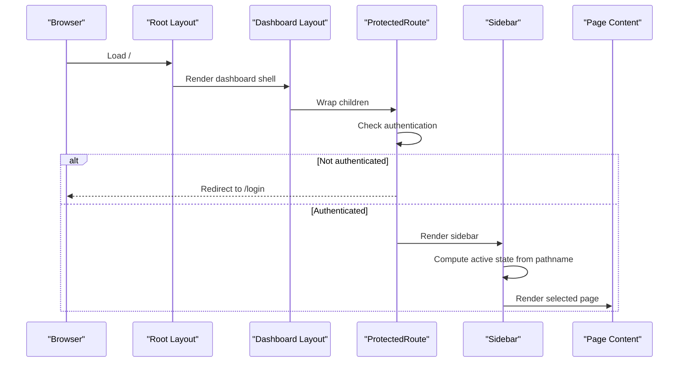
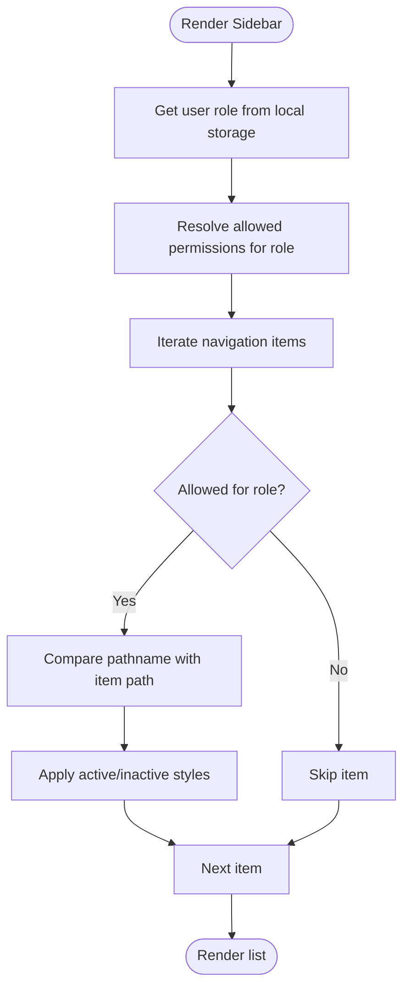
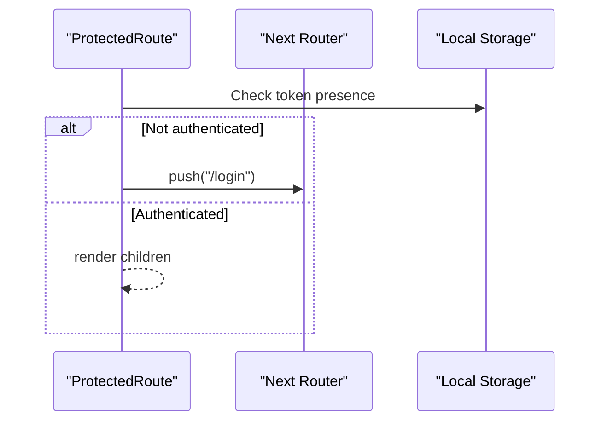
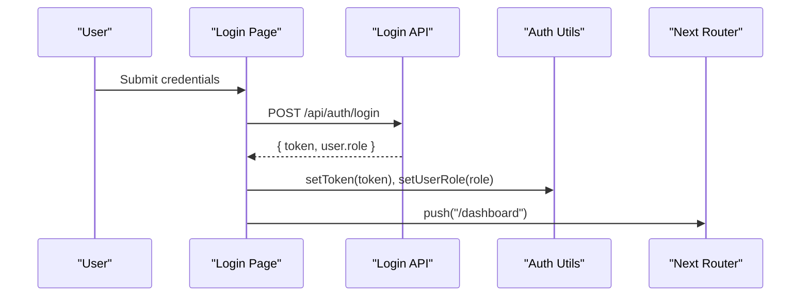
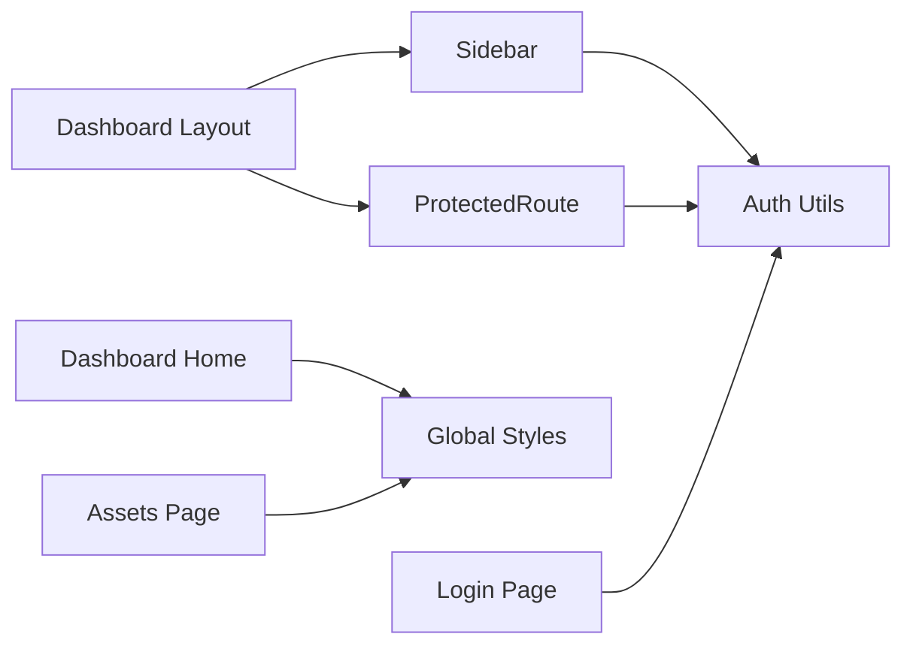

# Dashboard & Navigation

<cite>
**Referenced Files in This Document**
- [src/app/dashboard/layout.tsx](file://src/app/dashboard/layout.tsx)
- [src/components/layout/Sidebar.tsx](file://src/components/layout/Sidebar.tsx)
- [src/components/auth/ProtectedRoute.tsx](file://src/components/auth/ProtectedRoute.tsx)
- [src/lib/auth.ts](file://src/lib/auth.ts)
- [src/app/dashboard/page.tsx](file://src/app/dashboard/page.tsx)
- [src/app/dashboard/assets/page.tsx](file://src/app/dashboard/assets/page.tsx)
- [src/app/globals.css](file://src/app/globals.css)
- [src/app/layout.tsx](file://src/app/layout.tsx)
- [src/app/login/page.tsx](file://src/app/login/page.tsx)
- [src/app/api/auth/login/route.ts](file://src/app/api/auth/login/route.ts)
- [src/app/api/assets/route.ts](file://src/app/api/assets/route.ts)
- [src/types/asset.ts](file://src/types/asset.ts)
</cite>

## Table of Contents
1. [Introduction](#introduction)
2. [Project Structure](#project-structure)
3. [Core Components](#core-components)
4. [Architecture Overview](#architecture-overview)
5. [Detailed Component Analysis](#detailed-component-analysis)
6. [Dependency Analysis](#dependency-analysis)
7. [Performance Considerations](#performance-considerations)
8. [Troubleshooting Guide](#troubleshooting-guide)
9. [Conclusion](#conclusion)
10. [Appendices](#appendices)

## Introduction
This document explains the dashboard and navigation system of the application. It covers the main dashboard layout architecture, component hierarchy, and responsive design implementation. It documents the Sidebar component’s role-based menu generation, navigation item visibility, and active state management. It also explains navigation flows across assets, custody, maintenance, and audit, along with the dashboard shell structure, header components, and quick-access features. Accessibility and responsive patterns are addressed, including mobile-friendly design. Practical examples show how to add new navigation items, customize the sidebar appearance, and implement breadcrumb navigation. Finally, it covers navigation state management, route protection integration, and user preference persistence, with guidance on extending the navigation system.

## Project Structure
The navigation and dashboard system is organized around a shared dashboard layout that wraps pages under the dashboard route. Authentication protection is enforced via a protected route wrapper. The Sidebar renders the primary navigation and reflects the current user role. Global theming and styles are centralized in the root layout and global CSS.

**Diagram sources**
- [src/app/layout.tsx:21-48](file://src/app/layout.tsx#L21-L48)
- [src/app/dashboard/layout.tsx:4-19](file://src/app/dashboard/layout.tsx#L4-L19)
- [src/components/auth/ProtectedRoute.tsx:7-31](file://src/components/auth/ProtectedRoute.tsx#L7-L31)
- [src/components/layout/Sidebar.tsx:33-89](file://src/components/layout/Sidebar.tsx#L33-L89)
- [src/app/dashboard/page.tsx:6-100](file://src/app/dashboard/page.tsx#L6-L100)
- [src/app/dashboard/assets/page.tsx:10-145](file://src/app/dashboard/assets/page.tsx#L10-L145)
- [src/app/login/page.tsx:9-139](file://src/app/login/page.tsx#L9-L139)

**Section sources**
- [src/app/dashboard/layout.tsx:4-19](file://src/app/dashboard/layout.tsx#L4-L19)
- [src/components/layout/Sidebar.tsx:33-89](file://src/components/layout/Sidebar.tsx#L33-L89)
- [src/components/auth/ProtectedRoute.tsx:7-31](file://src/components/auth/ProtectedRoute.tsx#L7-L31)
- [src/app/layout.tsx:21-48](file://src/app/layout.tsx#L21-L48)

## Core Components
- Dashboard Layout: Provides the shell for the dashboard, embedding the Sidebar and rendering page content within a protected route.
- Sidebar: Renders role-aware navigation items, highlights the active route, and displays branding and footer.
- ProtectedRoute: Guards dashboard routes by checking authentication state and redirecting unauthenticated users to the login page.
- Authentication Utilities: Persist tokens and roles in local storage and expose helpers for authentication checks.
- Dashboard Home: Serves as the landing page inside the dashboard layout, featuring quick stats and quick links.
- Assets Page: Demonstrates a typical dashboard page with search, filtering, and a data table.

**Section sources**
- [src/app/dashboard/layout.tsx:4-19](file://src/app/dashboard/layout.tsx#L4-L19)
- [src/components/layout/Sidebar.tsx:33-89](file://src/components/layout/Sidebar.tsx#L33-L89)
- [src/components/auth/ProtectedRoute.tsx:7-31](file://src/components/auth/ProtectedRoute.tsx#L7-L31)
- [src/lib/auth.ts:7-36](file://src/lib/auth.ts#L7-L36)
- [src/app/dashboard/page.tsx:6-100](file://src/app/dashboard/page.tsx#L6-L100)
- [src/app/dashboard/assets/page.tsx:10-145](file://src/app/dashboard/assets/page.tsx#L10-L145)

## Architecture Overview
The navigation architecture centers on a protected dashboard layout. The Sidebar reads the current path to compute active states and filters visible items based on the user’s role. Authentication state is persisted locally and checked during navigation protection.

**Diagram sources**
- [src/app/layout.tsx:21-48](file://src/app/layout.tsx#L21-L48)
- [src/app/dashboard/layout.tsx:4-19](file://src/app/dashboard/layout.tsx#L4-L19)
- [src/components/auth/ProtectedRoute.tsx:7-31](file://src/components/auth/ProtectedRoute.tsx#L7-L31)
- [src/components/layout/Sidebar.tsx:33-89](file://src/components/layout/Sidebar.tsx#L33-L89)

## Detailed Component Analysis

### Dashboard Layout
- Purpose: Provides a two-column shell with a fixed-width Sidebar and a scrollable main content area. Wraps children in a ProtectedRoute to enforce authentication.
- Behavior: Uses Flexbox to arrange the sidebar and main content, with padding and overflow controls for responsiveness.

**Section sources**
- [src/app/dashboard/layout.tsx:4-19](file://src/app/dashboard/layout.tsx#L4-L19)

### Sidebar Component
- Role-based menu generation:
  - Maintains a mapping of roles to allowed permissions.
  - Maintains a static list of navigation items, each associated with a permission.
  - Filters visible items by checking if the user’s role allows the item’s permission.
- Active state management:
  - Reads the current pathname and compares it to each item’s path to determine active state.
  - Applies distinct styling for active vs inactive items.
- Visual presentation:
  - Includes a branded header and a footer with version info.
  - Uses Lucide icons per item and Tailwind classes for consistent spacing and transitions.

**Diagram sources**
- [src/components/layout/Sidebar.tsx:16-31](file://src/components/layout/Sidebar.tsx#L16-L31)
- [src/components/layout/Sidebar.tsx:33-89](file://src/components/layout/Sidebar.tsx#L33-L89)
- [src/lib/auth.ts:24-32](file://src/lib/auth.ts#L24-L32)

**Section sources**
- [src/components/layout/Sidebar.tsx:16-31](file://src/components/layout/Sidebar.tsx#L16-L31)
- [src/components/layout/Sidebar.tsx:33-89](file://src/components/layout/Sidebar.tsx#L33-L89)
- [src/lib/auth.ts:24-32](file://src/lib/auth.ts#L24-L32)

### ProtectedRoute Component
- Purpose: Ensures only authenticated users can access protected pages.
- Behavior: On mount, checks authentication. If not authenticated, redirects to the login page. While checking, it renders a spinner screen. Once confirmed authenticated, it renders the wrapped children.

**Diagram sources**
- [src/components/auth/ProtectedRoute.tsx:7-31](file://src/components/auth/ProtectedRoute.tsx#L7-L31)
- [src/lib/auth.ts:34-36](file://src/lib/auth.ts#L34-L36)

**Section sources**
- [src/components/auth/ProtectedRoute.tsx:7-31](file://src/components/auth/ProtectedRoute.tsx#L7-L31)
- [src/lib/auth.ts:34-36](file://src/lib/auth.ts#L34-L36)

### Authentication Utilities
- Token and role persistence:
  - Stores and retrieves authentication token and user role in local storage.
  - Exposes helpers to check authentication status and to clear sensitive data.
- Integration:
  - Used by ProtectedRoute to decide navigation and by the login page to persist credentials after successful login.

**Section sources**
- [src/lib/auth.ts:7-36](file://src/lib/auth.ts#L7-L36)

### Dashboard Home Page
- Purpose: Landing page inside the dashboard layout.
- Features:
  - Welcome card with branding.
  - Quick stats cards for system status, security level, and active alerts.
  - Quick access buttons linking to frequently used sections.

**Section sources**
- [src/app/dashboard/page.tsx:6-100](file://src/app/dashboard/page.tsx#L6-L100)

### Assets Page
- Purpose: Example of a dashboard page with interactive elements.
- Features:
  - Fetches asset data using the stored token.
  - Implements search and filtering.
  - Displays data in a responsive table with status badges.

**Section sources**
- [src/app/dashboard/assets/page.tsx:10-145](file://src/app/dashboard/assets/page.tsx#L10-L145)
- [src/app/api/assets/route.ts:48-66](file://src/app/api/assets/route.ts#L48-L66)
- [src/types/asset.ts:1-14](file://src/types/asset.ts#L1-L14)

### Login Page and Authentication Flow
- Purpose: Handles user login, validates credentials, and persists token and role.
- Flow:
  - Submits credentials to the login API endpoint.
  - On success, stores token and role, shows a success toast, and navigates to the dashboard.
  - On failure, shows an error toast and keeps the user on the login page.

**Diagram sources**
- [src/app/login/page.tsx:16-45](file://src/app/login/page.tsx#L16-L45)
- [src/app/api/auth/login/route.ts:3-48](file://src/app/api/auth/login/route.ts#L3-L48)
- [src/lib/auth.ts:12-32](file://src/lib/auth.ts#L12-L32)

**Section sources**
- [src/app/login/page.tsx:16-45](file://src/app/login/page.tsx#L16-L45)
- [src/app/api/auth/login/route.ts:3-48](file://src/app/api/auth/login/route.ts#L3-L48)
- [src/lib/auth.ts:12-32](file://src/lib/auth.ts#L12-L32)

## Dependency Analysis
- Dashboard Layout depends on:
  - ProtectedRoute for authentication gating.
  - Sidebar for navigation rendering.
- Sidebar depends on:
  - Next.js navigation hooks for pathname.
  - Authentication utilities for role retrieval.
  - Lucide icons for visual indicators.
- ProtectedRoute depends on:
  - Authentication utilities for checking state.
  - Next.js router for redirection.
- Dashboard Home and Assets Page depend on:
  - Global styles for consistent theming.
  - Next.js Link for internal navigation.

**Diagram sources**
- [src/app/dashboard/layout.tsx:4-19](file://src/app/dashboard/layout.tsx#L4-L19)
- [src/components/auth/ProtectedRoute.tsx:7-31](file://src/components/auth/ProtectedRoute.tsx#L7-L31)
- [src/components/layout/Sidebar.tsx:33-89](file://src/components/layout/Sidebar.tsx#L33-L89)
- [src/lib/auth.ts:7-36](file://src/lib/auth.ts#L7-L36)
- [src/app/dashboard/page.tsx:6-100](file://src/app/dashboard/page.tsx#L6-L100)
- [src/app/dashboard/assets/page.tsx:10-145](file://src/app/dashboard/assets/page.tsx#L10-L145)
- [src/app/login/page.tsx:9-139](file://src/app/login/page.tsx#L9-L139)
- [src/app/globals.css:1-52](file://src/app/globals.css#L1-L52)

**Section sources**
- [src/app/dashboard/layout.tsx:4-19](file://src/app/dashboard/layout.tsx#L4-L19)
- [src/components/layout/Sidebar.tsx:33-89](file://src/components/layout/Sidebar.tsx#L33-L89)
- [src/components/auth/ProtectedRoute.tsx:7-31](file://src/components/auth/ProtectedRoute.tsx#L7-L31)
- [src/lib/auth.ts:7-36](file://src/lib/auth.ts#L7-L36)
- [src/app/globals.css:1-52](file://src/app/globals.css#L1-L52)

## Performance Considerations
- Client-side routing: Next.js handles client-side navigation efficiently; avoid unnecessary re-renders by keeping navigation logic in the Sidebar and relying on pathname comparisons.
- Minimal re-renders: The Sidebar computes active state from the current pathname and role; keep the role resolution lightweight by using local storage.
- Asset fetching: The Assets page fetches data on mount and uses local filtering; consider pagination or server-side filtering for large datasets.
- Theming: Global CSS defines theme variables and daisyUI components; ensure minimal overrides to reduce style recalculation.

[No sources needed since this section provides general guidance]

## Troubleshooting Guide
- Navigation does not highlight the active item:
  - Verify the pathname comparison matches the item path exactly.
  - Confirm the Sidebar is reading the current pathname correctly.
- Items do not appear for a given role:
  - Check the role-to-permissions mapping and ensure the role is persisted in local storage.
- ProtectedRoute redirects to login unexpectedly:
  - Confirm the token exists in local storage and that ProtectedRoute is wrapping the dashboard layout.
- Styling inconsistencies:
  - Ensure global styles are applied and theme variables are defined.

**Section sources**
- [src/components/layout/Sidebar.tsx:33-89](file://src/components/layout/Sidebar.tsx#L33-L89)
- [src/lib/auth.ts:7-36](file://src/lib/auth.ts#L7-L36)
- [src/components/auth/ProtectedRoute.tsx:7-31](file://src/components/auth/ProtectedRoute.tsx#L7-L31)
- [src/app/globals.css:1-52](file://src/app/globals.css#L1-L52)

## Conclusion
The dashboard and navigation system is structured around a protected layout with a role-aware Sidebar and consistent theming. Navigation is driven by pathname comparisons and role-based visibility, while authentication is enforced centrally. Pages like Assets demonstrate typical dashboard patterns with search, filtering, and data presentation. The system is extensible: adding new sections requires updating the navigation items and permissions mapping, and UI customization can be achieved through global styles and component props.

[No sources needed since this section summarizes without analyzing specific files]

## Appendices

### Responsive Design and Mobile-Friendly Patterns
- Sidebar width: Fixed width for desktop; consider media queries or a collapsible variant for smaller screens.
- Grid layouts: Quick stats and quick links adapt across breakpoints using grid utilities.
- Scroll areas: Main content area is scrollable to accommodate long pages.
- Icons and spacing: Consistent icon sizes and padding improve readability on small screens.

**Section sources**
- [src/app/dashboard/layout.tsx:11-16](file://src/app/dashboard/layout.tsx#L11-L16)
- [src/app/dashboard/page.tsx:37-97](file://src/app/dashboard/page.tsx#L37-L97)
- [src/app/globals.css:1-52](file://src/app/globals.css#L1-L52)

### Accessibility Considerations
- Focus management: Ensure keyboard navigation works with the Sidebar and buttons.
- Color contrast: Theme variables define primary and neutral colors; verify sufficient contrast for active/inactive states.
- Semantic markup: Use semantic HTML and ARIA attributes where appropriate for screen readers.

[No sources needed since this section provides general guidance]

### Practical Examples

- Add a new navigation item:
  - Extend the navigation items list with a new item containing name, icon, path, and permission.
  - Add the permission to the role-to-permissions mapping to control visibility.
  - Reference: [Navigation items and permissions:16-31](file://src/components/layout/Sidebar.tsx#L16-L31)

- Customize sidebar appearance:
  - Adjust Tailwind classes for colors, borders, and spacing in the Sidebar component.
  - Modify theme variables in global CSS for consistent updates across the app.
  - References: [Sidebar component:33-89](file://src/components/layout/Sidebar.tsx#L33-89), [Global styles:1-52](file://src/app/globals.css#L1-L52)

- Implement breadcrumb navigation:
  - Derive breadcrumbs from the current pathname segments.
  - Render a breadcrumb bar above page content with clickable links to parent routes.
  - References: [Pathname usage](file://src/components/layout/Sidebar.tsx#L34), [Page content examples:6-100](file://src/app/dashboard/page.tsx#L6-L100)

- Navigation state management:
  - Use the current pathname to compute active states and apply styles accordingly.
  - Keep role and token in local storage for consistent state across sessions.
  - References: [Active state computation:61-61](file://src/components/layout/Sidebar.tsx#L61-L61), [Local storage utilities:7-36](file://src/lib/auth.ts#L7-L36)

- Route protection integration:
  - Wrap the dashboard layout with the ProtectedRoute component to guard access.
  - Redirect unauthenticated users to the login page.
  - References: [ProtectedRoute wrapper:10-17](file://src/app/dashboard/layout.tsx#L10-L17), [ProtectedRoute logic:7-31](file://src/components/auth/ProtectedRoute.tsx#L7-31)

- User preference persistence:
  - Store user preferences (e.g., collapsed sidebar state) in local storage.
  - Apply preferences on initial render to maintain continuity across sessions.
  - References: [Local storage pattern:7-36](file://src/lib/auth.ts#L7-L36)