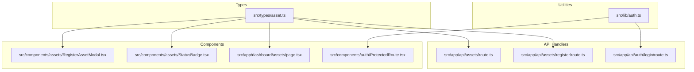
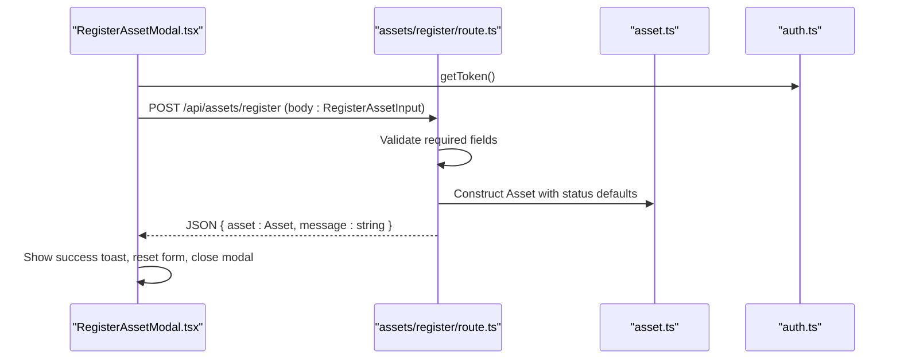
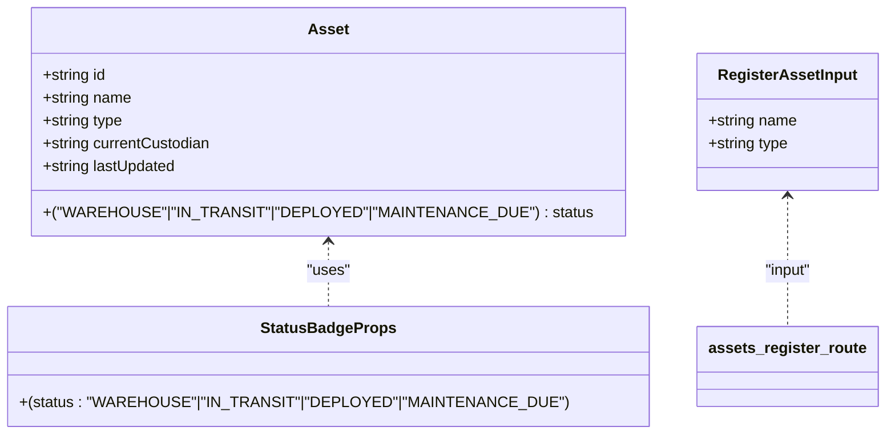
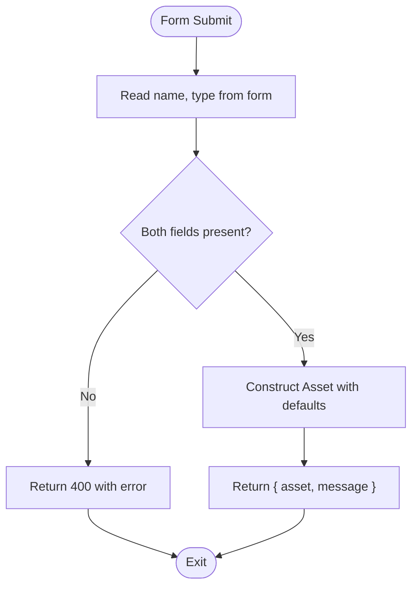
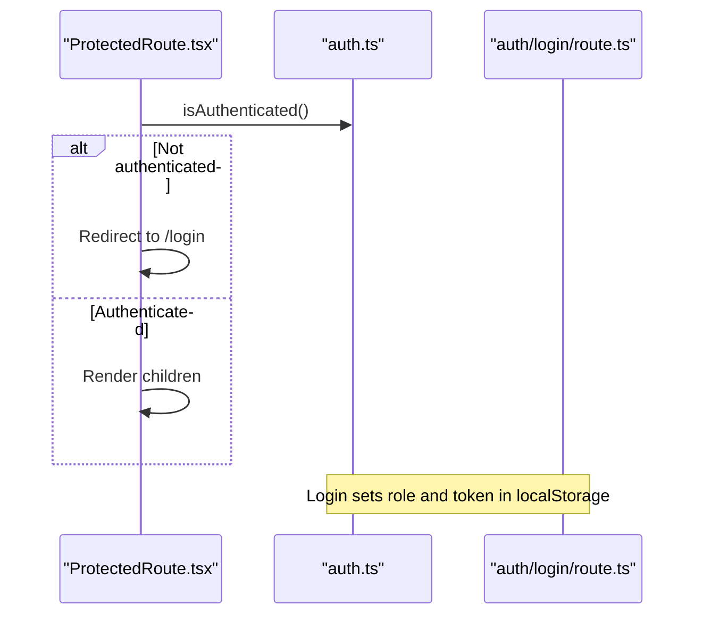
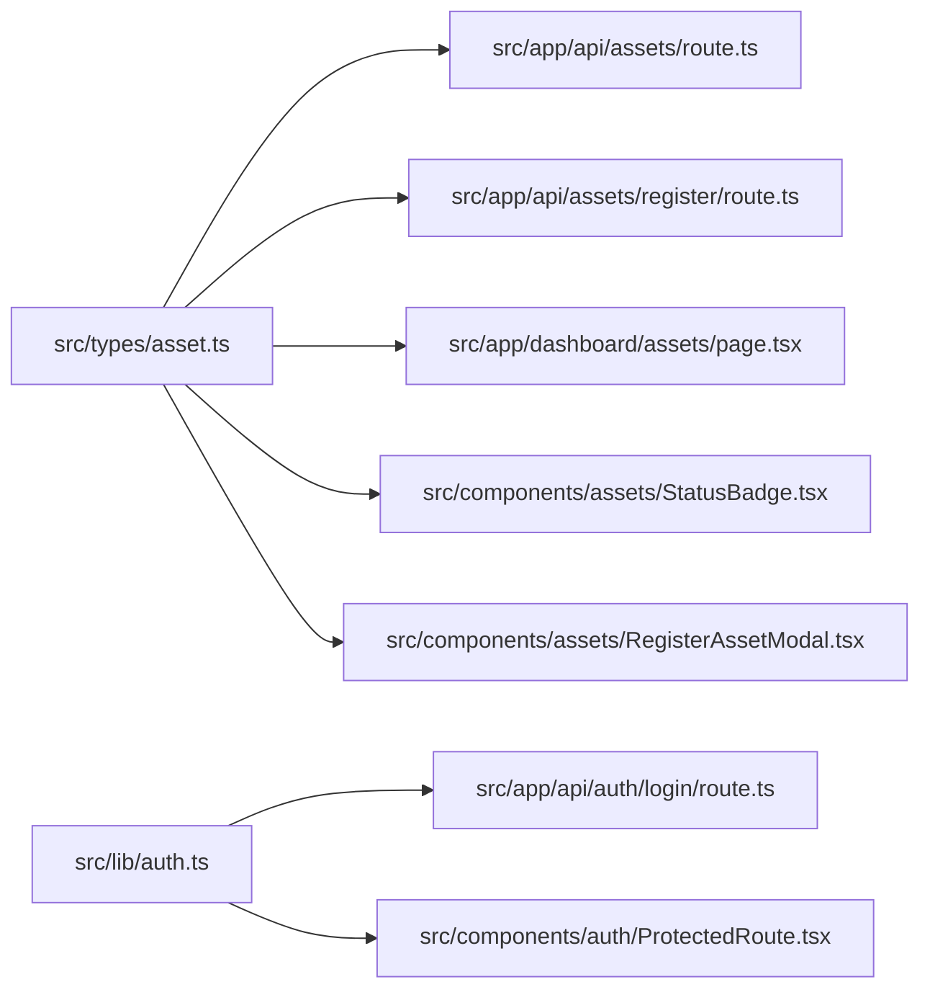

# Data Models & Types

<cite>
**Referenced Files in This Document**
- [asset.ts](file://src/types/asset.ts)
- [route.ts](file://src/app/api/assets/register/route.ts)
- [route.ts](file://src/app/api/assets/route.ts)
- [auth.ts](file://src/lib/auth.ts)
- [RegisterAssetModal.tsx](file://src/components/assets/RegisterAssetModal.tsx)
- [StatusBadge.tsx](file://src/components/assets/StatusBadge.tsx)
- [page.tsx](file://src/app/dashboard/assets/page.tsx)
- [route.ts](file://src/app/api/auth/login/route.ts)
- [ProtectedRoute.tsx](file://src/components/auth/ProtectedRoute.tsx)
- [package.json](file://package.json)
- [tsconfig.json](file://tsconfig.json)
</cite>

## Table of Contents
1. [Introduction](#introduction)
2. [Project Structure](#project-structure)
3. [Core Components](#core-components)
4. [Architecture Overview](#architecture-overview)
5. [Detailed Component Analysis](#detailed-component-analysis)
6. [Dependency Analysis](#dependency-analysis)
7. [Performance Considerations](#performance-considerations)
8. [Troubleshooting Guide](#troubleshooting-guide)
9. [Conclusion](#conclusion)
10. [Appendices](#appendices)

## Introduction
This document provides comprehensive data model documentation for ArmorTrack’s TypeScript interfaces and type definitions. It focuses on:
- The Asset interface and its properties, data types, validation rules, and business constraints
- The User interface for authentication data, roles, and permissions
- The RegisterAssetInput interface for form validation and API request handling
- TypeScript best practices, type safety patterns, and interface inheritance
- Validation strategies, enum-like status values, and date/time handling
- Examples of type usage across components, API handlers, and utility functions
- Guidelines for evolving types, migrations, and maintaining backward compatibility

## Project Structure
The data models are centralized under a dedicated types folder and consumed by API routes, components, and utilities. Strict type usage is enforced via the TypeScript compiler configuration.

**Diagram sources**
- [asset.ts:1-14](file://src/types/asset.ts#L1-L14)
- [route.ts:1-67](file://src/app/api/assets/route.ts#L1-L67)
- [route.ts:1-37](file://src/app/api/assets/register/route.ts#L1-L37)
- [route.ts:1-49](file://src/app/api/auth/login/route.ts#L1-L49)
- [RegisterAssetModal.tsx:1-123](file://src/components/assets/RegisterAssetModal.tsx#L1-L123)
- [StatusBadge.tsx:1-23](file://src/components/assets/StatusBadge.tsx#L1-L23)
- [page.tsx:1-145](file://src/app/dashboard/assets/page.tsx#L1-L145)
- [auth.ts:1-37](file://src/lib/auth.ts#L1-L37)
- [ProtectedRoute.tsx:1-32](file://src/components/auth/ProtectedRoute.tsx#L1-L32)

**Section sources**
- [asset.ts:1-14](file://src/types/asset.ts#L1-L14)
- [route.ts:1-67](file://src/app/api/assets/route.ts#L1-L67)
- [route.ts:1-37](file://src/app/api/assets/register/route.ts#L1-L37)
- [auth.ts:1-37](file://src/lib/auth.ts#L1-L37)
- [RegisterAssetModal.tsx:1-123](file://src/components/assets/RegisterAssetModal.tsx#L1-L123)
- [StatusBadge.tsx:1-23](file://src/components/assets/StatusBadge.tsx#L1-L23)
- [page.tsx:1-145](file://src/app/dashboard/assets/page.tsx#L1-L145)
- [route.ts:1-49](file://src/app/api/auth/login/route.ts#L1-L49)
- [ProtectedRoute.tsx:1-32](file://src/components/auth/ProtectedRoute.tsx#L1-L32)
- [package.json:1-31](file://package.json#L1-L31)
- [tsconfig.json:1-35](file://tsconfig.json#L1-L35)

## Core Components
This section documents the primary TypeScript interfaces and their usage across the application.

- Asset
  - Purpose: Represents a tracked military asset with lifecycle and custodial metadata
  - Properties:
    - id: string — Unique identifier for the asset
    - name: string — Human-readable asset name
    - type: string — Category/type of the asset
    - status: union literal of allowed statuses — See Status Values below
    - currentCustodian: string — Current custodial unit or person responsible
    - lastUpdated: string — ISO 8601 timestamp string
  - Validation rules and constraints:
    - Required fields: name, type
    - status must be one of the allowed literals
    - lastUpdated must be a valid ISO 8601 string
  - Business constraints:
    - status transitions are governed by application logic (not enforced here)
    - id generation is handled by the registration endpoint

- RegisterAssetInput
  - Purpose: Input shape for registering a new asset
  - Properties:
    - name: string — Required
    - type: string — Required
  - Validation rules:
    - Both fields are required for successful registration

- User
  - Purpose: Authentication and authorization payload
  - Properties:
    - email: string — User’s email address
    - name: string — Display name
    - role: string — Role string (e.g., ADMIN, AUDITOR, WAREHOUSE, TRANSPORTER, MANUFACTURER)

- Status Values
  - Allowed values: WAREHOUSE, IN_TRANSIT, DEPLOYED, MAINTENANCE_DUE
  - Used consistently across Asset.status and StatusBadge props

**Section sources**
- [asset.ts:1-14](file://src/types/asset.ts#L1-L14)
- [route.ts:9-14](file://src/app/api/assets/register/route.ts#L9-L14)
- [route.ts:5-46](file://src/app/api/assets/route.ts#L5-L46)
- [StatusBadge.tsx:3-5](file://src/components/assets/StatusBadge.tsx#L3-L5)
- [auth.ts:1-5](file://src/lib/auth.ts#L1-L5)
- [route.ts:27-32](file://src/app/api/auth/login/route.ts#L27-L32)

## Architecture Overview
The data model architecture enforces strong typing across the frontend and backend. Components consume typed data, API routes produce typed responses, and utilities handle authentication tokens and roles.

**Diagram sources**
- [RegisterAssetModal.tsx:16-51](file://src/components/assets/RegisterAssetModal.tsx#L16-L51)
- [route.ts:4-36](file://src/app/api/assets/register/route.ts#L4-L36)
- [asset.ts:1-14](file://src/types/asset.ts#L1-L14)
- [auth.ts:7-22](file://src/lib/auth.ts#L7-L22)

## Detailed Component Analysis

### Asset Interface
- Definition location: [asset.ts:1-8](file://src/types/asset.ts#L1-L8)
- Consumers:
  - API GET handler: [route.ts:5-46](file://src/app/api/assets/route.ts#L5-L46)
  - Dashboard page rendering: [page.tsx:11-24](file://src/app/dashboard/assets/page.tsx#L11-L24)
  - Status badge component: [StatusBadge.tsx:14-22](file://src/components/assets/StatusBadge.tsx#L14-L22)
- Usage patterns:
  - Strongly typed arrays and individual instances
  - Filtering and rendering in the assets dashboard
  - Status rendering via a dedicated component

**Diagram sources**
- [asset.ts:1-14](file://src/types/asset.ts#L1-L14)
- [StatusBadge.tsx:3-5](file://src/components/assets/StatusBadge.tsx#L3-L5)
- [route.ts:10-13](file://src/app/api/assets/register/route.ts#L10-L13)

**Section sources**
- [asset.ts:1-14](file://src/types/asset.ts#L1-L14)
- [route.ts:5-46](file://src/app/api/assets/route.ts#L5-L46)
- [page.tsx:11-24](file://src/app/dashboard/assets/page.tsx#L11-L24)
- [StatusBadge.tsx:14-22](file://src/components/assets/StatusBadge.tsx#L14-L22)

### RegisterAssetInput Interface
- Definition location: [asset.ts:10-13](file://src/types/asset.ts#L10-L13)
- Validation and API handling:
  - Required field checks in the registration route: [route.ts:9-14](file://src/app/api/assets/register/route.ts#L9-L14)
  - Frontend form submission: [RegisterAssetModal.tsx:16-51](file://src/components/assets/RegisterAssetModal.tsx#L16-L51)
- Best practices:
  - Keep input shape minimal and aligned with backend expectations
  - Centralize validation logic in the API route for consistency

**Diagram sources**
- [RegisterAssetModal.tsx:16-51](file://src/components/assets/RegisterAssetModal.tsx#L16-L51)
- [route.ts:9-14](file://src/app/api/assets/register/route.ts#L9-L14)
- [asset.ts:10-13](file://src/types/asset.ts#L10-L13)

**Section sources**
- [asset.ts:10-13](file://src/types/asset.ts#L10-L13)
- [route.ts:9-14](file://src/app/api/assets/register/route.ts#L9-L14)
- [RegisterAssetModal.tsx:16-51](file://src/components/assets/RegisterAssetModal.tsx#L16-L51)

### User Interface and Authentication Utilities
- Definition location: [auth.ts:1-5](file://src/lib/auth.ts#L1-L5)
- Token and role utilities:
  - Token retrieval, storage, removal: [auth.ts:7-22](file://src/lib/auth.ts#L7-L22)
  - Role retrieval and storage: [auth.ts:24-32](file://src/lib/auth.ts#L24-L32)
  - Authentication guard usage: [ProtectedRoute.tsx:11-17](file://src/components/auth/ProtectedRoute.tsx#L11-L17)
- Login endpoint demonstrates role assignment logic: [route.ts:27-32](file://src/app/api/auth/login/route.ts#L27-L32)

**Diagram sources**
- [ProtectedRoute.tsx:7-17](file://src/components/auth/ProtectedRoute.tsx#L7-L17)
- [auth.ts:34-36](file://src/lib/auth.ts#L34-L36)
- [route.ts:27-32](file://src/app/api/auth/login/route.ts#L27-L32)

**Section sources**
- [auth.ts:1-37](file://src/lib/auth.ts#L1-L37)
- [ProtectedRoute.tsx:1-32](file://src/components/auth/ProtectedRoute.tsx#L1-L32)
- [route.ts:1-49](file://src/app/api/auth/login/route.ts#L1-L49)

### StatusBadge Component
- Props type mirrors Asset.status: [StatusBadge.tsx:3-5](file://src/components/assets/StatusBadge.tsx#L3-L5)
- Color and label mapping ensures consistent UI semantics for each status

**Section sources**
- [StatusBadge.tsx:1-23](file://src/components/assets/StatusBadge.tsx#L1-L23)

### Assets Dashboard Page
- Consumes Asset array and renders status via StatusBadge: [page.tsx:11-24](file://src/app/dashboard/assets/page.tsx#L11-L24)
- Filters assets by id/name using Asset properties: [page.tsx:37-41](file://src/app/dashboard/assets/page.tsx#L37-L41)

**Section sources**
- [page.tsx:1-145](file://src/app/dashboard/assets/page.tsx#L1-L145)

## Dependency Analysis
The following diagram shows how types are consumed by components and API routes.

**Diagram sources**
- [asset.ts:1-14](file://src/types/asset.ts#L1-L14)
- [route.ts:1-67](file://src/app/api/assets/route.ts#L1-L67)
- [route.ts:1-37](file://src/app/api/assets/register/route.ts#L1-L37)
- [page.tsx:1-145](file://src/app/dashboard/assets/page.tsx#L1-L145)
- [StatusBadge.tsx:1-23](file://src/components/assets/StatusBadge.tsx#L1-L23)
- [RegisterAssetModal.tsx:1-123](file://src/components/assets/RegisterAssetModal.tsx#L1-L123)
- [auth.ts:1-37](file://src/lib/auth.ts#L1-L37)
- [route.ts:1-49](file://src/app/api/auth/login/route.ts#L1-L49)
- [ProtectedRoute.tsx:1-32](file://src/components/auth/ProtectedRoute.tsx#L1-L32)

**Section sources**
- [asset.ts:1-14](file://src/types/asset.ts#L1-L14)
- [route.ts:1-67](file://src/app/api/assets/route.ts#L1-L67)
- [route.ts:1-37](file://src/app/api/assets/register/route.ts#L1-L37)
- [page.tsx:1-145](file://src/app/dashboard/assets/page.tsx#L1-L145)
- [StatusBadge.tsx:1-23](file://src/components/assets/StatusBadge.tsx#L1-L23)
- [RegisterAssetModal.tsx:1-123](file://src/components/assets/RegisterAssetModal.tsx#L1-L123)
- [auth.ts:1-37](file://src/lib/auth.ts#L1-L37)
- [route.ts:1-49](file://src/app/api/auth/login/route.ts#L1-L49)
- [ProtectedRoute.tsx:1-32](file://src/components/auth/ProtectedRoute.tsx#L1-L32)

## Performance Considerations
- Prefer union literal types for status to enable compile-time checks and efficient runtime switches
- Keep Asset.lastUpdated as a string (ISO 8601) to avoid heavy parsing; parse only when rendering
- Memoize derived computations (e.g., filtered assets) to reduce re-renders in large lists
- Centralize validation in API routes to minimize redundant checks in components

## Troubleshooting Guide
Common issues and resolutions:
- Missing required fields during registration:
  - Symptom: 400 error indicating missing name or type
  - Resolution: Ensure RegisterAssetInput is fully populated before sending the request
  - Reference: [route.ts:9-14](file://src/app/api/assets/register/route.ts#L9-L14)
- Incorrect status value:
  - Symptom: Type errors or unexpected UI behavior
  - Resolution: Use only allowed status literals
  - Reference: [asset.ts](file://src/types/asset.ts#L5)
- Authentication failures:
  - Symptom: ProtectedRoute redirects to login
  - Resolution: Verify token presence and validity; confirm login endpoint role assignment
  - References: [ProtectedRoute.tsx:11-17](file://src/components/auth/ProtectedRoute.tsx#L11-L17), [route.ts:27-32](file://src/app/api/auth/login/route.ts#L27-L32)
- Date parsing inconsistencies:
  - Symptom: Incorrect time display in dashboards
  - Resolution: Ensure lastUpdated is stored as ISO 8601 string and parsed only for display
  - Reference: [page.tsx:128-129](file://src/app/dashboard/assets/page.tsx#L128-L129)

**Section sources**
- [route.ts:9-14](file://src/app/api/assets/register/route.ts#L9-L14)
- [asset.ts](file://src/types/asset.ts#L5)
- [ProtectedRoute.tsx:11-17](file://src/components/auth/ProtectedRoute.tsx#L11-L17)
- [route.ts:27-32](file://src/app/api/auth/login/route.ts#L27-L32)
- [page.tsx:128-129](file://src/app/dashboard/assets/page.tsx#L128-L129)

## Conclusion
ArmorTrack’s data models emphasize explicit, minimal interfaces with strict validation at the API boundary and consistent consumption across components. The union literal status type and ISO 8601 timestamps provide predictable behavior and strong type safety. Following the guidelines below will help maintain and evolve the type system effectively.

## Appendices

### TypeScript Best Practices Observed
- Strict mode enabled via compiler options: [tsconfig.json](file://tsconfig.json#L7)
- Path aliases configured for clean imports: [tsconfig.json:21-23](file://tsconfig.json#L21-L23)
- Minimal, focused interfaces with single responsibilities
- Centralized validation in API routes to keep components free of business logic
- Union literal types for enumerations (status) to prevent invalid values

**Section sources**
- [tsconfig.json:1-35](file://tsconfig.json#L1-L35)

### Extending Data Models: Guidelines
- Adding new properties to Asset:
  - Define the property in the Asset interface
  - Update API handlers to populate the new field
  - Update components to render or consume the new field
  - Reference: [asset.ts:1-8](file://src/types/asset.ts#L1-L8)
- Introducing new enums or union literals:
  - Prefer union literals for small, fixed sets (as with status)
  - Use separate enums for larger domains requiring richer operations
- Backward compatibility:
  - Avoid removing required fields; mark new optional fields as such
  - Provide default values in API handlers for new optional fields
- Migration strategies:
  - Version APIs (e.g., /api/v1/assets) while keeping v1 endpoints
  - Gradually update clients after deprecation windows
  - Maintain old type definitions temporarily for legacy consumers

**Section sources**
- [asset.ts:1-14](file://src/types/asset.ts#L1-L14)
- [route.ts:17-24](file://src/app/api/assets/register/route.ts#L17-L24)
- [route.ts:5-46](file://src/app/api/assets/route.ts#L5-L46)

### Example Usage Locations
- API handlers:
  - Registration: [route.ts:4-36](file://src/app/api/assets/register/route.ts#L4-L36)
  - Listing: [route.ts:48-66](file://src/app/api/assets/route.ts#L48-L66)
- Components:
  - Registration modal: [RegisterAssetModal.tsx:16-51](file://src/components/assets/RegisterAssetModal.tsx#L16-L51)
  - Status badge: [StatusBadge.tsx:14-22](file://src/components/assets/StatusBadge.tsx#L14-L22)
  - Assets dashboard: [page.tsx:15-30](file://src/app/dashboard/assets/page.tsx#L15-L30)
- Utilities:
  - Authentication: [auth.ts:7-36](file://src/lib/auth.ts#L7-L36)
  - Protected route: [ProtectedRoute.tsx:11-17](file://src/components/auth/ProtectedRoute.tsx#L11-L17)

**Section sources**
- [route.ts:4-36](file://src/app/api/assets/register/route.ts#L4-L36)
- [route.ts:48-66](file://src/app/api/assets/route.ts#L48-L66)
- [RegisterAssetModal.tsx:16-51](file://src/components/assets/RegisterAssetModal.tsx#L16-L51)
- [StatusBadge.tsx:14-22](file://src/components/assets/StatusBadge.tsx#L14-L22)
- [page.tsx:15-30](file://src/app/dashboard/assets/page.tsx#L15-L30)
- [auth.ts:7-36](file://src/lib/auth.ts#L7-L36)
- [ProtectedRoute.tsx:11-17](file://src/components/auth/ProtectedRoute.tsx#L11-L17)