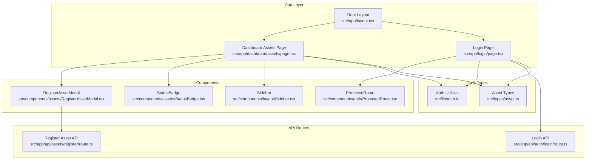
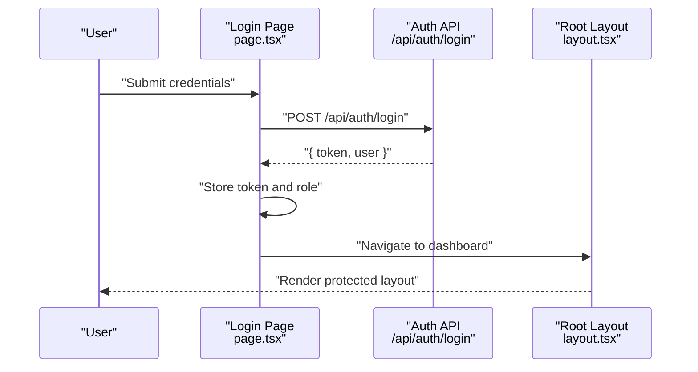
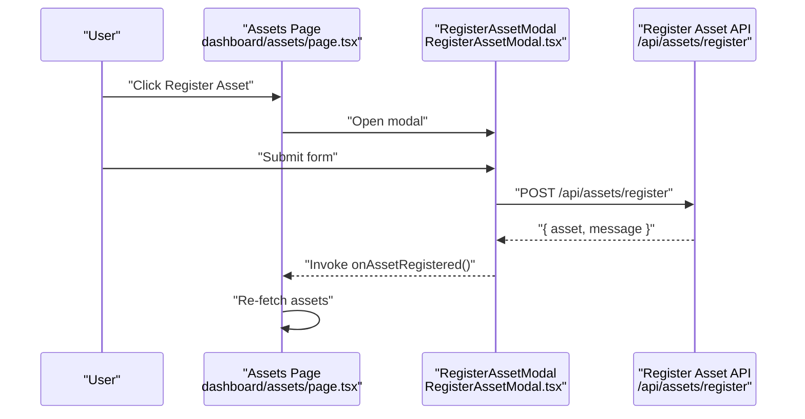
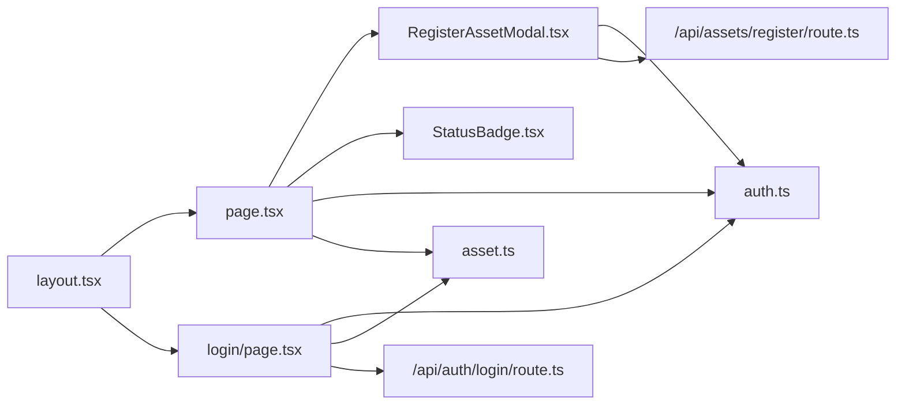

# Development Guidelines

<cite>
**Referenced Files in This Document**
- [README.md](file://README.md)
- [package.json](file://package.json)
- [tsconfig.json](file://tsconfig.json)
- [eslint.config.mjs](file://eslint.config.mjs)
- [next.config.ts](file://next.config.ts)
- [src/app/layout.tsx](file://src/app/layout.tsx)
- [src/app/login/page.tsx](file://src/app/login/page.tsx)
- [src/app/dashboard/assets/page.tsx](file://src/app/dashboard/assets/page.tsx)
- [src/app/api/assets/register/route.ts](file://src/app/api/assets/register/route.ts)
- [src/app/api/auth/login/route.ts](file://src/app/api/auth/login/route.ts)
- [src/lib/auth.ts](file://src/lib/auth.ts)
- [src/types/asset.ts](file://src/types/asset.ts)
- [src/components/assets/RegisterAssetModal.tsx](file://src/components/assets/RegisterAssetModal.tsx)
- [src/components/assets/StatusBadge.tsx](file://src/components/assets/StatusBadge.tsx)
- [src/components/auth/ProtectedRoute.tsx](file://src/components/auth/ProtectedRoute.tsx)
- [src/components/layout/Sidebar.tsx](file://src/components/layout/Sidebar.tsx)
</cite>

## Table of Contents
1. [Introduction](#introduction)
2. [Project Structure](#project-structure)
3. [Core Components](#core-components)
4. [Architecture Overview](#architecture-overview)
5. [Detailed Component Analysis](#detailed-component-analysis)
6. [Dependency Analysis](#dependency-analysis)
7. [Performance Considerations](#performance-considerations)
8. [Testing Strategies](#testing-strategies)
9. [Build and Deployment](#build-and-deployment)
10. [Code Review and Contribution Workflow](#code-review-and-contribution-workflow)
11. [Debugging and Troubleshooting](#debugging-and-troubleshooting)
12. [Appendices](#appendices)

## Introduction
This document provides comprehensive development guidelines for contributing to ArmorTrack. It covers code organization principles, component development standards, architectural patterns, TypeScript best practices, ESLint and formatting standards, component development guidelines, testing strategies, build configuration, Next.js optimization settings, deployment preparation, code review processes, and debugging techniques. The goal is to ensure consistent, maintainable, and secure development across the project.

## Project Structure
ArmorTrack follows a Next.js App Router structure with a clear separation of concerns:
- Application pages under src/app
- Shared UI components under src/components
- Utilities and authentication helpers under src/lib
- Type definitions under src/types
- Global styles and root layout under src/app
- API routes under src/app/api

Key characteristics:
- Strict TypeScript configuration with path aliases
- ESLint configured via the Next.js shared config
- Minimal Next.js configuration scaffold
- Tailwind CSS v4 integration via Tailwind PostCSS plugin

**Diagram sources**
- [src/app/layout.tsx:1-49](file://src/app/layout.tsx#L1-L49)
- [src/app/dashboard/assets/page.tsx:1-145](file://src/app/dashboard/assets/page.tsx#L1-L145)
- [src/app/login/page.tsx:1-139](file://src/app/login/page.tsx#L1-L139)
- [src/components/assets/RegisterAssetModal.tsx:1-123](file://src/components/assets/RegisterAssetModal.tsx#L1-L123)
- [src/components/assets/StatusBadge.tsx:1-23](file://src/components/assets/StatusBadge.tsx#L1-L23)
- [src/components/layout/Sidebar.tsx:1-90](file://src/components/layout/Sidebar.tsx#L1-L90)
- [src/components/auth/ProtectedRoute.tsx:1-32](file://src/components/auth/ProtectedRoute.tsx#L1-L32)
- [src/lib/auth.ts:1-37](file://src/lib/auth.ts#L1-L37)
- [src/types/asset.ts:1-14](file://src/types/asset.ts#L1-L14)
- [src/app/api/assets/register/route.ts:1-37](file://src/app/api/assets/register/route.ts#L1-L37)
- [src/app/api/auth/login/route.ts:1-49](file://src/app/api/auth/login/route.ts#L1-L49)

**Section sources**
- [README.md:1-37](file://README.md#L1-L37)
- [package.json:1-31](file://package.json#L1-L31)
- [tsconfig.json:1-35](file://tsconfig.json#L1-L35)
- [eslint.config.mjs:1-19](file://eslint.config.mjs#L1-L19)
- [next.config.ts:1-8](file://next.config.ts#L1-L8)
- [src/app/layout.tsx:1-49](file://src/app/layout.tsx#L1-L49)

## Core Components
This section outlines the foundational building blocks and their responsibilities:
- Authentication utilities: token and role management, authentication checks
- Asset types: strongly typed asset and registration input interfaces
- UI components: reusable presentational components for status and modals
- Pages: client-side pages orchestrating data fetching and rendering
- API routes: serverless endpoints implementing business logic

Guidelines:
- Keep components small, single-responsibility, and composable
- Prefer props interfaces over inline object types for clarity and reuse
- Centralize shared logic in lib modules (e.g., auth)
- Use strict typing for all props and state
- Enforce type safety at boundaries (API payloads, form submissions)

**Section sources**
- [src/lib/auth.ts:1-37](file://src/lib/auth.ts#L1-L37)
- [src/types/asset.ts:1-14](file://src/types/asset.ts#L1-L14)
- [src/components/assets/StatusBadge.tsx:1-23](file://src/components/assets/StatusBadge.tsx#L1-L23)
- [src/components/assets/RegisterAssetModal.tsx:1-123](file://src/components/assets/RegisterAssetModal.tsx#L1-L123)
- [src/app/dashboard/assets/page.tsx:1-145](file://src/app/dashboard/assets/page.tsx#L1-L145)
- [src/app/api/assets/register/route.ts:1-37](file://src/app/api/assets/register/route.ts#L1-L37)

## Architecture Overview
The system follows a client-server split:
- Client pages handle UI, routing, and local state
- API routes encapsulate server logic and data generation
- Authentication flows are handled via client-side forms and serverless endpoints
- Shared components render UI consistently across pages

**Diagram sources**
- [src/app/login/page.tsx:1-139](file://src/app/login/page.tsx#L1-L139)
- [src/app/api/auth/login/route.ts:1-49](file://src/app/api/auth/login/route.ts#L1-L49)
- [src/app/layout.tsx:1-49](file://src/app/layout.tsx#L1-L49)

**Diagram sources**
- [src/app/dashboard/assets/page.tsx:1-145](file://src/app/dashboard/assets/page.tsx#L1-L145)
- [src/components/assets/RegisterAssetModal.tsx:1-123](file://src/components/assets/RegisterAssetModal.tsx#L1-L123)
- [src/app/api/assets/register/route.ts:1-37](file://src/app/api/assets/register/route.ts#L1-L37)

## Detailed Component Analysis

### Authentication Utilities
- Responsibilities: token storage/retrieval, role management, authentication checks
- Best practices:
  - Guard against SSR by checking for window availability
  - Clear related keys together to avoid inconsistent state
  - Export minimal, focused functions for easy testing

**Section sources**
- [src/lib/auth.ts:1-37](file://src/lib/auth.ts#L1-L37)

### Asset Types
- Responsibilities: define shape of asset records and registration inputs
- Best practices:
  - Use union literal types for constrained enums
  - Keep input interfaces separate from persisted entity shapes
  - Centralize types to prevent drift across modules

**Section sources**
- [src/types/asset.ts:1-14](file://src/types/asset.ts#L1-L14)

### StatusBadge Component
- Responsibilities: render status with appropriate styling
- Best practices:
  - Use a configuration map for status-to-styling mapping
  - Accept only allowed status values via union literal types
  - Keep component pure and deterministic

**Section sources**
- [src/components/assets/StatusBadge.tsx:1-23](file://src/components/assets/StatusBadge.tsx#L1-L23)

### RegisterAssetModal Component
- Responsibilities: capture inputs, submit to API, show feedback, notify parent to refresh data
- Best practices:
  - Use form submission handlers and controlled inputs
  - Manage loading state and error handling
  - Use dialog element APIs for modal lifecycle
  - Keep props minimal and explicit

**Section sources**
- [src/components/assets/RegisterAssetModal.tsx:1-123](file://src/components/assets/RegisterAssetModal.tsx#L1-L123)

### ProtectedRoute Component
- Responsibilities: enforce authentication guard during client navigation
- Best practices:
  - Perform checks on mount and after navigation
  - Render a loading state while verifying
  - Redirect unauthenticated users to login

**Section sources**
- [src/components/auth/ProtectedRoute.tsx:1-32](file://src/components/auth/ProtectedRoute.tsx#L1-L32)

### Sidebar Component
- Responsibilities: render role-aware navigation
- Best practices:
  - Define permissions centrally
  - Use Lucide icons for consistent UX
  - Compute active state from path

**Section sources**
- [src/components/layout/Sidebar.tsx:1-90](file://src/components/layout/Sidebar.tsx#L1-L90)

### Assets Page
- Responsibilities: fetch assets, filter, render table, open modal
- Best practices:
  - Fetch on mount and re-fetch after mutations
  - Use controlled inputs for search
  - Render loading states and empty states

**Section sources**
- [src/app/dashboard/assets/page.tsx:1-145](file://src/app/dashboard/assets/page.tsx#L1-L145)

### Login Page
- Responsibilities: collect credentials, call login API, persist tokens, navigate
- Best practices:
  - Validate presence of required fields
  - Handle errors gracefully and surface messages
  - Disable button during submission

**Section sources**
- [src/app/login/page.tsx:1-139](file://src/app/login/page.tsx#L1-L139)

### API Routes
- Register Asset API: validates payload, generates mock asset, returns structured response
- Login API: validates credentials, determines role, returns token and user info
- Best practices:
  - Validate inputs early and return appropriate HTTP status codes
  - Return consistent JSON structures for success and error
  - Avoid exposing secrets; replace with secure JWT signing in production

**Section sources**
- [src/app/api/assets/register/route.ts:1-37](file://src/app/api/assets/register/route.ts#L1-L37)
- [src/app/api/auth/login/route.ts:1-49](file://src/app/api/auth/login/route.ts#L1-L49)

## Dependency Analysis
- Internal dependencies:
  - Pages depend on components and lib modules
  - Components depend on lib modules and shared types
  - API routes depend on shared types
- External dependencies:
  - Next.js runtime and App Router
  - React and React DOM
  - Tailwind CSS v4 and DaisyUI
  - lucide-react for icons
  - react-hot-toast for notifications

**Diagram sources**
- [src/app/dashboard/assets/page.tsx:1-145](file://src/app/dashboard/assets/page.tsx#L1-L145)
- [src/app/login/page.tsx:1-139](file://src/app/login/page.tsx#L1-L139)
- [src/components/assets/RegisterAssetModal.tsx:1-123](file://src/components/assets/RegisterAssetModal.tsx#L1-L123)
- [src/components/assets/StatusBadge.tsx:1-23](file://src/components/assets/StatusBadge.tsx#L1-L23)
- [src/lib/auth.ts:1-37](file://src/lib/auth.ts#L1-L37)
- [src/types/asset.ts:1-14](file://src/types/asset.ts#L1-L14)
- [src/app/api/assets/register/route.ts:1-37](file://src/app/api/assets/register/route.ts#L1-L37)
- [src/app/api/auth/login/route.ts:1-49](file://src/app/api/auth/login/route.ts#L1-L49)
- [src/app/layout.tsx:1-49](file://src/app/layout.tsx#L1-L49)

**Section sources**
- [package.json:1-31](file://package.json#L1-L31)

## Performance Considerations
- Client-side rendering:
  - Keep components pure and memoize expensive computations
  - Defer heavy work to background threads or server when possible
- Data fetching:
  - Use controlled inputs and avoid unnecessary re-renders
  - Implement efficient filtering on the client for small datasets
- UI responsiveness:
  - Disable buttons during async operations
  - Show loading spinners and skeleton states
- Fonts and assets:
  - Leverage Next.js automatic font optimization
  - Minimize unused CSS via Tailwind purging

[No sources needed since this section provides general guidance]

## Testing Strategies
Recommended testing approach:
- Unit tests for pure functions (e.g., auth helpers):
  - Verify token retrieval, setting, clearing, and authentication checks
  - Test boundary conditions (SSR guards, missing keys)
- Component tests:
  - Use a testing library to render components with props
  - Simulate user interactions (form submission, modal open/close)
  - Assert rendered output and emitted events
- API route tests:
  - Validate input validation and error responses
  - Verify successful payload construction and response shape
- Integration tests:
  - End-to-end flows for login and asset registration
  - Mock external services and network requests

[No sources needed since this section provides general guidance]

## Build and Deployment
- Build configuration:
  - Next.js build pipeline handles transpilation, bundling, and optimization
  - TypeScript strict mode enforces type safety during build
- Optimization settings:
  - Next.js App Router with React Server Components
  - Automatic font optimization and image optimization
  - Tailwind CSS v4 with PostCSS pipeline
- Deployment preparation:
  - Ensure environment variables are configured for production
  - Verify API routes are compatible with hosting platform
  - Confirm static export compatibility if applicable

**Section sources**
- [package.json:1-31](file://package.json#L1-L31)
- [tsconfig.json:1-35](file://tsconfig.json#L1-L35)
- [next.config.ts:1-8](file://next.config.ts#L1-L8)
- [README.md:32-37](file://README.md#L32-L37)

## Code Review and Contribution Workflow
Workflow guidelines:
- Branching:
  - Feature branches per task; keep commits atomic and focused
- Pull requests:
  - Include summary, rationale, and screenshots for UI changes
  - Reference related issues and include test coverage updates
- Reviews:
  - Focus on correctness, readability, maintainability, and security
  - Ensure type safety and adherence to component patterns
- Conventions:
  - Use imperative commit messages
  - Keep PRs small and self-contained

[No sources needed since this section provides general guidance]

## Debugging and Troubleshooting
Common issues and resolutions:
- Authentication failures:
  - Verify token storage and presence in requests
  - Check role-based navigation and sidebar visibility
- API errors:
  - Inspect request payloads and required fields
  - Validate response status and error messages
- UI issues:
  - Confirm modal lifecycle and dialog element usage
  - Check Tailwind classes and theme configuration
- Type errors:
  - Ensure props match declared interfaces
  - Validate API response shapes against types

**Section sources**
- [src/lib/auth.ts:1-37](file://src/lib/auth.ts#L1-L37)
- [src/app/api/auth/login/route.ts:1-49](file://src/app/api/auth/login/route.ts#L1-L49)
- [src/components/assets/RegisterAssetModal.tsx:1-123](file://src/components/assets/RegisterAssetModal.tsx#L1-L123)
- [src/app/layout.tsx:1-49](file://src/app/layout.tsx#L1-L49)

## Appendices

### TypeScript Best Practices
- Interfaces and types:
  - Define props interfaces for all components
  - Use union literal types for constrained enums
  - Keep shared types in a dedicated module
- Type safety enforcement:
  - Enable strict mode and incremental builds
  - Avoid type assertions; prefer narrowing and validation
- Coding conventions:
  - Use camelCase for identifiers
  - Prefer readonly props and immutable state updates
  - Group related exports and keep modules cohesive

**Section sources**
- [tsconfig.json:1-35](file://tsconfig.json#L1-L35)
- [src/types/asset.ts:1-14](file://src/types/asset.ts#L1-L14)
- [src/components/assets/StatusBadge.tsx:1-23](file://src/components/assets/StatusBadge.tsx#L1-L23)

### ESLint and Formatting Standards
- Configuration:
  - Next.js core-web-vitals and TypeScript configs applied
  - Overrides to customize ignores and rules
- Formatting:
  - Use Prettier-compatible defaults enforced by ESLint
  - Maintain consistent indentation and spacing
- Linting rules:
  - Disallow unused variables and unreachable code
  - Enforce consistent prop interfaces and component signatures

**Section sources**
- [eslint.config.mjs:1-19](file://eslint.config.mjs#L1-L19)
- [package.json:20-29](file://package.json#L20-L29)

### Component Development Guidelines
- Props interfaces:
  - Define explicit interfaces for all component props
  - Use optional props sparingly; prefer defaults
- State management:
  - Prefer local component state for UI-only state
  - Lift state up when sharing across components
- Performance:
  - Memoize derived data and callbacks
  - Avoid unnecessary re-renders with stable references
- Accessibility:
  - Use semantic HTML and ARIA attributes where needed
  - Ensure keyboard navigation support

**Section sources**
- [src/components/assets/RegisterAssetModal.tsx:1-123](file://src/components/assets/RegisterAssetModal.tsx#L1-L123)
- [src/app/dashboard/assets/page.tsx:1-145](file://src/app/dashboard/assets/page.tsx#L1-L145)

### API Route Patterns
- Request validation:
  - Validate required fields and types
  - Return appropriate HTTP status codes
- Response shaping:
  - Use consistent success/error structures
  - Include messages and data payloads
- Security:
  - Sanitize inputs and avoid exposing internal details
  - Implement rate limiting and input sanitization in production

**Section sources**
- [src/app/api/assets/register/route.ts:1-37](file://src/app/api/assets/register/route.ts#L1-L37)
- [src/app/api/auth/login/route.ts:1-49](file://src/app/api/auth/login/route.ts#L1-L49)