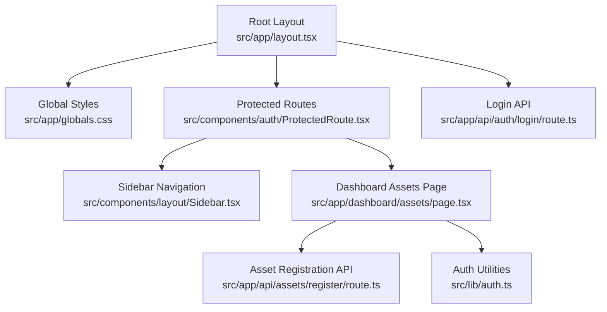

# Getting Started

<cite>
**Referenced Files in This Document**
- [README.md](file://README.md)
- [package.json](file://package.json)
- [next.config.ts](file://next.config.ts)
- [tsconfig.json](file://tsconfig.json)
- [postcss.config.mjs](file://postcss.config.mjs)
- [eslint.config.mjs](file://eslint.config.mjs)
- [src/app/layout.tsx](file://src/app/layout.tsx)
- [src/app/globals.css](file://src/app/globals.css)
- [src/app/api/auth/login/route.ts](file://src/app/api/auth/login/route.ts)
- [src/app/api/assets/register/route.ts](file://src/app/api/assets/register/route.ts)
- [src/app/dashboard/assets/page.tsx](file://src/app/dashboard/assets/page.tsx)
- [src/components/layout/Sidebar.tsx](file://src/components/layout/Sidebar.tsx)
- [src/components/auth/ProtectedRoute.tsx](file://src/components/auth/ProtectedRoute.tsx)
- [src/lib/auth.ts](file://src/lib/auth.ts)
- [AGENTS.md](file://AGENTS.md)
</cite>

## Table of Contents
1. [Introduction](#introduction)
2. [Prerequisites](#prerequisites)
3. [Installation](#installation)
4. [Development Server](#development-server)
5. [Accessing the Application](#accessing-the-application)
6. [Initial Configuration](#initial-configuration)
7. [Project Structure Overview](#project-structure-overview)
8. [Understanding the Codebase](#understanding-the-codebase)
9. [Browser Compatibility](#browser-compatibility)
10. [Recommended Development Tools](#recommended-development-tools)
11. [Troubleshooting](#troubleshooting)
12. [Conclusion](#conclusion)

## Introduction
ArmorTrack is a Next.js application designed for military asset tracking and management. It provides a modern web interface with role-based navigation, asset registration, and live dashboard views. This guide helps you install, configure, and run the project locally, and offers practical tips for first-time contributors.

## Prerequisites
- Operating system: Windows, macOS, or Linux
- Node.js version: The project uses Next.js 16.2.2 and TypeScript 5. Ensure your Node.js version is compatible with these dependencies. While the exact minimum Node.js version is not explicitly declared in the repository, Next.js 16.x typically requires Node.js 18.x or newer. Verify your Node.js version before proceeding.
- Package managers: The project supports multiple package managers. You can use npm, yarn, pnpm, or bun to install dependencies and run scripts.
- Git: Required to clone the repository.

Notes:
- The repository includes a note indicating that this Next.js version has breaking changes and differs from typical training data. Review the included agent rules before writing code.

**Section sources**
- [package.json:11-19](file://package.json#L11-L19)
- [package.json:20-29](file://package.json#L20-L29)
- [AGENTS.md:1-6](file://AGENTS.md#L1-L6)

## Installation
Follow these steps to set up ArmorTrack locally:

1. Clone the repository
   - Use Git to clone the repository to your local machine.
   - Example command: git clone <repository-url>

2. Navigate to the project directory
   - Change into the project folder after cloning.

3. Install dependencies
   - Choose one of the supported package managers to install dependencies:
     - npm: npm install
     - yarn: yarn install
     - pnpm: pnpm install
     - bun: bun install

4. Verify installation
   - After installation completes, confirm that the development server script is available in the package scripts.

**Section sources**
- [README.md:3-17](file://README.md#L3-L17)
- [package.json:5-10](file://package.json#L5-L10)

## Development Server
Start the Next.js development server using any of the supported package managers:

- npm: npm run dev
- yarn: yarn dev
- pnpm: pnpm dev
- bun: bun dev

The development server runs on port 3000 by default. The server will transpile TypeScript, apply Tailwind CSS via PostCSS, and hot-reload changes during development.

Environment variables:
- There are no environment variables configured in the repository. The application does not require additional environment configuration for local development.

**Section sources**
- [README.md:5-15](file://README.md#L5-L15)
- [package.json:5-10](file://package.json#L5-L10)
- [next.config.ts:1-8](file://next.config.ts#L1-L8)

## Accessing the Application
Once the development server is running, open your browser and navigate to:
- http://localhost:3000

You should see the application’s home page. From here:
- Explore the dashboard and asset management features.
- Use the sidebar navigation to move between sections based on your role.
- Try logging in to trigger protected routes and role-based visibility.

Verification checklist:
- The page loads without errors.
- Fonts and theme styles are applied.
- Toast notifications appear for user actions.

**Section sources**
- [README.md:17](file://README.md#L17)
- [src/app/layout.tsx:16-19](file://src/app/layout.tsx#L16-L19)
- [src/app/layout.tsx:27-46](file://src/app/layout.tsx#L27-L46)

## Initial Configuration
No environment variables are required for local development. However, you can customize the following configurations:

- Next.js configuration
  - The project defines an empty Next.js configuration file. Add custom Next.js options here if needed.
  - Reference: [next.config.ts:1-8](file://next.config.ts#L1-L8)

- TypeScript configuration
  - The TypeScript compiler is configured to target ES2017, enable strict mode, and resolve modules with the bundler. Paths are aliased under @/.
  - Reference: [tsconfig.json:1-35](file://tsconfig.json#L1-L35)

- Tailwind CSS and PostCSS
  - Tailwind is integrated via a PostCSS plugin. DaisyUI is enabled globally.
  - Reference: [postcss.config.mjs:1-8](file://postcss.config.mjs#L1-L8)
  - Reference: [src/app/globals.css:1-2](file://src/app/globals.css#L1-L2)

- ESLint
  - ESLint is configured with Next.js core-web-vitals and TypeScript presets. Overrides adjust default ignores.
  - Reference: [eslint.config.mjs:1-19](file://eslint.config.mjs#L1-L19)

**Section sources**
- [next.config.ts:1-8](file://next.config.ts#L1-L8)
- [tsconfig.json:1-35](file://tsconfig.json#L1-L35)
- [postcss.config.mjs:1-8](file://postcss.config.mjs#L1-L8)
- [eslint.config.mjs:1-19](file://eslint.config.mjs#L1-L19)

## Project Structure Overview
The repository follows a Next.js App Router structure. Key areas include:
- Public assets: static assets served from the public directory.
- Application code: src/app contains pages, API routes, and shared layouts.
- Components: src/components contains reusable UI elements and layout components.
- Libraries: src/lib contains shared utilities (e.g., authentication helpers).
- Types: src/types defines TypeScript interfaces used across the app.

High-level structure highlights:
- App shell and global styles: src/app/layout.tsx and src/app/globals.css
- Authentication: src/app/api/auth/login/route.ts and src/lib/auth.ts
- Asset management: src/app/dashboard/assets/page.tsx and related components
- Navigation: src/components/layout/Sidebar.tsx
- Route protection: src/components/auth/ProtectedRoute.tsx

**Diagram sources**
- [src/app/layout.tsx:16-48](file://src/app/layout.tsx#L16-L48)
- [src/app/globals.css:1-52](file://src/app/globals.css#L1-L52)
- [src/components/auth/ProtectedRoute.tsx:7-31](file://src/components/auth/ProtectedRoute.tsx#L7-L31)
- [src/components/layout/Sidebar.tsx:33-89](file://src/components/layout/Sidebar.tsx#L33-L89)
- [src/app/dashboard/assets/page.tsx:10-144](file://src/app/dashboard/assets/page.tsx#L10-L144)
- [src/app/api/assets/register/route.ts:4-36](file://src/app/api/assets/register/route.ts#L4-L36)
- [src/lib/auth.ts:7-36](file://src/lib/auth.ts#L7-L36)
- [src/app/api/auth/login/route.ts:3-48](file://src/app/api/auth/login/route.ts#L3-L48)

## Understanding the Codebase
Beginner-friendly navigation tips:
- Entry points
  - Application shell and metadata: [src/app/layout.tsx:16-48](file://src/app/layout.tsx#L16-L48)
  - Global styles and theme tokens: [src/app/globals.css:1-52](file://src/app/globals.css#L1-L52)

- Authentication flow
  - Login endpoint: [src/app/api/auth/login/route.ts:3-48](file://src/app/api/auth/login/route.ts#L3-L48)
  - Auth utilities (tokens, roles): [src/lib/auth.ts:7-36](file://src/lib/auth.ts#L7-L36)
  - Protected route wrapper: [src/components/auth/ProtectedRoute.tsx:7-31](file://src/components/auth/ProtectedRoute.tsx#L7-L31)

- Dashboard and assets
  - Assets dashboard page: [src/app/dashboard/assets/page.tsx:10-144](file://src/app/dashboard/assets/page.tsx#L10-L144)
  - Asset registration API: [src/app/api/assets/register/route.ts:4-36](file://src/app/api/assets/register/route.ts#L4-L36)

- Navigation and permissions
  - Sidebar with role-based visibility: [src/components/layout/Sidebar.tsx:33-89](file://src/components/layout/Sidebar.tsx#L33-L89)

- Build and linting
  - Scripts and dependencies: [package.json:5-19](file://package.json#L5-L19)
  - TypeScript configuration: [tsconfig.json:1-35](file://tsconfig.json#L1-L35)
  - PostCSS/Tailwind: [postcss.config.mjs:1-8](file://postcss.config.mjs#L1-L8)
  - ESLint: [eslint.config.mjs:1-19](file://eslint.config.mjs#L1-L19)

**Section sources**
- [src/app/layout.tsx:16-48](file://src/app/layout.tsx#L16-L48)
- [src/app/globals.css:1-52](file://src/app/globals.css#L1-L52)
- [src/app/api/auth/login/route.ts:3-48](file://src/app/api/auth/login/route.ts#L3-L48)
- [src/lib/auth.ts:7-36](file://src/lib/auth.ts#L7-L36)
- [src/components/auth/ProtectedRoute.tsx:7-31](file://src/components/auth/ProtectedRoute.tsx#L7-L31)
- [src/app/dashboard/assets/page.tsx:10-144](file://src/app/dashboard/assets/page.tsx#L10-L144)
- [src/app/api/assets/register/route.ts:4-36](file://src/app/api/assets/register/route.ts#L4-L36)
- [src/components/layout/Sidebar.tsx:33-89](file://src/components/layout/Sidebar.tsx#L33-L89)
- [package.json:5-19](file://package.json#L5-L19)
- [tsconfig.json:1-35](file://tsconfig.json#L1-L35)
- [postcss.config.mjs:1-8](file://postcss.config.mjs#L1-L8)
- [eslint.config.mjs:1-19](file://eslint.config.mjs#L1-L19)

## Browser Compatibility
- The project targets modern browsers compatible with the configured TypeScript target (ES2017) and Next.js 16.x runtime.
- Ensure your browser supports:
  - ES2017 features
  - CSS custom properties (used for theming)
  - Modern JavaScript module resolution

[No sources needed since this section provides general guidance]

## Recommended Development Tools
- Editor: VS Code with extensions for TypeScript, ESLint, and Tailwind CSS
- Linting: ESLint is preconfigured; run lint checks using the provided script
- Formatting: Use your editor’s formatter aligned with the project’s lint rules
- Version control: Git for local commits and collaboration

**Section sources**
- [eslint.config.mjs:1-19](file://eslint.config.mjs#L1-L19)
- [package.json:5-10](file://package.json#L5-L10)

## Troubleshooting
Common issues and resolutions:
- Port 3000 is in use
  - Stop the conflicting process or change the port in the Next.js configuration.
  - Reference: [next.config.ts:1-8](file://next.config.ts#L1-L8)

- Node.js version mismatch
  - Upgrade to a compatible Node.js version (Node.js 18.x or newer recommended for Next.js 16.x).
  - Reference: [package.json:11-19](file://package.json#L11-L19)

- Missing dependencies after clone
  - Reinstall dependencies using your preferred package manager:
    - npm: npm install
    - yarn: yarn install
    - pnpm: pnpm install
    - bun: bun install

- Authentication redirects to login
  - Ensure you are authenticated via the login endpoint before accessing protected routes.
  - Reference: [src/app/api/auth/login/route.ts:3-48](file://src/app/api/auth/login/route.ts#L3-L48)
  - Reference: [src/components/auth/ProtectedRoute.tsx:7-31](file://src/components/auth/ProtectedRoute.tsx#L7-L31)

- Role-based navigation not visible
  - Roles are determined by the login endpoint. Confirm your role assignment and verify local storage entries.
  - Reference: [src/app/api/auth/login/route.ts:27-32](file://src/app/api/auth/login/route.ts#L27-L32)
  - Reference: [src/lib/auth.ts:24-32](file://src/lib/auth.ts#L24-L32)

- Asset registration errors
  - Verify that the registration API receives required fields (name, type) and that the frontend sends a valid bearer token.
  - Reference: [src/app/api/assets/register/route.ts:4-36](file://src/app/api/assets/register/route.ts#L4-L36)
  - Reference: [src/app/dashboard/assets/page.tsx:15-34](file://src/app/dashboard/assets/page.tsx#L15-L34)

**Section sources**
- [next.config.ts:1-8](file://next.config.ts#L1-L8)
- [package.json:11-19](file://package.json#L11-L19)
- [src/app/api/auth/login/route.ts:3-48](file://src/app/api/auth/login/route.ts#L3-L48)
- [src/components/auth/ProtectedRoute.tsx:7-31](file://src/components/auth/ProtectedRoute.tsx#L7-L31)
- [src/lib/auth.ts:24-32](file://src/lib/auth.ts#L24-L32)
- [src/app/api/assets/register/route.ts:4-36](file://src/app/api/assets/register/route.ts#L4-L36)
- [src/app/dashboard/assets/page.tsx:15-34](file://src/app/dashboard/assets/page.tsx#L15-L34)

## Conclusion
You now have the essentials to install, run, and explore ArmorTrack locally. Use the development server, review the authentication and navigation flows, and leverage the provided configuration files to tailor the environment to your needs. For deeper customization, consult the Next.js documentation and the included agent rules.

[No sources needed since this section summarizes without analyzing specific files]