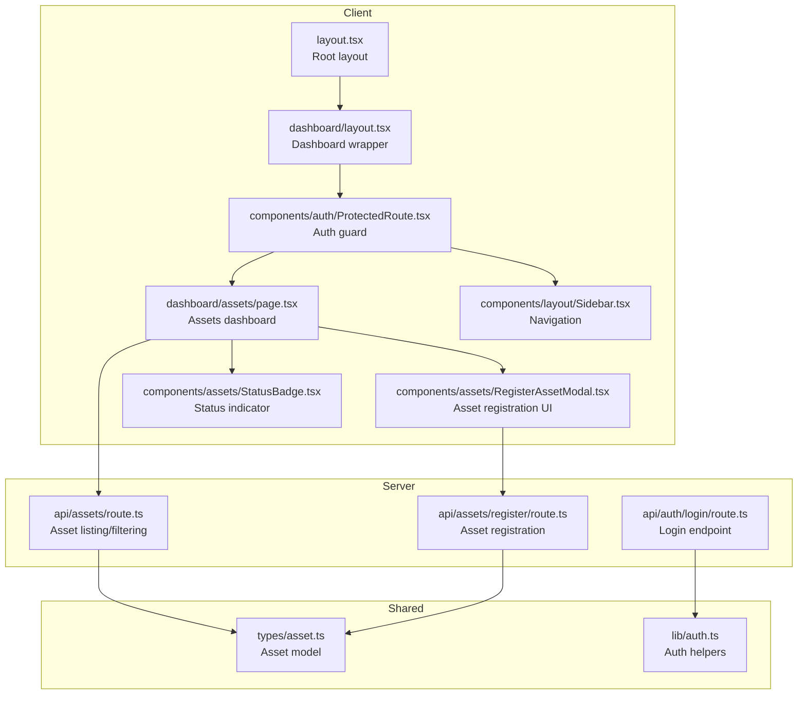
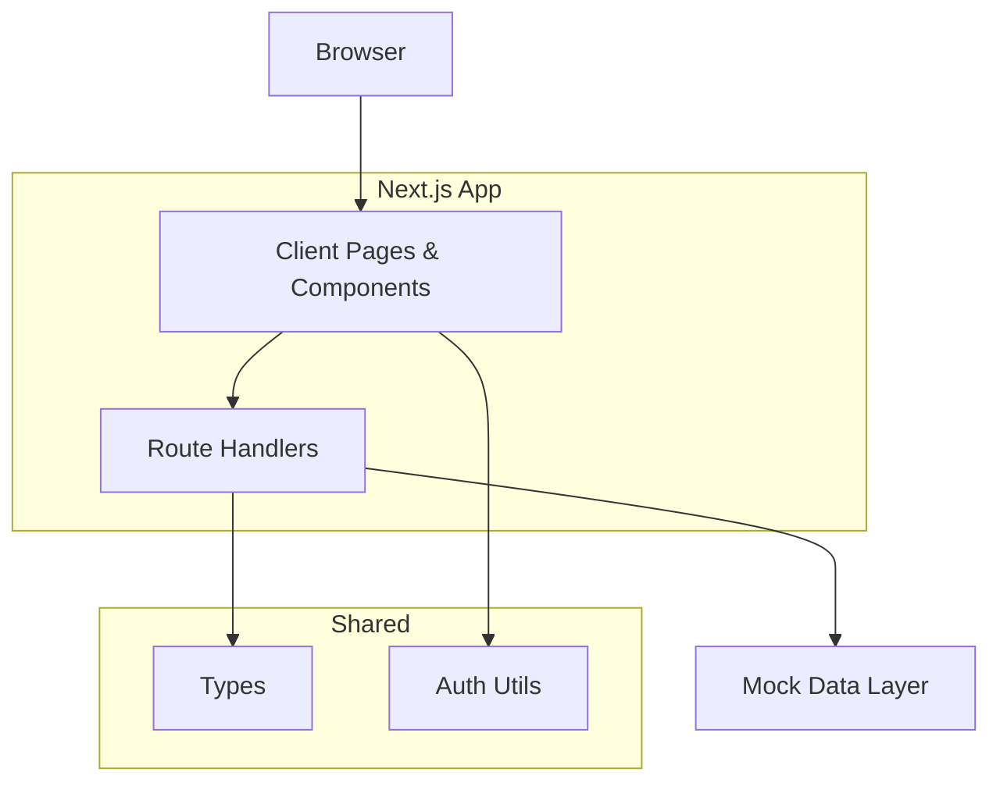
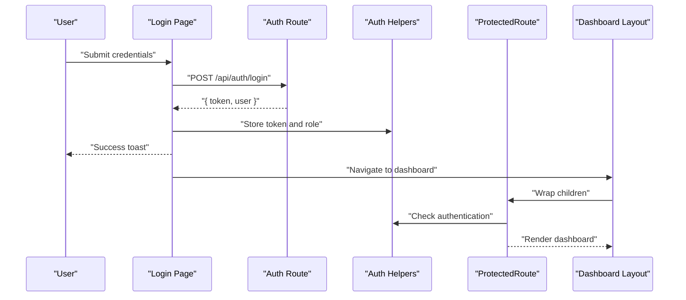
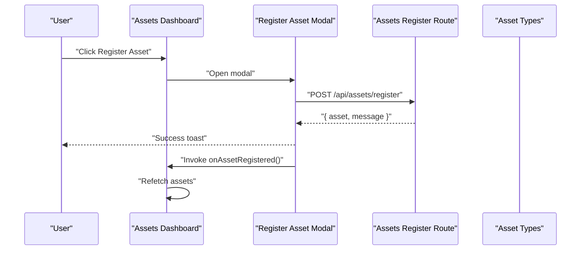
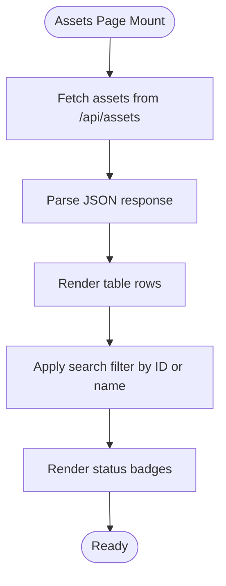
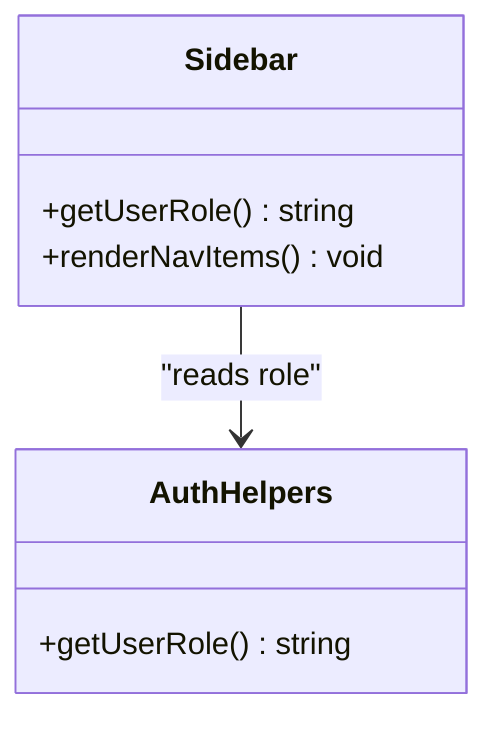
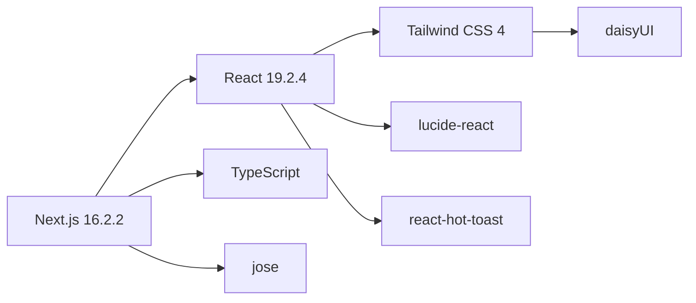

# Project Overview

<cite>
**Referenced Files in This Document**
- [README.md](file://README.md)
- [package.json](file://package.json)
- [src/app/layout.tsx](file://src/app/layout.tsx)
- [src/lib/auth.ts](file://src/lib/auth.ts)
- [src/types/asset.ts](file://src/types/asset.ts)
- [src/app/api/auth/login/route.ts](file://src/app/api/auth/login/route.ts)
- [src/app/api/assets/route.ts](file://src/app/api/assets/route.ts)
- [src/app/api/assets/register/route.ts](file://src/app/api/assets/register/route.ts)
- [src/app/login/page.tsx](file://src/app/login/page.tsx)
- [src/app/dashboard/assets/page.tsx](file://src/app/dashboard/assets/page.tsx)
- [src/app/dashboard/layout.tsx](file://src/app/dashboard/layout.tsx)
- [src/components/auth/ProtectedRoute.tsx](file://src/components/auth/ProtectedRoute.tsx)
- [src/components/assets/RegisterAssetModal.tsx](file://src/components/assets/RegisterAssetModal.tsx)
- [src/components/assets/StatusBadge.tsx](file://src/components/assets/StatusBadge.tsx)
- [src/components/layout/Sidebar.tsx](file://src/components/layout/Sidebar.tsx)
</cite>

## Table of Contents
1. [Introduction](#introduction)
2. [Project Structure](#project-structure)
3. [Core Components](#core-components)
4. [Architecture Overview](#architecture-overview)
5. [Detailed Component Analysis](#detailed-component-analysis)
6. [Dependency Analysis](#dependency-analysis)
7. [Performance Considerations](#performance-considerations)
8. [Troubleshooting Guide](#troubleshooting-guide)
9. [Conclusion](#conclusion)

## Introduction
ArmorTrack is a military asset management system designed to track equipment, vehicles, and personnel gear throughout their lifecycle. Its primary goal is to improve operational efficiency by providing visibility into asset status, custody, and movement across organizations such as manufacturers, warehouses, transport units, field deployments, and maintenance facilities. The platform supports multi-role authentication and role-based navigation, enabling tailored workflows for different stakeholders.

Target audience:
- Military personnel responsible for asset custody and deployment
- Logistics managers overseeing inventory, transit, and distribution
- Administrators managing system access and audit functions
- Auditors ensuring compliance and traceability

Key capabilities:
- Multi-role authentication and session management
- Asset lifecycle management (registration, status updates, custody handover)
- Real-time status tracking and searchable dashboards
- Role-based navigation and permissions

## Project Structure
The project follows a Next.js App Router structure with a clear separation of server-side API routes, client-side pages, shared components, and typed models. The UI leverages Tailwind CSS and daisyUI for consistent theming and responsive design.

**Diagram sources**
- [src/app/layout.tsx:1-49](file://src/app/layout.tsx#L1-L49)
- [src/app/dashboard/layout.tsx:1-20](file://src/app/dashboard/layout.tsx#L1-L20)
- [src/app/dashboard/assets/page.tsx:1-145](file://src/app/dashboard/assets/page.tsx#L1-L145)
- [src/components/layout/Sidebar.tsx:1-90](file://src/components/layout/Sidebar.tsx#L1-L90)
- [src/components/auth/ProtectedRoute.tsx:1-32](file://src/components/auth/ProtectedRoute.tsx#L1-L32)
- [src/components/assets/RegisterAssetModal.tsx:1-123](file://src/components/assets/RegisterAssetModal.tsx#L1-L123)
- [src/components/assets/StatusBadge.tsx:1-23](file://src/components/assets/StatusBadge.tsx#L1-L23)
- [src/app/api/auth/login/route.ts:1-49](file://src/app/api/auth/login/route.ts#L1-L49)
- [src/app/api/assets/register/route.ts:1-37](file://src/app/api/assets/register/route.ts#L1-L37)
- [src/app/api/assets/route.ts:1-67](file://src/app/api/assets/route.ts#L1-L67)
- [src/types/asset.ts:1-14](file://src/types/asset.ts#L1-L14)
- [src/lib/auth.ts:1-37](file://src/lib/auth.ts#L1-L37)

**Section sources**
- [README.md:1-37](file://README.md#L1-L37)
- [package.json:1-31](file://package.json#L1-L31)
- [src/app/layout.tsx:1-49](file://src/app/layout.tsx#L1-L49)
- [src/app/dashboard/layout.tsx:1-20](file://src/app/dashboard/layout.tsx#L1-L20)

## Core Components
- Authentication and roles
  - Token storage and retrieval, role persistence, and authentication checks are handled via shared helpers.
  - Login page posts credentials to the server and stores returned token and role.
  - Protected route wrapper enforces authentication before rendering dashboard content.
- Asset model and lifecycle
  - Asset interface defines identifiers, type, status, custodian, and timestamps.
  - Lifecycle statuses include warehouse, in-transit, deployed, and maintenance-due.
- Dashboard and UI
  - Assets dashboard lists assets, supports search, and integrates with modals for registration.
  - Status badges render contextual indicators based on status values.
  - Sidebar renders role-aware navigation items.

**Section sources**
- [src/lib/auth.ts:1-37](file://src/lib/auth.ts#L1-L37)
- [src/app/api/auth/login/route.ts:1-49](file://src/app/api/auth/login/route.ts#L1-L49)
- [src/app/login/page.tsx:1-139](file://src/app/login/page.tsx#L1-L139)
- [src/components/auth/ProtectedRoute.tsx:1-32](file://src/components/auth/ProtectedRoute.tsx#L1-L32)
- [src/types/asset.ts:1-14](file://src/types/asset.ts#L1-L14)
- [src/app/dashboard/assets/page.tsx:1-145](file://src/app/dashboard/assets/page.tsx#L1-L145)
- [src/components/assets/StatusBadge.tsx:1-23](file://src/components/assets/StatusBadge.tsx#L1-L23)
- [src/components/layout/Sidebar.tsx:1-90](file://src/components/layout/Sidebar.tsx#L1-L90)

## Architecture Overview
ArmorTrack adopts a client-server split:
- Client-side pages and components handle UI, routing, and user interactions.
- Server-side API routes manage authentication, asset CRUD, and data queries.
- Shared TypeScript types define contracts between client and server.
- Tailwind CSS and daisyUI provide a cohesive, themeable UI framework.

**Diagram sources**
- [src/app/dashboard/assets/page.tsx:1-145](file://src/app/dashboard/assets/page.tsx#L1-L145)
- [src/app/api/assets/route.ts:1-67](file://src/app/api/assets/route.ts#L1-L67)
- [src/app/api/assets/register/route.ts:1-37](file://src/app/api/assets/register/route.ts#L1-L37)
- [src/app/api/auth/login/route.ts:1-49](file://src/app/api/auth/login/route.ts#L1-L49)
- [src/types/asset.ts:1-14](file://src/types/asset.ts#L1-L14)
- [src/lib/auth.ts:1-37](file://src/lib/auth.ts#L1-L37)

## Detailed Component Analysis

### Authentication Flow
The login process authenticates users, assigns roles, and redirects to the dashboard. ProtectedRoute ensures subsequent navigation requires a valid session.

**Diagram sources**
- [src/app/login/page.tsx:1-139](file://src/app/login/page.tsx#L1-L139)
- [src/app/api/auth/login/route.ts:1-49](file://src/app/api/auth/login/route.ts#L1-L49)
- [src/lib/auth.ts:1-37](file://src/lib/auth.ts#L1-L37)
- [src/app/dashboard/layout.tsx:1-20](file://src/app/dashboard/layout.tsx#L1-L20)
- [src/components/auth/ProtectedRoute.tsx:1-32](file://src/components/auth/ProtectedRoute.tsx#L1-L32)

**Section sources**
- [src/app/login/page.tsx:1-139](file://src/app/login/page.tsx#L1-L139)
- [src/app/api/auth/login/route.ts:1-49](file://src/app/api/auth/login/route.ts#L1-L49)
- [src/components/auth/ProtectedRoute.tsx:1-32](file://src/components/auth/ProtectedRoute.tsx#L1-L32)
- [src/lib/auth.ts:1-37](file://src/lib/auth.ts#L1-L37)

### Asset Registration Workflow
Users can register new assets through a modal that posts to the registration route and refreshes the asset list.

**Diagram sources**
- [src/app/dashboard/assets/page.tsx:1-145](file://src/app/dashboard/assets/page.tsx#L1-L145)
- [src/components/assets/RegisterAssetModal.tsx:1-123](file://src/components/assets/RegisterAssetModal.tsx#L1-L123)
- [src/app/api/assets/register/route.ts:1-37](file://src/app/api/assets/register/route.ts#L1-L37)
- [src/types/asset.ts:1-14](file://src/types/asset.ts#L1-L14)

**Section sources**
- [src/app/dashboard/assets/page.tsx:1-145](file://src/app/dashboard/assets/page.tsx#L1-L145)
- [src/components/assets/RegisterAssetModal.tsx:1-123](file://src/components/assets/RegisterAssetModal.tsx#L1-L123)
- [src/app/api/assets/register/route.ts:1-37](file://src/app/api/assets/register/route.ts#L1-L37)
- [src/types/asset.ts:1-14](file://src/types/asset.ts#L1-L14)

### Asset Listing and Filtering
The assets page fetches data from the assets route, supports status filtering, and displays results with status badges.

**Diagram sources**
- [src/app/dashboard/assets/page.tsx:1-145](file://src/app/dashboard/assets/page.tsx#L1-L145)
- [src/app/api/assets/route.ts:1-67](file://src/app/api/assets/route.ts#L1-L67)
- [src/components/assets/StatusBadge.tsx:1-23](file://src/components/assets/StatusBadge.tsx#L1-L23)

**Section sources**
- [src/app/dashboard/assets/page.tsx:1-145](file://src/app/dashboard/assets/page.tsx#L1-L145)
- [src/app/api/assets/route.ts:1-67](file://src/app/api/assets/route.ts#L1-L67)
- [src/components/assets/StatusBadge.tsx:1-23](file://src/components/assets/StatusBadge.tsx#L1-L23)

### Role-Based Navigation
The sidebar reads the user’s role and renders permitted navigation items accordingly.

**Diagram sources**
- [src/components/layout/Sidebar.tsx:1-90](file://src/components/layout/Sidebar.tsx#L1-L90)
- [src/lib/auth.ts:1-37](file://src/lib/auth.ts#L1-L37)

**Section sources**
- [src/components/layout/Sidebar.tsx:1-90](file://src/components/layout/Sidebar.tsx#L1-L90)
- [src/lib/auth.ts:1-37](file://src/lib/auth.ts#L1-L37)

## Dependency Analysis
Technology stack and relationships:
- Next.js 16.2.2 powers the full-stack web application with App Router.
- React 19.2.4 and React DOM provide the UI runtime.
- TypeScript enforces type safety across client and server route handlers.
- Tailwind CSS v4 and daisyUI offer utility-first styling and themed components.
- jose enables cryptographic utilities (e.g., JWT handling).
- lucide-react provides icons.
- react-hot-toast delivers toast notifications.

**Diagram sources**
- [package.json:1-31](file://package.json#L1-L31)

**Section sources**
- [package.json:1-31](file://package.json#L1-L31)

## Performance Considerations
- Client-side filtering is efficient for small to medium datasets; consider server-side pagination and advanced filters for larger inventories.
- Toast notifications are lightweight but avoid excessive concurrent toasts to prevent UI thrashing.
- Asset listing uses mock data; replace with database-backed endpoints for scalability.
- Consider caching strategies for frequently accessed asset lists and status summaries.

## Troubleshooting Guide
Common issues and resolutions:
- Authentication failures
  - Verify credentials and ensure token storage is available in the browser.
  - Confirm login route returns token and user with role.
- Authorization errors
  - ProtectedRoute redirects unauthenticated users to the login page.
  - Check local storage keys for token and role presence.
- Asset registration errors
  - Ensure required fields are present and the registration route responds successfully.
  - Inspect network tab for error messages returned by the server.
- UI rendering issues
  - Confirm Tailwind and daisyUI classes are applied and theme is set appropriately.
  - Validate that modal and badge components receive correct props.

**Section sources**
- [src/app/login/page.tsx:1-139](file://src/app/login/page.tsx#L1-L139)
- [src/app/api/auth/login/route.ts:1-49](file://src/app/api/auth/login/route.ts#L1-L49)
- [src/components/auth/ProtectedRoute.tsx:1-32](file://src/components/auth/ProtectedRoute.tsx#L1-L32)
- [src/lib/auth.ts:1-37](file://src/lib/auth.ts#L1-L37)
- [src/components/assets/RegisterAssetModal.tsx:1-123](file://src/components/assets/RegisterAssetModal.tsx#L1-L123)
- [src/app/api/assets/register/route.ts:1-37](file://src/app/api/assets/register/route.ts#L1-L37)

## Conclusion
ArmorTrack provides a focused foundation for military asset lifecycle management with role-aware access, intuitive dashboards, and extensible APIs. By leveraging modern web technologies and a clean component architecture, it supports improved logistics visibility, streamlined workflows, and scalable enhancements for real-world deployments.