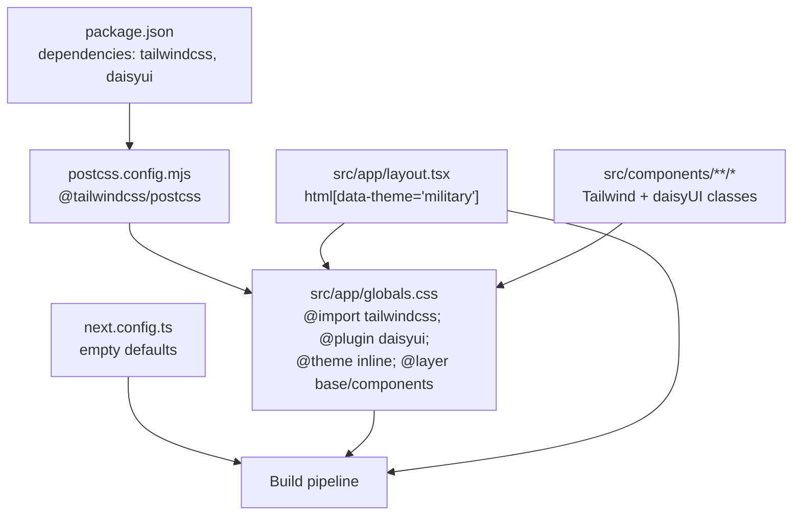
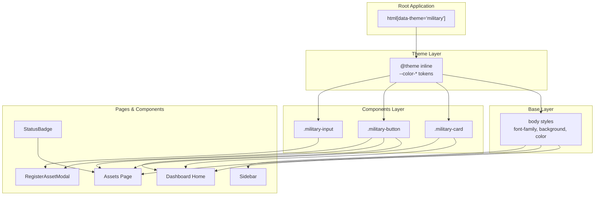
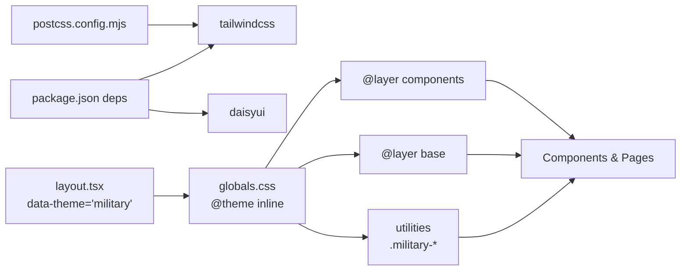

# Styling & Theming

<cite>
**Referenced Files in This Document**
- [package.json](file://package.json)
- [postcss.config.mjs](file://postcss.config.mjs)
- [next.config.ts](file://next.config.ts)
- [src/app/globals.css](file://src/app/globals.css)
- [src/app/layout.tsx](file://src/app/layout.tsx)
- [src/app/dashboard/page.tsx](file://src/app/dashboard/page.tsx)
- [src/app/dashboard/assets/page.tsx](file://src/app/dashboard/assets/page.tsx)
- [src/components/assets/RegisterAssetModal.tsx](file://src/components/assets/RegisterAssetModal.tsx)
- [src/components/assets/StatusBadge.tsx](file://src/components/assets/StatusBadge.tsx)
- [src/components/layout/Sidebar.tsx](file://src/components/layout/Sidebar.tsx)
</cite>

## Table of Contents
1. [Introduction](#introduction)
2. [Project Structure](#project-structure)
3. [Core Components](#core-components)
4. [Architecture Overview](#architecture-overview)
5. [Detailed Component Analysis](#detailed-component-analysis)
6. [Dependency Analysis](#dependency-analysis)
7. [Performance Considerations](#performance-considerations)
8. [Troubleshooting Guide](#troubleshooting-guide)
9. [Conclusion](#conclusion)
10. [Appendices](#appendices)

## Introduction
This document describes ArmorTrack’s visual design system with a focus on Tailwind CSS, daisyUI integration, and theme customization. It explains the military-themed color palette, typography, visual hierarchy, responsive patterns, and accessibility considerations. It also provides guidelines for maintaining design consistency, extending the theme, and optimizing styles.

## Project Structure
The styling system is organized around:
- Global CSS layering with Tailwind and daisyUI
- Theme tokens defined via CSS variables
- Component-level styling using Tailwind utilities and daisyUI variants
- A custom “military” theme applied at the root HTML element

**Diagram sources**
- [package.json:11-29](file://package.json#L11-L29)
- [postcss.config.mjs:1-7](file://postcss.config.mjs#L1-L7)
- [src/app/globals.css:1-52](file://src/app/globals.css#L1-L52)
- [src/app/layout.tsx:27-29](file://src/app/layout.tsx#L27-L29)
- [next.config.ts:1-8](file://next.config.ts#L1-L8)

**Section sources**
- [package.json:11-29](file://package.json#L11-L29)
- [postcss.config.mjs:1-7](file://postcss.config.mjs#L1-L7)
- [src/app/globals.css:1-52](file://src/app/globals.css#L1-L52)
- [src/app/layout.tsx:27-29](file://src/app/layout.tsx#L27-L29)
- [next.config.ts:1-8](file://next.config.ts#L1-L8)

## Core Components
- Tailwind CSS v4 is configured via PostCSS plugin.
- daisyUI v5 is enabled globally to provide component variants and utilities.
- A custom “military” theme is defined using CSS variables and applied at the root HTML element.
- Typography leverages Next Font variables for Geist Sans and Geist Mono.
- Global base styles and reusable component utilities are declared in a dedicated CSS file.

Key implementation references:
- Tailwind and daisyUI enablement and PostCSS wiring
  - [package.json:11-29](file://package.json#L11-L29)
  - [postcss.config.mjs:1-7](file://postcss.config.mjs#L1-L7)
- Theme tokens and layering
  - [src/app/globals.css:4-22](file://src/app/globals.css#L4-L22)
  - [src/app/globals.css:24-51](file://src/app/globals.css#L24-L51)
- Root theme application and fonts
  - [src/app/layout.tsx:27-29](file://src/app/layout.tsx#L27-L29)
  - [src/app/layout.tsx:6-14](file://src/app/layout.tsx#L6-L14)

**Section sources**
- [package.json:11-29](file://package.json#L11-L29)
- [postcss.config.mjs:1-7](file://postcss.config.mjs#L1-L7)
- [src/app/globals.css:4-22](file://src/app/globals.css#L4-L22)
- [src/app/globals.css:24-51](file://src/app/globals.css#L24-L51)
- [src/app/layout.tsx:6-14](file://src/app/layout.tsx#L6-L14)
- [src/app/layout.tsx:27-29](file://src/app/layout.tsx#L27-L29)

## Architecture Overview
The styling architecture follows a layered approach:
- Base layer sets global body styles and font families.
- Components layer defines reusable utilities (e.g., .military-card, .military-button).
- Theme layer defines color tokens and semantic variables.
- Component pages and shared components consume Tailwind utilities and daisyUI variants.

**Diagram sources**
- [src/app/globals.css:4-22](file://src/app/globals.css#L4-L22)
- [src/app/globals.css:24-51](file://src/app/globals.css#L24-L51)
- [src/app/layout.tsx:27-29](file://src/app/layout.tsx#L27-L29)
- [src/app/dashboard/page.tsx:10-34](file://src/app/dashboard/page.tsx#L10-L34)
- [src/app/dashboard/assets/page.tsx:78-91](file://src/app/dashboard/assets/page.tsx#L78-L91)
- [src/components/layout/Sidebar.tsx:39-53](file://src/components/layout/Sidebar.tsx#L39-L53)
- [src/components/assets/StatusBadge.tsx:14-22](file://src/components/assets/StatusBadge.tsx#L14-L22)
- [src/components/assets/RegisterAssetModal.tsx:54-120](file://src/components/assets/RegisterAssetModal.tsx#L54-L120)

## Detailed Component Analysis

### Theme Tokens and Variables
- Color tokens define primary, secondary, accent, neutral, base palette, and semantic statuses (info, success, warning, error).
- Typography tokens bind to Next Font variables for sans and mono faces.
- These tokens are consumed by Tailwind utilities and daisyUI components.

Implementation references:
- [src/app/globals.css:4-22](file://src/app/globals.css#L4-L22)

**Section sources**
- [src/app/globals.css:4-22](file://src/app/globals.css#L4-L22)

### Base Styles and Typography
- Global body styles apply background, text color, and font stack.
- Next Fonts (Geist Sans and Geist Mono) are exposed via CSS variables and used in the html element class.

Implementation references:
- [src/app/globals.css:24-30](file://src/app/globals.css#L24-L30)
- [src/app/layout.tsx:6-14](file://src/app/layout.tsx#L6-L14)
- [src/app/layout.tsx:29](file://src/app/layout.tsx#L29)

**Section sources**
- [src/app/globals.css:24-30](file://src/app/globals.css#L24-L30)
- [src/app/layout.tsx:6-14](file://src/app/layout.tsx#L6-L14)
- [src/app/layout.tsx:29](file://src/app/layout.tsx#L29)

### Reusable Utilities (.military-* classes)
- .military-card: border and box-shadow for elevated presentation.
- .military-button: bold, uppercase, and letter-spacing for a military aesthetic.
- .military-input: bordered inputs with subtle border styling and focused state.

Implementation references:
- [src/app/globals.css:32-51](file://src/app/globals.css#L32-L51)

**Section sources**
- [src/app/globals.css:32-51](file://src/app/globals.css#L32-L51)

### Root Theme Application
- The html element applies data-theme="military", enabling daisyUI theme resolution and Tailwind variable consumption.

Implementation references:
- [src/app/layout.tsx:27](file://src/app/layout.tsx#L27)

**Section sources**
- [src/app/layout.tsx:27](file://src/app/layout.tsx#L27)

### Dashboard Home Card
- Uses card utilities, primary background accents, and consistent spacing and typography.
- Implements a divider and iconography for visual hierarchy.

Implementation references:
- [src/app/dashboard/page.tsx:10-34](file://src/app/dashboard/page.tsx#L10-L34)

**Section sources**
- [src/app/dashboard/page.tsx:10-34](file://src/app/dashboard/page.tsx#L10-L34)

### Assets Page Layout and Inputs
- Responsive grid for quick stats cards.
- Search bar with icon and custom input styling.
- Table with zebra striping and hover states.

Implementation references:
- [src/app/dashboard/assets/page.tsx:37-79](file://src/app/dashboard/assets/page.tsx#L37-L79)
- [src/app/dashboard/assets/page.tsx:78-91](file://src/app/dashboard/assets/page.tsx#L78-L91)
- [src/app/dashboard/assets/page.tsx:97-138](file://src/app/dashboard/assets/page.tsx#L97-L138)

**Section sources**
- [src/app/dashboard/assets/page.tsx:37-79](file://src/app/dashboard/assets/page.tsx#L37-L79)
- [src/app/dashboard/assets/page.tsx:78-91](file://src/app/dashboard/assets/page.tsx#L78-L91)
- [src/app/dashboard/assets/page.tsx:97-138](file://src/app/dashboard/assets/page.tsx#L97-L138)

### Sidebar Navigation
- Uses base-200 background, primary borders, and active/inactive states with primary color fill and content color.
- Iconography and uppercase typography reinforce the military theme.

Implementation references:
- [src/components/layout/Sidebar.tsx:39-79](file://src/components/layout/Sidebar.tsx#L39-L79)

**Section sources**
- [src/components/layout/Sidebar.tsx:39-79](file://src/components/layout/Sidebar.tsx#L39-L79)

### StatusBadge Component
- Maps status values to daisyUI badge variants (ghost, warning, info, error) with consistent typography and sizing.

Implementation references:
- [src/components/assets/StatusBadge.tsx:7-12](file://src/components/assets/StatusBadge.tsx#L7-L12)
- [src/components/assets/StatusBadge.tsx:14-22](file://src/components/assets/StatusBadge.tsx#L14-L22)

**Section sources**
- [src/components/assets/StatusBadge.tsx:7-12](file://src/components/assets/StatusBadge.tsx#L7-L12)
- [src/components/assets/StatusBadge.tsx:14-22](file://src/components/assets/StatusBadge.tsx#L14-L22)

### RegisterAssetModal Component
- Modal box with base-100 background and .military-card styling.
- Form controls use .military-input; submit button uses .military-button and daisyUI primary button.
- Focus-visible and loading states are handled with Tailwind utilities.

Implementation references:
- [src/components/assets/RegisterAssetModal.tsx:54-120](file://src/components/assets/RegisterAssetModal.tsx#L54-L120)

**Section sources**
- [src/components/assets/RegisterAssetModal.tsx:54-120](file://src/components/assets/RegisterAssetModal.tsx#L54-L120)

## Dependency Analysis
- Tailwind CSS v4 is wired via @tailwindcss/postcss.
- daisyUI is enabled globally and provides component variants and states.
- The “military” theme is applied at the root level and consumed by all components.

**Diagram sources**
- [package.json:11-29](file://package.json#L11-L29)
- [postcss.config.mjs:1-7](file://postcss.config.mjs#L1-L7)
- [src/app/layout.tsx:27](file://src/app/layout.tsx#L27)
- [src/app/globals.css:4-22](file://src/app/globals.css#L4-L22)
- [src/app/globals.css:24-51](file://src/app/globals.css#L24-L51)

**Section sources**
- [package.json:11-29](file://package.json#L11-L29)
- [postcss.config.mjs:1-7](file://postcss.config.mjs#L1-L7)
- [src/app/layout.tsx:27](file://src/app/layout.tsx#L27)
- [src/app/globals.css:4-22](file://src/app/globals.css#L4-L22)
- [src/app/globals.css:24-51](file://src/app/globals.css#L24-L51)

## Performance Considerations
- Keep the number of custom utilities minimal to reduce CSS output.
- Prefer daisyUI variants over custom overrides to leverage compiled tokens.
- Use responsive prefixes judiciously to avoid excessive media queries.
- Ensure fonts are subset appropriately and loaded efficiently via Next Font.
- Avoid deep nesting in custom utilities; keep selectors flat for maintainability.

[No sources needed since this section provides general guidance]

## Troubleshooting Guide
- Theme not applying:
  - Verify html element has data-theme="military".
  - Confirm @theme inline tokens are present and reachable.
  - Ensure @import "tailwindcss" and @plugin "daisyui" are included.
  - References:
    - [src/app/layout.tsx:27](file://src/app/layout.tsx#L27)
    - [src/app/globals.css:1-2](file://src/app/globals.css#L1-L2)
    - [src/app/globals.css:4-22](file://src/app/globals.css#L4-L22)
- Utility classes not taking effect:
  - Check that .military-* utilities are defined in @layer components.
  - Confirm Tailwind is processing the file via PostCSS.
  - References:
    - [src/app/globals.css:32-51](file://src/app/globals.css#L32-L51)
    - [postcss.config.mjs:1-7](file://postcss.config.mjs#L1-L7)
- Modal or form inputs not styled:
  - Ensure .military-input and .military-button are applied alongside daisyUI classes.
  - References:
    - [src/components/assets/RegisterAssetModal.tsx:70](file://src/components/assets/RegisterAssetModal.tsx#L70)
    - [src/components/assets/RegisterAssetModal.tsx:102](file://src/components/assets/RegisterAssetModal.tsx#L102)
- Accessibility issues:
  - Ensure sufficient contrast between foreground and background colors.
  - Provide visible focus indicators for interactive elements.
  - Use semantic roles and ARIA attributes where appropriate.
  - References:
    - [src/app/globals.css:4-22](file://src/app/globals.css#L4-L22)
    - [src/app/globals.css:24-30](file://src/app/globals.css#L24-L30)

**Section sources**
- [src/app/layout.tsx:27](file://src/app/layout.tsx#L27)
- [src/app/globals.css:1-2](file://src/app/globals.css#L1-L2)
- [src/app/globals.css:4-22](file://src/app/globals.css#L4-L22)
- [src/app/globals.css:32-51](file://src/app/globals.css#L32-L51)
- [postcss.config.mjs:1-7](file://postcss.config.mjs#L1-L7)
- [src/components/assets/RegisterAssetModal.tsx:70](file://src/components/assets/RegisterAssetModal.tsx#L70)
- [src/components/assets/RegisterAssetModal.tsx:102](file://src/components/assets/RegisterAssetModal.tsx#L102)

## Conclusion
ArmorTrack’s styling system combines Tailwind CSS v4 and daisyUI with a custom “military” theme. The design system emphasizes a cohesive color palette, consistent typography, and reusable utilities. Components adhere to a predictable pattern of base/background tokens, daisyUI variants, and custom utilities. Following the guidelines herein ensures maintainable, accessible, and performant UI updates.

[No sources needed since this section summarizes without analyzing specific files]

## Appendices

### Design System Principles
- Consistency: Use base tokens and daisyUI variants across components.
- Readability: Favor high contrast combinations and clear visual hierarchy.
- Accessibility: Ensure focus visibility, semantic markup, and sufficient color contrast.
- Extensibility: Add new utilities sparingly; prefer theme tokens and daisyUI variants.

[No sources needed since this section provides general guidance]

### Practical Examples Index
- Applying the “military” theme:
  - [src/app/layout.tsx:27](file://src/app/layout.tsx#L27)
- Defining custom utilities:
  - [src/app/globals.css:32-51](file://src/app/globals.css#L32-L51)
- Using badges for status:
  - [src/components/assets/StatusBadge.tsx:14-22](file://src/components/assets/StatusBadge.tsx#L14-L22)
- Styling a modal:
  - [src/components/assets/RegisterAssetModal.tsx:54-120](file://src/components/assets/RegisterAssetModal.tsx#L54-L120)
- Building a dashboard card:
  - [src/app/dashboard/page.tsx:10-34](file://src/app/dashboard/page.tsx#L10-L34)

**Section sources**
- [src/app/layout.tsx:27](file://src/app/layout.tsx#L27)
- [src/app/globals.css:32-51](file://src/app/globals.css#L32-L51)
- [src/components/assets/StatusBadge.tsx:14-22](file://src/components/assets/StatusBadge.tsx#L14-L22)
- [src/components/assets/RegisterAssetModal.tsx:54-120](file://src/components/assets/RegisterAssetModal.tsx#L54-L120)
- [src/app/dashboard/page.tsx:10-34](file://src/app/dashboard/page.tsx#L10-L34)