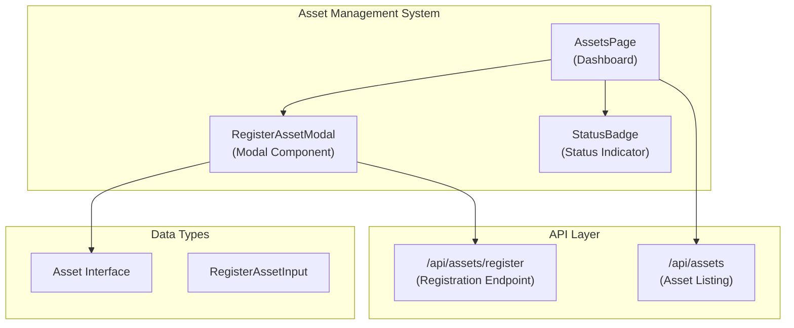
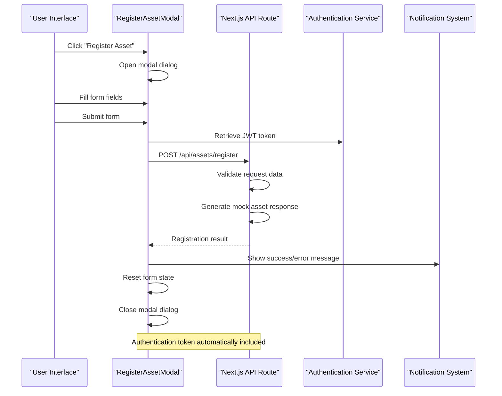
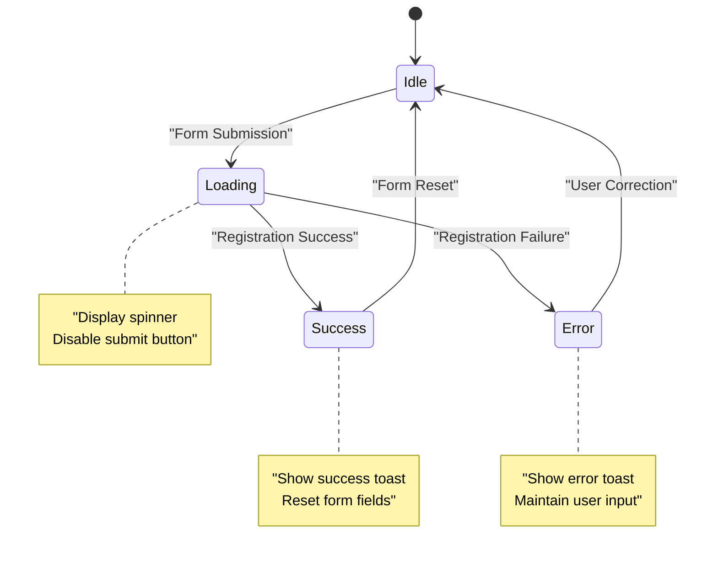
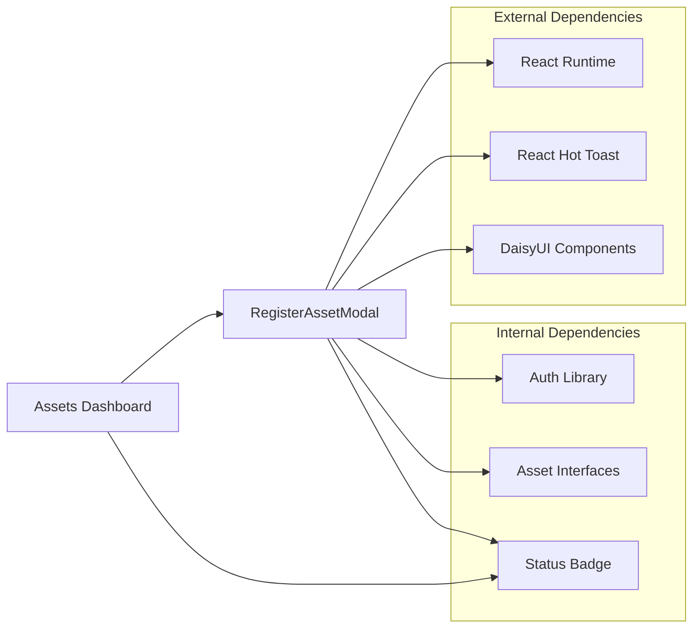

# RegisterAssetModal Component

<cite>
**Referenced Files in This Document**
- [RegisterAssetModal.tsx](file://src/components/assets/RegisterAssetModal.tsx)
- [route.ts](file://src/app/api/assets/register/route.ts)
- [asset.ts](file://src/types/asset.ts)
- [page.tsx](file://src/app/dashboard/assets/page.tsx)
- [route.ts](file://src/app/api/assets/route.ts)
- [StatusBadge.tsx](file://src/components/assets/StatusBadge.tsx)
- [auth.ts](file://src/lib/auth.ts)
- [globals.css](file://src/app/globals.css)
- [package.json](file://package.json)
</cite>

## Table of Contents
1. [Introduction](#introduction)
2. [Project Structure](#project-structure)
3. [Core Components](#core-components)
4. [Architecture Overview](#architecture-overview)
5. [Detailed Component Analysis](#detailed-component-analysis)
6. [Dependency Analysis](#dependency-analysis)
7. [Performance Considerations](#performance-considerations)
8. [Troubleshooting Guide](#troubleshooting-guide)
9. [Conclusion](#conclusion)

## Introduction

The RegisterAssetModal component is a crucial part of the ArmorTrack asset management system, providing a user-friendly interface for registering new military assets. This modal serves as the primary entry point for adding new equipment to the inventory system, featuring a clean form interface with validation, loading states, and comprehensive error handling.

The component integrates seamlessly with the Next.js API routes to handle asset registration requests, utilizing JWT authentication tokens for secure communication. It follows modern React patterns with client-side state management and provides immediate user feedback through toast notifications and visual indicators.

## Project Structure

The RegisterAssetModal component is organized within the asset management system's component hierarchy:

**Diagram sources**
- [RegisterAssetModal.tsx:1-123](file://src/components/assets/RegisterAssetModal.tsx#L1-L123)
- [page.tsx:10-145](file://src/app/dashboard/assets/page.tsx#L10-L145)
- [route.ts:1-37](file://src/app/api/assets/register/route.ts#L1-L37)

**Section sources**
- [RegisterAssetModal.tsx:1-123](file://src/components/assets/RegisterAssetModal.tsx#L1-L123)
- [page.tsx:10-145](file://src/app/dashboard/assets/page.tsx#L10-L145)

## Core Components

### Component Architecture

The RegisterAssetModal component follows a functional React architecture with the following key characteristics:

- **Client-side rendering**: Uses `"use client"` directive for client-side interactivity
- **Form state management**: Manages two primary form fields (name and type) with React hooks
- **Authentication integration**: Automatically retrieves JWT tokens from local storage
- **Toast notification system**: Provides immediate user feedback for success and error states
- **Modal dialog interface**: Utilizes native HTML dialog element with custom styling

### Form Structure and Validation

The modal presents a structured form with two essential fields:

1. **Asset Name Field**
   - Text input with required validation
   - Placeholder guidance for user input
   - Real-time state synchronization

2. **Asset Type Selection**
   - Dropdown selector with predefined military categories
   - Required field validation
   - Comprehensive category coverage including weapons, vehicles, and equipment

**Section sources**
- [RegisterAssetModal.tsx:62-94](file://src/components/assets/RegisterAssetModal.tsx#L62-L94)
- [RegisterAssetModal.tsx:11-14](file://src/components/assets/RegisterAssetModal.tsx#L11-L14)

## Architecture Overview

The RegisterAssetModal operates within a three-tier architecture that ensures separation of concerns and maintainable code organization:

**Diagram sources**
- [RegisterAssetModal.tsx:16-51](file://src/components/assets/RegisterAssetModal.tsx#L16-L51)
- [route.ts:4-37](file://src/app/api/assets/register/route.ts#L4-L37)
- [auth.ts:7-10](file://src/lib/auth.ts#L7-L10)

## Detailed Component Analysis

### State Management Implementation

The component utilizes React's useState hook for managing form state with precision:

**Diagram sources**
- [RegisterAssetModal.tsx:14-14](file://src/components/assets/RegisterAssetModal.tsx#L14-L14)
- [RegisterAssetModal.tsx:16-51](file://src/components/assets/RegisterAssetModal.tsx#L16-L51)

### Form Handling and Validation Logic

The form implements comprehensive validation at multiple levels:

#### Client-Side Validation
- **Required Fields**: Both name and type fields are mandatory
- **Real-time Feedback**: Immediate validation feedback during user interaction
- **Visual Indicators**: Form controls adapt to validation states

#### Server-Side Validation
- **Data Integrity**: Backend validation ensures complete and valid data
- **Error Propagation**: Clear error messages for failed validation attempts
- **Consistent Response Format**: Standardized error and success responses

### Modal Interaction Patterns

The modal implements several interaction patterns for optimal user experience:

#### Opening Mechanisms
- **Programmatic Control**: JavaScript-based modal opening through DOM manipulation
- **Button Trigger**: Primary trigger from the main assets page
- **Keyboard Navigation**: Support for escape key to close modal

#### Closing Behaviors
- **Automatic Closure**: Modal closes upon successful registration
- **Manual Closure**: Users can close via X button or backdrop click
- **Form Reset**: Complete form state reset upon modal closure

### API Integration Details

The component communicates with the asset registration API endpoint through a well-defined interface:

#### Request Format
- **HTTP Method**: POST requests to `/api/assets/register`
- **Content Type**: JSON-encoded payload
- **Authentication**: Bearer token in Authorization header
- **Payload Structure**: `{ name: string, type: string }`

#### Response Handling
- **Success Response**: Asset creation confirmation with generated asset data
- **Error Response**: Detailed error messages for validation failures
- **Loading States**: Visual feedback during asynchronous operations

**Section sources**
- [RegisterAssetModal.tsx:20-35](file://src/components/assets/RegisterAssetModal.tsx#L20-L35)
- [route.ts:6-14](file://src/app/api/assets/register/route.ts#L6-L14)

### Accessibility Features

The component incorporates several accessibility enhancements:

#### Keyboard Navigation
- **Tab Order**: Logical tab order through form fields
- **Escape Key**: Modal closure via escape key press
- **Focus Management**: Automatic focus restoration

#### Screen Reader Support
- **Descriptive Labels**: Clear form field labeling
- **Status Announcements**: Toast notifications for screen readers
- **ARIA Attributes**: Semantic HTML structure

#### Visual Accessibility
- **Color Contrast**: High contrast form elements
- **Responsive Design**: Mobile-friendly form layout
- **Focus States**: Visible focus indicators

### Responsive Design Implementation

The modal adapts to various screen sizes while maintaining usability:

#### Breakpoint Behavior
- **Mobile Optimization**: Touch-friendly form controls
- **Desktop Layout**: Optimized spacing and typography
- **Flexible Sizing**: Adaptive modal dimensions

#### Typography Hierarchy
- **Clear Headings**: Distinctive modal title styling
- **Label Clarity**: Prominent form field labels
- **Instructional Text**: Helpful placeholder guidance

## Dependency Analysis

The RegisterAssetModal component has well-defined dependencies that contribute to system cohesion:

**Diagram sources**
- [RegisterAssetModal.tsx:3-5](file://src/components/assets/RegisterAssetModal.tsx#L3-L5)
- [page.tsx:7-8](file://src/app/dashboard/assets/page.tsx#L7-L8)
- [package.json:11-19](file://package.json#L11-L19)

### Component Coupling Analysis

The component maintains loose coupling with other system elements:

- **Minimal External Dependencies**: Only requires React and toast notification library
- **Interface-Based Communication**: Uses well-defined props for parent-child communication
- **Type Safety**: Strong typing through TypeScript interfaces
- **Separation of Concerns**: Authentication logic isolated in dedicated module

**Section sources**
- [RegisterAssetModal.tsx:1-9](file://src/components/assets/RegisterAssetModal.tsx#L1-L9)
- [asset.ts:1-14](file://src/types/asset.ts#L1-L14)

## Performance Considerations

### Loading State Optimization

The component implements efficient loading state management:

- **Spinner Animation**: Lightweight loading indicator during API calls
- **Button Disabling**: Prevents duplicate submissions during processing
- **Memory Management**: Proper cleanup of event listeners and timeouts

### Network Efficiency

- **Minimal Payload Size**: Compact JSON payload with essential fields only
- **Optimized Requests**: Single API call per registration attempt
- **Error Recovery**: Graceful handling of network failures

### Rendering Performance

- **Selective Updates**: Only re-renders affected form elements
- **Event Delegation**: Efficient event handling for form interactions
- **CSS Optimization**: Minimal styling overhead with daisyUI integration

## Troubleshooting Guide

### Common Issues and Solutions

#### Authentication Failures
**Problem**: Registration requests fail with 401 errors
**Solution**: Verify JWT token presence in local storage and proper token format

#### Form Validation Errors
**Problem**: Form submission blocked despite valid input
**Solution**: Check browser console for validation errors and ensure required fields are populated

#### Modal Not Opening
**Problem**: Modal fails to appear when clicking registration button
**Solution**: Verify modal element exists in DOM and JavaScript execution context

#### API Communication Issues
**Problem**: Network errors during asset registration
**Solution**: Check server availability and CORS configuration for API endpoints

### Debugging Strategies

#### Console Logging
- Enable browser developer tools for network request inspection
- Monitor toast notifications for error details
- Check authentication token validity

#### State Inspection
- Monitor form state changes during user interaction
- Verify loading state transitions
- Confirm successful form reset after submission

**Section sources**
- [RegisterAssetModal.tsx:46-48](file://src/components/assets/RegisterAssetModal.tsx#L46-L48)
- [auth.ts:34-37](file://src/lib/auth.ts#L34-L37)

## Conclusion

The RegisterAssetModal component represents a well-architected solution for asset registration within the ArmorTrack system. Its design demonstrates excellent separation of concerns, comprehensive error handling, and user-centric interface patterns.

Key strengths include:
- **Robust Authentication Integration**: Seamless JWT token handling
- **Comprehensive Validation**: Multi-layered validation approach
- **Accessibility Compliance**: Built-in accessibility features
- **Performance Optimization**: Efficient state management and loading states
- **Integration Flexibility**: Clean API boundaries and modular design

The component successfully fulfills its role as the primary asset registration interface while maintaining consistency with the broader asset management system's design principles and user experience standards.