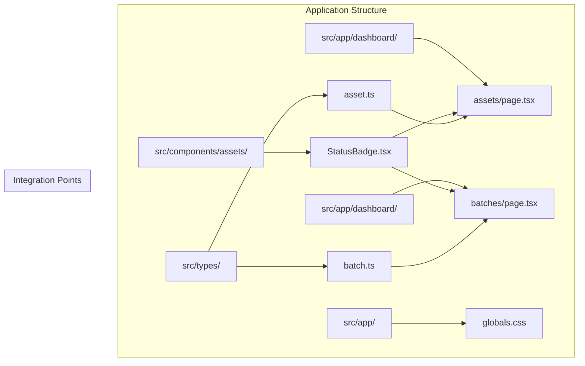
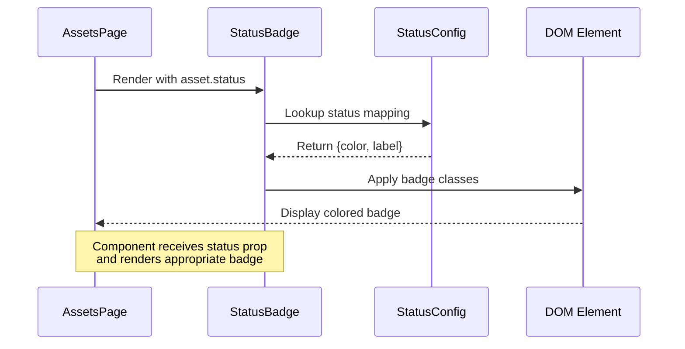
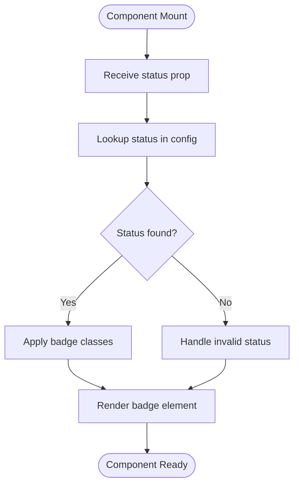
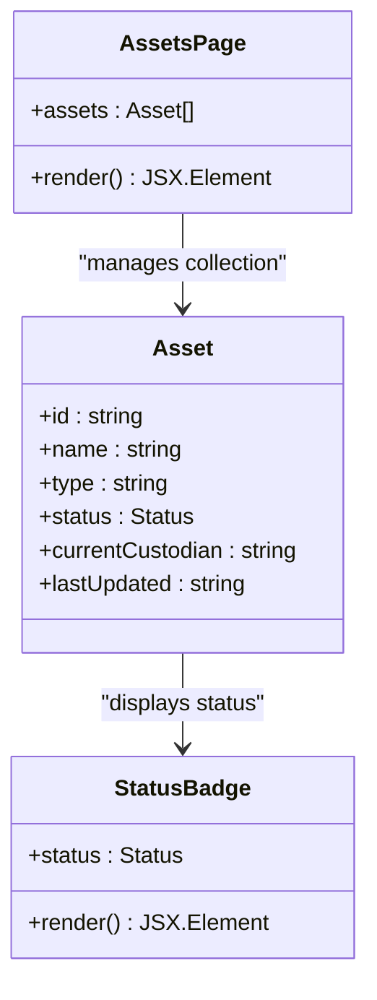
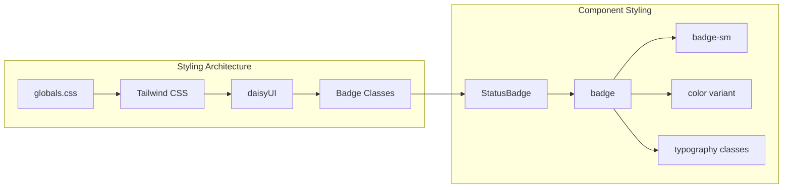
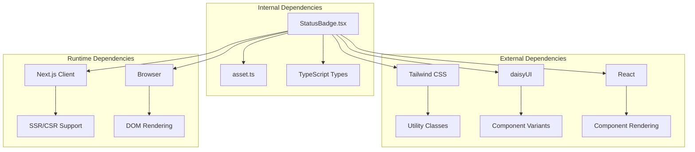

# StatusBadge Component

<cite>
**Referenced Files in This Document**
- [StatusBadge.tsx](file://src/components/assets/StatusBadge.tsx)
- [asset.ts](file://src/types/asset.ts)
- [page.tsx](file://src/app/dashboard/assets/page.tsx)
- [globals.css](file://src/app/globals.css)
- [batch.ts](file://src/types/batch.ts)
- [page.tsx](file://src/app/dashboard/batches/page.tsx)
</cite>

## Table of Contents
1. [Introduction](#introduction)
2. [Project Structure](#project-structure)
3. [Core Components](#core-components)
4. [Architecture Overview](#architecture-overview)
5. [Detailed Component Analysis](#detailed-component-analysis)
6. [Dependency Analysis](#dependency-analysis)
7. [Performance Considerations](#performance-considerations)
8. [Troubleshooting Guide](#troubleshooting-guide)
9. [Conclusion](#conclusion)

## Introduction
The StatusBadge component is a specialized visual indicator designed to communicate asset status through color-coded badges. It serves as a consistent, accessible way to display operational states across the application's asset management interfaces. The component transforms discrete status values into meaningful visual cues using Tailwind CSS and daisyUI styling frameworks.

## Project Structure
The StatusBadge component follows a modular architecture within the Next.js application structure, positioned alongside other asset-related components and integrated into the broader dashboard ecosystem.



**Diagram sources**
- [StatusBadge.tsx:1-23](file://src/components/assets/StatusBadge.tsx#L1-L23)
- [page.tsx:1-145](file://src/app/dashboard/assets/page.tsx#L1-L145)
- [page.tsx:1-281](file://src/app/dashboard/batches/page.tsx#L1-L281)

**Section sources**
- [StatusBadge.tsx:1-23](file://src/components/assets/StatusBadge.tsx#L1-L23)
- [page.tsx:1-145](file://src/app/dashboard/assets/page.tsx#L1-L145)

## Core Components
The StatusBadge component consists of a TypeScript interface defining the component's contract and a configuration object mapping status values to visual presentations.

### TypeScript Interface Definition
The component accepts a single prop with strict typing for guaranteed status values:

```typescript
interface StatusBadgeProps {
  status: 'WAREHOUSE' | 'IN_TRANSIT' | 'DEPLOYED' | 'MAINTENANCE_DUE';
}
```

### Status Configuration Mapping
The component maintains an internal configuration object that defines the visual presentation for each status:

| Status Value | Tailwind Class | Display Label |
|-------------|----------------|---------------|
| WAREHOUSE | `badge-ghost` | Warehouse |
| IN_TRANSIT | `badge-warning` | In Transit |
| DEPLOYED | `badge-info` | Deployed |
| MAINTENANCE_DUE | `badge-error` | Maintenance Due |

### Styling Implementation
The component applies a consistent set of utility classes for uniform appearance:
- Base badge styling (`badge`)
- Color variants (`badge-ghost`, `badge-warning`, `badge-info`, `badge-error`)
- Size control (`badge-sm`)
- Typography enhancements (`font-semibold`, `uppercase`, `tracking-wider`)

**Section sources**
- [StatusBadge.tsx:3-22](file://src/components/assets/StatusBadge.tsx#L3-L22)

## Architecture Overview
The StatusBadge component integrates seamlessly into the application's asset management workflow, serving as a reusable UI element across multiple dashboard pages.



**Diagram sources**
- [StatusBadge.tsx:14-22](file://src/components/assets/StatusBadge.tsx#L14-L22)
- [page.tsx:119-132](file://src/app/dashboard/assets/page.tsx#L119-L132)

## Detailed Component Analysis

### Component Implementation
The StatusBadge component demonstrates a clean, functional approach to status visualization:



**Diagram sources**
- [StatusBadge.tsx:14-22](file://src/components/assets/StatusBadge.tsx#L14-L22)

### Integration Patterns
The component is integrated into two primary dashboard contexts:

#### Asset List Integration
Within the assets table, StatusBadge renders as part of a standardized row structure:



**Diagram sources**
- [page.tsx:119-132](file://src/app/dashboard/assets/page.tsx#L119-L132)
- [asset.ts:1-8](file://src/types/asset.ts#L1-L8)

#### Batch Management Integration
While the batches page uses a separate status mapping, it demonstrates the component's flexibility for different status domains:

| Batch Status | Tailwind Class | Display Label |
|-------------|----------------|---------------|
| PENDING | `badge-ghost` | Pending |
| IN_TRANSIT | `badge-info` | In Transit |
| DELIVERED | `badge-success` | Delivered |

**Section sources**
- [StatusBadge.tsx:14-22](file://src/components/assets/StatusBadge.tsx#L14-L22)
- [page.tsx:119-132](file://src/app/dashboard/assets/page.tsx#L119-L132)
- [page.tsx:45-52](file://src/app/dashboard/batches/page.tsx#L45-L52)

### Styling System Integration
The component leverages the application's centralized styling architecture:



**Diagram sources**
- [globals.css:1-52](file://src/app/globals.css#L1-L52)
- [StatusBadge.tsx:18](file://src/components/assets/StatusBadge.tsx#L18)

**Section sources**
- [globals.css:1-52](file://src/app/globals.css#L1-L52)
- [StatusBadge.tsx:18](file://src/components/assets/StatusBadge.tsx#L18)

## Dependency Analysis
The StatusBadge component maintains loose coupling with external dependencies while providing strong type safety.



**Diagram sources**
- [StatusBadge.tsx:1-23](file://src/components/assets/StatusBadge.tsx#L1-L23)
- [asset.ts:1-8](file://src/types/asset.ts#L1-L8)

### Type Safety and Validation
The component enforces type safety through TypeScript's discriminated union types, preventing runtime errors from invalid status values.

**Section sources**
- [StatusBadge.tsx:3-5](file://src/components/assets/StatusBadge.tsx#L3-L5)
- [asset.ts:5](file://src/types/asset.ts#L5)

## Performance Considerations
The StatusBadge component is designed for optimal performance characteristics:

### Rendering Efficiency
- Stateless functional component with minimal re-render triggers
- Single lookup operation for status-to-class mapping
- Lightweight DOM structure with essential utility classes

### Memory Usage
- No internal state management
- Minimal closure overhead
- Efficient string concatenation for class names

### Bundle Impact
- Minimal code footprint suitable for frequent rendering
- Leverages shared Tailwind/daisyUI class definitions
- No external library dependencies

## Troubleshooting Guide

### Common Issues and Solutions

#### Invalid Status Values
**Problem**: Passing unsupported status values
**Solution**: Ensure status values match the allowed union types
**Prevention**: Use TypeScript type checking in consuming components

#### Styling Consistency
**Problem**: Inconsistent badge appearance across components
**Solution**: Verify Tailwind CSS and daisyUI are properly configured
**Prevention**: Centralize styling through the application's theme system

#### Accessibility Concerns
**Problem**: Screen reader compatibility issues
**Solution**: Consider adding aria-label attributes for complex status descriptions
**Enhancement**: Implement role="status" for dynamic content updates

### Debugging Techniques
1. **Type Checking**: Verify status prop types match component interface
2. **Console Logging**: Add temporary logging for status values during development
3. **CSS Inspection**: Use browser dev tools to verify applied classes
4. **Component Testing**: Create isolated test cases for each status value

**Section sources**
- [StatusBadge.tsx:3-5](file://src/components/assets/StatusBadge.tsx#L3-L5)

## Conclusion
The StatusBadge component exemplifies clean, maintainable React development with strong type safety and consistent styling integration. Its modular design enables seamless integration across multiple dashboard contexts while maintaining visual coherence through the application's established design system. The component's simplicity and performance characteristics make it an ideal foundation for status visualization in asset management applications.

The implementation demonstrates best practices in component architecture, type safety enforcement, and styling integration that can serve as a model for similar UI elements throughout the application ecosystem.