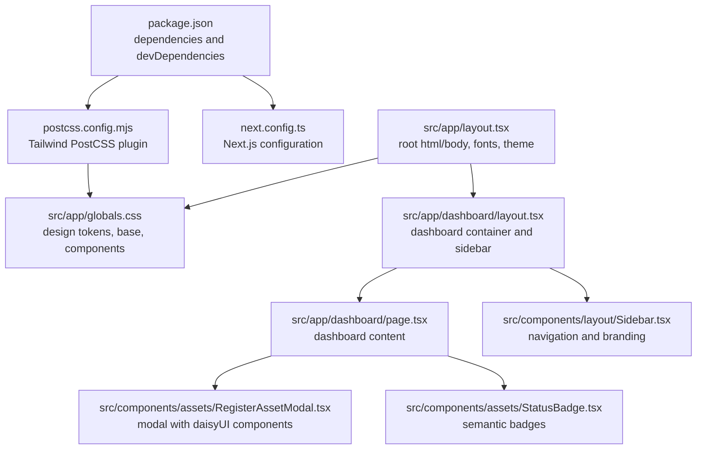
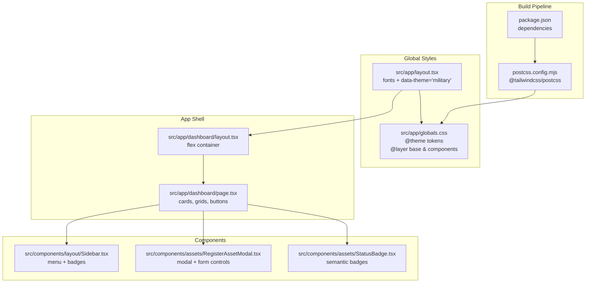
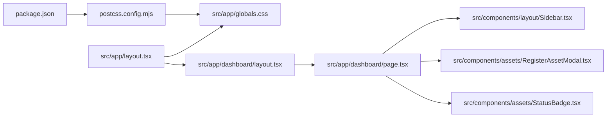

# Styling System & Design Tokens

<cite>
**Referenced Files in This Document**
- [package.json](file://package.json)
- [postcss.config.mjs](file://postcss.config.mjs)
- [next.config.ts](file://next.config.ts)
- [src/app/globals.css](file://src/app/globals.css)
- [src/app/layout.tsx](file://src/app/layout.tsx)
- [src/app/dashboard/layout.tsx](file://src/app/dashboard/layout.tsx)
- [src/app/dashboard/page.tsx](file://src/app/dashboard/page.tsx)
- [src/components/layout/Sidebar.tsx](file://src/components/layout/Sidebar.tsx)
- [src/components/assets/RegisterAssetModal.tsx](file://src/components/assets/RegisterAssetModal.tsx)
- [src/components/assets/StatusBadge.tsx](file://src/components/assets/StatusBadge.tsx)
</cite>

## Table of Contents
1. [Introduction](#introduction)
2. [Project Structure](#project-structure)
3. [Core Components](#core-components)
4. [Architecture Overview](#architecture-overview)
5. [Detailed Component Analysis](#detailed-component-analysis)
6. [Dependency Analysis](#dependency-analysis)
7. [Performance Considerations](#performance-considerations)
8. [Troubleshooting Guide](#troubleshooting-guide)
9. [Conclusion](#conclusion)
10. [Appendices](#appendices)

## Introduction
This document describes the styling system and design tokens used across the application. It explains how Tailwind CSS and daisyUI are configured and integrated, how design tokens are defined and consumed, and how global styles, typography, and spacing are established. It also covers layout approaches using flexbox and grid, color palette semantics, accessibility considerations, and guidelines for maintaining design consistency and extending the system.

## Project Structure
The styling system is primarily driven by:
- Tailwind CSS via PostCSS plugin
- daisyUI component library
- Global CSS defining design tokens and base styles
- Next.js app directory integration through root layout and per-route layouts
- Component-level usage of Tailwind utilities and daisyUI variants

**Diagram sources**
- [package.json:11-29](file://package.json#L11-L29)
- [postcss.config.mjs:1-7](file://postcss.config.mjs#L1-L7)
- [next.config.ts:1-8](file://next.config.ts#L1-L8)
- [src/app/globals.css:1-52](file://src/app/globals.css#L1-L52)
- [src/app/layout.tsx:1-49](file://src/app/layout.tsx#L1-L49)
- [src/app/dashboard/layout.tsx:1-20](file://src/app/dashboard/layout.tsx#L1-L20)
- [src/app/dashboard/page.tsx:1-101](file://src/app/dashboard/page.tsx#L1-L101)
- [src/components/layout/Sidebar.tsx:1-90](file://src/components/layout/Sidebar.tsx#L1-L90)
- [src/components/assets/RegisterAssetModal.tsx:1-123](file://src/components/assets/RegisterAssetModal.tsx#L1-L123)
- [src/components/assets/StatusBadge.tsx:1-23](file://src/components/assets/StatusBadge.tsx#L1-L23)

**Section sources**
- [package.json:11-29](file://package.json#L11-L29)
- [postcss.config.mjs:1-7](file://postcss.config.mjs#L1-L7)
- [next.config.ts:1-8](file://next.config.ts#L1-L8)
- [src/app/globals.css:1-52](file://src/app/globals.css#L1-L52)
- [src/app/layout.tsx:1-49](file://src/app/layout.tsx#L1-L49)
- [src/app/dashboard/layout.tsx:1-20](file://src/app/dashboard/layout.tsx#L1-L20)
- [src/app/dashboard/page.tsx:1-101](file://src/app/dashboard/page.tsx#L1-L101)
- [src/components/layout/Sidebar.tsx:1-90](file://src/components/layout/Sidebar.tsx#L1-L90)
- [src/components/assets/RegisterAssetModal.tsx:1-123](file://src/components/assets/RegisterAssetModal.tsx#L1-L123)
- [src/components/assets/StatusBadge.tsx:1-23](file://src/components/assets/StatusBadge.tsx#L1-L23)

## Core Components
- Tailwind CSS and daisyUI integration via PostCSS and package dependencies
- Global design tokens defined as CSS custom properties and consumed throughout the app
- Base layer establishing body styles and font families
- Components layer for reusable utility classes (custom “military-*” utilities)
- Theme selection via data attribute on the root html element
- Component-level usage of Tailwind utilities and daisyUI variants

Key implementation references:
- Tailwind and daisyUI installed and configured
  - [package.json:11-29](file://package.json#L11-L29)
  - [postcss.config.mjs:1-7](file://postcss.config.mjs#L1-L7)
- Global design tokens and layers
  - [src/app/globals.css:4-22](file://src/app/globals.css#L4-L22)
  - [src/app/globals.css:24-30](file://src/app/globals.css#L24-L30)
  - [src/app/globals.css:32-51](file://src/app/globals.css#L32-L51)
- Root theme and fonts
  - [src/app/layout.tsx:27](file://src/app/layout.tsx#L27)
  - [src/app/layout.tsx:6-14](file://src/app/layout.tsx#L6-L14)
- Dashboard layout and content
  - [src/app/dashboard/layout.tsx:11](file://src/app/dashboard/layout.tsx#L11)
  - [src/app/dashboard/page.tsx:10](file://src/app/dashboard/page.tsx#L10)

**Section sources**
- [package.json:11-29](file://package.json#L11-L29)
- [postcss.config.mjs:1-7](file://postcss.config.mjs#L1-L7)
- [src/app/globals.css:4-22](file://src/app/globals.css#L4-L22)
- [src/app/globals.css:24-30](file://src/app/globals.css#L24-L30)
- [src/app/globals.css:32-51](file://src/app/globals.css#L32-L51)
- [src/app/layout.tsx:6-14](file://src/app/layout.tsx#L6-L14)
- [src/app/layout.tsx:27](file://src/app/layout.tsx#L27)
- [src/app/dashboard/layout.tsx:11](file://src/app/dashboard/layout.tsx#L11)
- [src/app/dashboard/page.tsx:10](file://src/app/dashboard/page.tsx#L10)

## Architecture Overview
The styling pipeline integrates Tailwind and daisyUI through PostCSS, defines design tokens globally, and applies theme and typography at the root level. Components consume utilities and variants for consistent layout and appearance.

**Diagram sources**
- [package.json:11-29](file://package.json#L11-L29)
- [postcss.config.mjs:1-7](file://postcss.config.mjs#L1-L7)
- [src/app/globals.css:1-52](file://src/app/globals.css#L1-L52)
- [src/app/layout.tsx:1-49](file://src/app/layout.tsx#L1-L49)
- [src/app/dashboard/layout.tsx:1-20](file://src/app/dashboard/layout.tsx#L1-L20)
- [src/app/dashboard/page.tsx:1-101](file://src/app/dashboard/page.tsx#L1-L101)
- [src/components/layout/Sidebar.tsx:1-90](file://src/components/layout/Sidebar.tsx#L1-L90)
- [src/components/assets/RegisterAssetModal.tsx:1-123](file://src/components/assets/RegisterAssetModal.tsx#L1-L123)
- [src/components/assets/StatusBadge.tsx:1-23](file://src/components/assets/StatusBadge.tsx#L1-L23)

## Detailed Component Analysis

### Tailwind CSS and daisyUI Integration
- Dependencies include Tailwind CSS v4 and daisyUI, along with the Tailwind PostCSS plugin.
- PostCSS configuration enables Tailwind processing.
- daisyUI is imported at the top of the global stylesheet and leverages its component variants.

Implementation references:
- Dependencies and versions
  - [package.json:11-29](file://package.json#L11-L29)
- Tailwind PostCSS plugin
  - [postcss.config.mjs:1-7](file://postcss.config.mjs#L1-L7)
- daisyUI import and theme usage
  - [src/app/globals.css:1-2](file://src/app/globals.css#L1-L2)
  - [src/app/layout.tsx:27](file://src/app/layout.tsx#L27)

**Section sources**
- [package.json:11-29](file://package.json#L11-L29)
- [postcss.config.mjs:1-7](file://postcss.config.mjs#L1-L7)
- [src/app/globals.css:1-2](file://src/app/globals.css#L1-L2)
- [src/app/layout.tsx:27](file://src/app/layout.tsx#L27)

### Global Design Tokens and Base Styles
- Design tokens are defined as CSS custom properties inside @theme, including background/foreground, fonts, primary/accent colors, neutral tones, base palette, and semantic colors.
- The base layer sets body background, text color, and font family.
- The components layer defines reusable utility classes prefixed with “military-” for cards, buttons, and inputs.

Implementation references:
- Token definitions
  - [src/app/globals.css:4-22](file://src/app/globals.css#L4-L22)
- Base layer styles
  - [src/app/globals.css:24-30](file://src/app/globals.css#L24-L30)
- Components layer utilities
  - [src/app/globals.css:32-51](file://src/app/globals.css#L32-L51)

**Section sources**
- [src/app/globals.css:4-22](file://src/app/globals.css#L4-L22)
- [src/app/globals.css:24-30](file://src/app/globals.css#L24-L30)
- [src/app/globals.css:32-51](file://src/app/globals.css#L32-L51)

### Typography and Font System
- Fonts are loaded via Next.js Google Fonts and exposed as CSS variables for use in global tokens and base layer.
- Sans and mono font families are defined as CSS variables and applied in the base layer.

Implementation references:
- Font declarations and variables
  - [src/app/layout.tsx:6-14](file://src/app/layout.tsx#L6-L14)
- Variable usage in base layer
  - [src/app/globals.css:7-8](file://src/app/globals.css#L7-L8)

**Section sources**
- [src/app/layout.tsx:6-14](file://src/app/layout.tsx#L6-L14)
- [src/app/globals.css:7-8](file://src/app/globals.css#L7-L8)

### Layout Styling with Flexbox and Grid
- The dashboard layout uses a flex container to establish a sidebar and main content area with appropriate spacing and overflow handling.
- Dashboard content employs a responsive grid for statistics cards and links.

Implementation references:
- Flex layout for dashboard shell
  - [src/app/dashboard/layout.tsx:11](file://src/app/dashboard/layout.tsx#L11)
- Responsive grid for stats
  - [src/app/dashboard/page.tsx:37](file://src/app/dashboard/page.tsx#L37)
- Additional grid usage for quick links
  - [src/app/dashboard/page.tsx:85](file://src/app/dashboard/page.tsx#L85)

**Section sources**
- [src/app/dashboard/layout.tsx:11](file://src/app/dashboard/layout.tsx#L11)
- [src/app/dashboard/page.tsx:37](file://src/app/dashboard/page.tsx#L37)
- [src/app/dashboard/page.tsx:85](file://src/app/dashboard/page.tsx#L85)

### Color Palette, Semantic Naming, and Accessibility
- The design system defines a primary palette and semantic colors (info, success, warning, error) for consistent usage.
- Semantic color naming is used in components (e.g., badge variants) to convey meaning.
- Accessibility considerations:
  - Prefer semantic color classes for meaning rather than relying solely on color.
  - Ensure sufficient contrast between foreground and background tokens.
  - Use content variants (e.g., primary-content) to maintain readable text on colored backgrounds.

Implementation references:
- Palette and semantic tokens
  - [src/app/globals.css:9-21](file://src/app/globals.css#L9-L21)
- Semantic usage in components
  - [src/components/assets/StatusBadge.tsx:8-11](file://src/components/assets/StatusBadge.tsx#L8-L11)
  - [src/app/dashboard/page.tsx:46](file://src/app/dashboard/page.tsx#L46)
  - [src/app/dashboard/page.tsx:60](file://src/app/dashboard/page.tsx#L60)
  - [src/app/dashboard/page.tsx:74](file://src/app/dashboard/page.tsx#L74)

**Section sources**
- [src/app/globals.css:9-21](file://src/app/globals.css#L9-L21)
- [src/components/assets/StatusBadge.tsx:8-11](file://src/components/assets/StatusBadge.tsx#L8-L11)
- [src/app/dashboard/page.tsx:46](file://src/app/dashboard/page.tsx#L46)
- [src/app/dashboard/page.tsx:60](file://src/app/dashboard/page.tsx#L60)
- [src/app/dashboard/page.tsx:74](file://src/app/dashboard/page.tsx#L74)

### daisyUI Integration and Theme Customization
- daisyUI is imported and enabled globally; theme is set at the root html element.
- Components leverage daisyUI variants such as button styles, modal boxes, inputs, selects, and badges.
- Custom “military-*” utilities augment daisyUI defaults for brand-specific styling.

Implementation references:
- daisyUI import and theme attribute
  - [src/app/globals.css:1-2](file://src/app/globals.css#L1-L2)
  - [src/app/layout.tsx:27](file://src/app/layout.tsx#L27)
- Modal and form components
  - [src/components/assets/RegisterAssetModal.tsx:54-116](file://src/components/assets/RegisterAssetModal.tsx#L54-L116)
- Badge usage
  - [src/components/assets/StatusBadge.tsx:18](file://src/components/assets/StatusBadge.tsx#L18)

**Section sources**
- [src/app/globals.css:1-2](file://src/app/globals.css#L1-L2)
- [src/app/layout.tsx:27](file://src/app/layout.tsx#L27)
- [src/components/assets/RegisterAssetModal.tsx:54-116](file://src/components/assets/RegisterAssetModal.tsx#L54-L116)
- [src/components/assets/StatusBadge.tsx:18](file://src/components/assets/StatusBadge.tsx#L18)

### Component-Level Styling Patterns
- Cards, buttons, and inputs use a combination of Tailwind utilities and custom “military-*” utilities for consistent branding.
- Navigation highlights active states using background and text content tokens.
- Modals integrate daisyUI modal classes with custom card styling.

Implementation references:
- Card and button utilities
  - [src/app/dashboard/page.tsx:10](file://src/app/dashboard/page.tsx#L10)
  - [src/app/dashboard/page.tsx:86](file://src/app/dashboard/page.tsx#L86)
- Input and select styling
  - [src/components/assets/RegisterAssetModal.tsx:70](file://src/components/assets/RegisterAssetModal.tsx#L70)
  - [src/components/assets/RegisterAssetModal.tsx:82](file://src/components/assets/RegisterAssetModal.tsx#L82)
- Active navigation state
  - [src/components/layout/Sidebar.tsx:66-70](file://src/components/layout/Sidebar.tsx#L66-L70)

**Section sources**
- [src/app/dashboard/page.tsx:10](file://src/app/dashboard/page.tsx#L10)
- [src/app/dashboard/page.tsx:86](file://src/app/dashboard/page.tsx#L86)
- [src/components/assets/RegisterAssetModal.tsx:70](file://src/components/assets/RegisterAssetModal.tsx#L70)
- [src/components/assets/RegisterAssetModal.tsx:82](file://src/components/assets/RegisterAssetModal.tsx#L82)
- [src/components/layout/Sidebar.tsx:66-70](file://src/components/layout/Sidebar.tsx#L66-L70)

### Responsive Breakpoints and Mobile-First Design
- Responsive grid usage demonstrates mobile-first approach with single column on small screens and multi-column layouts on larger breakpoints.
- Utility classes apply consistent spacing and typography scaling across breakpoints.

Implementation references:
- Responsive grid for stats
  - [src/app/dashboard/page.tsx:37](file://src/app/dashboard/page.tsx#L37)
- Responsive grid for quick links
  - [src/app/dashboard/page.tsx:85](file://src/app/dashboard/page.tsx#L85)

**Section sources**
- [src/app/dashboard/page.tsx:37](file://src/app/dashboard/page.tsx#L37)
- [src/app/dashboard/page.tsx:85](file://src/app/dashboard/page.tsx#L85)

### Cross-Browser Compatibility Considerations
- The design relies on widely supported CSS custom properties and Tailwind utilities.
- daisyUI provides normalized base styles and component resets to improve consistency across browsers.

[No sources needed since this section provides general guidance]

## Dependency Analysis
The styling system depends on Tailwind CSS and daisyUI being present and configured. The global stylesheet consumes these dependencies to define tokens and components, while components consume the resulting utilities.

**Diagram sources**
- [package.json:11-29](file://package.json#L11-L29)
- [postcss.config.mjs:1-7](file://postcss.config.mjs#L1-L7)
- [src/app/globals.css:1-52](file://src/app/globals.css#L1-L52)
- [src/app/layout.tsx:1-49](file://src/app/layout.tsx#L1-L49)
- [src/app/dashboard/layout.tsx:1-20](file://src/app/dashboard/layout.tsx#L1-L20)
- [src/app/dashboard/page.tsx:1-101](file://src/app/dashboard/page.tsx#L1-L101)
- [src/components/layout/Sidebar.tsx:1-90](file://src/components/layout/Sidebar.tsx#L1-L90)
- [src/components/assets/RegisterAssetModal.tsx:1-123](file://src/components/assets/RegisterAssetModal.tsx#L1-L123)
- [src/components/assets/StatusBadge.tsx:1-23](file://src/components/assets/StatusBadge.tsx#L1-L23)

**Section sources**
- [package.json:11-29](file://package.json#L11-L29)
- [postcss.config.mjs:1-7](file://postcss.config.mjs#L1-L7)
- [src/app/globals.css:1-52](file://src/app/globals.css#L1-L52)
- [src/app/layout.tsx:1-49](file://src/app/layout.tsx#L1-L49)
- [src/app/dashboard/layout.tsx:1-20](file://src/app/dashboard/layout.tsx#L1-L20)
- [src/app/dashboard/page.tsx:1-101](file://src/app/dashboard/page.tsx#L1-L101)
- [src/components/layout/Sidebar.tsx:1-90](file://src/components/layout/Sidebar.tsx#L1-L90)
- [src/components/assets/RegisterAssetModal.tsx:1-123](file://src/components/assets/RegisterAssetModal.tsx#L1-L123)
- [src/components/assets/StatusBadge.tsx:1-23](file://src/components/assets/StatusBadge.tsx#L1-L23)

## Performance Considerations
- Keep the number of custom utilities minimal to reduce CSS bloat.
- Prefer semantic color classes and content variants to avoid duplicating color logic.
- Use responsive variants judiciously to prevent excessive media queries.

[No sources needed since this section provides general guidance]

## Troubleshooting Guide
- If daisyUI components do not render with expected styles, verify the theme attribute is set on the root html element.
  - [src/app/layout.tsx:27](file://src/app/layout.tsx#L27)
- If custom “military-*” utilities are missing, confirm they are defined in the components layer and included in the global stylesheet.
  - [src/app/globals.css:32-51](file://src/app/globals.css#L32-L51)
- If fonts appear incorrect, ensure the font variables are declared and applied in the base layer.
  - [src/app/layout.tsx:6-14](file://src/app/layout.tsx#L6-L14)
  - [src/app/globals.css:7-8](file://src/app/globals.css#L7-L8)

**Section sources**
- [src/app/layout.tsx:27](file://src/app/layout.tsx#L27)
- [src/app/globals.css:32-51](file://src/app/globals.css#L32-L51)
- [src/app/layout.tsx:6-14](file://src/app/layout.tsx#L6-L14)
- [src/app/globals.css:7-8](file://src/app/globals.css#L7-L8)

## Conclusion
The application’s styling system combines Tailwind CSS and daisyUI with a centralized design token system defined in global CSS. The root layout applies theme and fonts, while components consistently use utilities and semantic variants for layout, color, and typography. The approach emphasizes maintainability, scalability, and accessibility through semantic color naming and content variants.

[No sources needed since this section summarizes without analyzing specific files]

## Appendices

### Maintaining Design Consistency
- Centralize design tokens in the global stylesheet and reference them via CSS variables.
- Use semantic color classes for status and meaning to keep styles consistent across components.
- Prefer daisyUI variants for common components and reserve custom utilities for branded overrides.

[No sources needed since this section provides general guidance]

### Creating Custom Utility Classes
- Add scoped custom utilities in the components layer of the global stylesheet.
- Keep naming consistent (e.g., “military-*”) and limit scope to specific contexts.

Reference:
- [src/app/globals.css:32-51](file://src/app/globals.css#L32-L51)

**Section sources**
- [src/app/globals.css:32-51](file://src/app/globals.css#L32-L51)

### Extending the Design System
- Extend token sets in the @theme block for new palettes or semantic categories.
- Introduce new component utilities for frequently reused patterns.
- Document new tokens and utilities to guide future development.

Reference:
- [src/app/globals.css:4-22](file://src/app/globals.css#L4-L22)
- [src/app/globals.css:32-51](file://src/app/globals.css#L32-L51)

**Section sources**
- [src/app/globals.css:4-22](file://src/app/globals.css#L4-L22)
- [src/app/globals.css:32-51](file://src/app/globals.css#L32-L51)