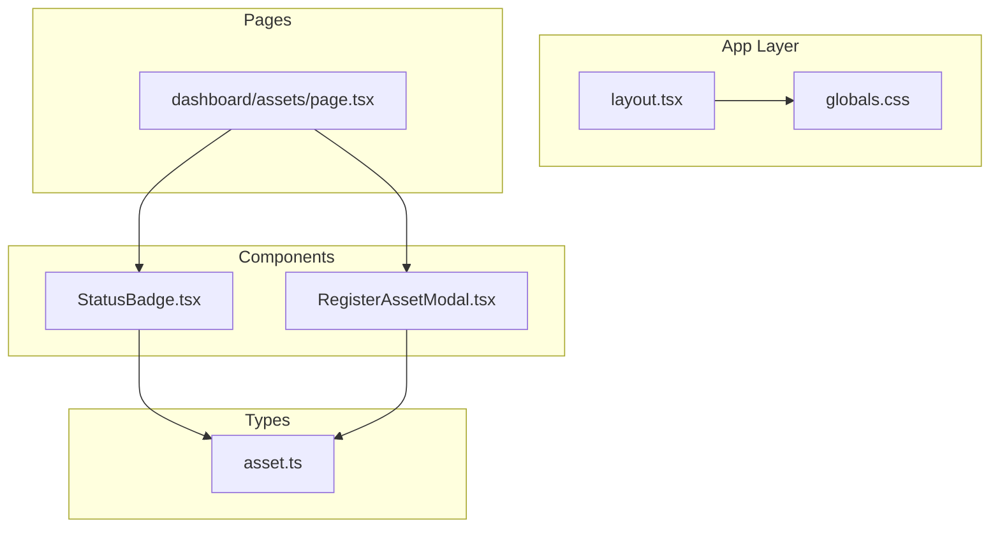
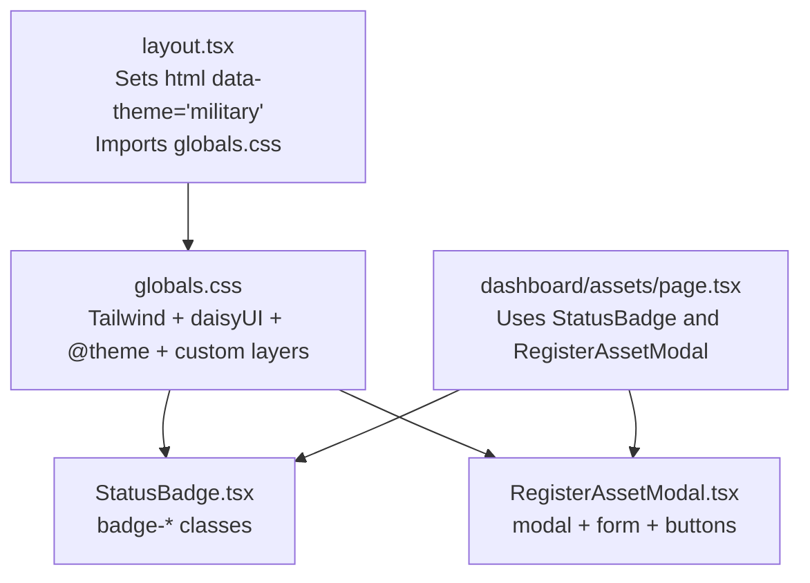
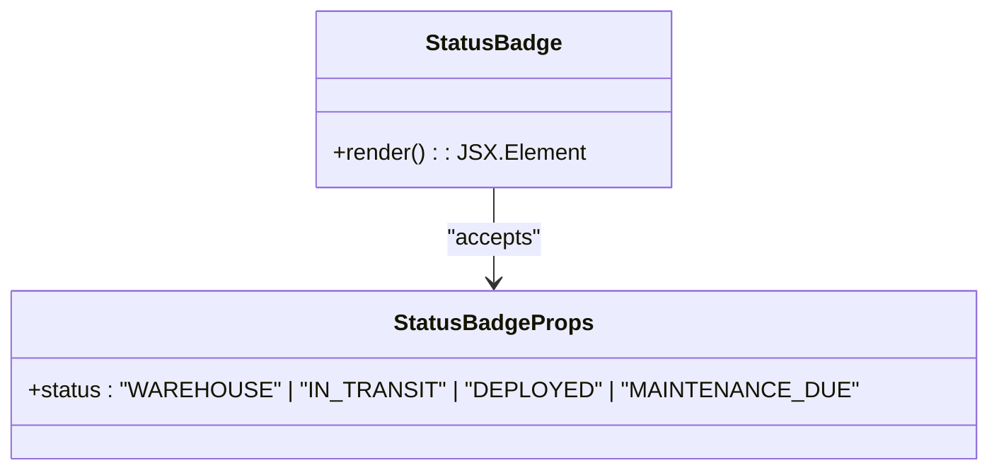
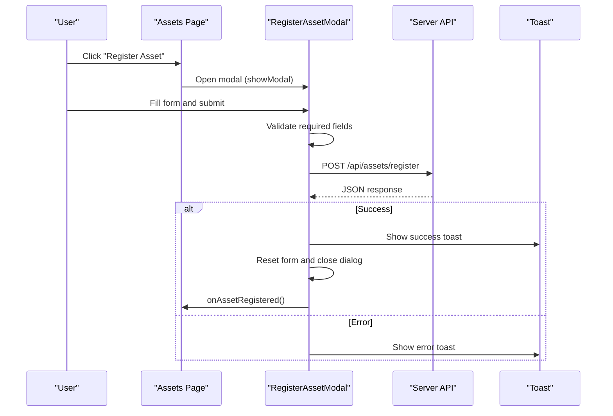
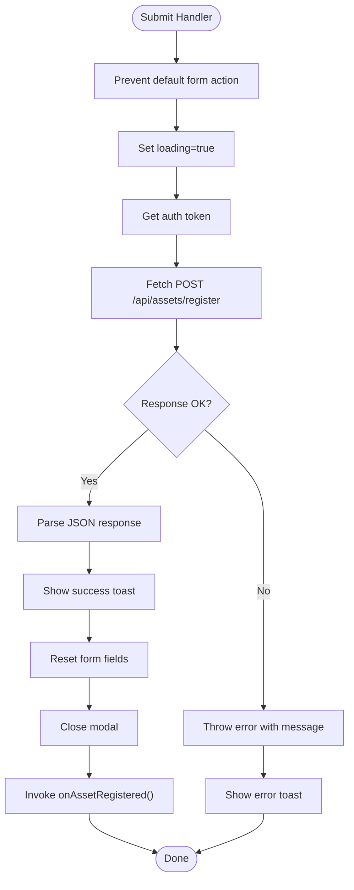
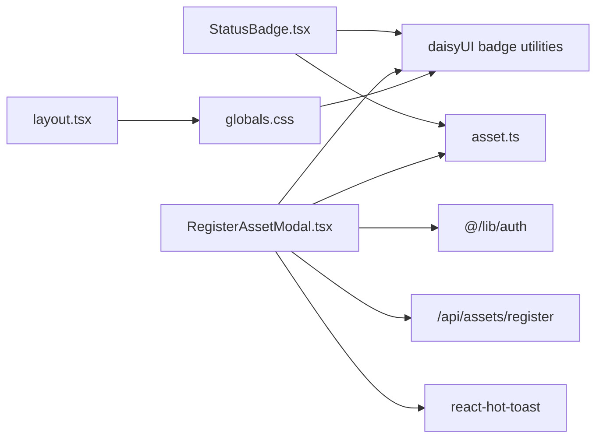

# UI Components Library

<cite>
**Referenced Files in This Document**
- [StatusBadge.tsx](file://src/components/assets/StatusBadge.tsx)
- [RegisterAssetModal.tsx](file://src/components/assets/RegisterAssetModal.tsx)
- [asset.ts](file://src/types/asset.ts)
- [page.tsx](file://src/app/dashboard/assets/page.tsx)
- [layout.tsx](file://src/app/layout.tsx)
- [globals.css](file://src/app/globals.css)
- [postcss.config.mjs](file://postcss.config.mjs)
- [package.json](file://package.json)
</cite>

## Table of Contents
1. [Introduction](#introduction)
2. [Project Structure](#project-structure)
3. [Core Components](#core-components)
4. [Architecture Overview](#architecture-overview)
5. [Detailed Component Analysis](#detailed-component-analysis)
6. [Dependency Analysis](#dependency-analysis)
7. [Performance Considerations](#performance-considerations)
8. [Troubleshooting Guide](#troubleshooting-guide)
9. [Conclusion](#conclusion)
10. [Appendices](#appendices)

## Introduction
This document describes the UI components library used in the ArmorTrack application. It focuses on two primary components:
- StatusBadge: A small, status-aware indicator with color-coded badges.
- RegisterAssetModal: A modal dialog for registering new assets with form validation, submission handling, and user feedback.

It also documents the styling system built on Tailwind CSS and daisyUI, component props and events, customization patterns, responsive design, accessibility considerations, and guidelines for extending the component library.

## Project Structure
The UI components live under src/components and are integrated into pages under src/app. The styling pipeline uses Tailwind CSS v4 with daisyUI plugin and a custom theme.

**Diagram sources**
- [layout.tsx:21-48](file://src/app/layout.tsx#L21-L48)
- [globals.css:1-52](file://src/app/globals.css#L1-L52)
- [StatusBadge.tsx:1-23](file://src/components/assets/StatusBadge.tsx#L1-L23)
- [RegisterAssetModal.tsx:1-123](file://src/components/assets/RegisterAssetModal.tsx#L1-L123)
- [asset.ts:1-14](file://src/types/asset.ts#L1-L14)
- [page.tsx:10-145](file://src/app/dashboard/assets/page.tsx#L10-L145)

**Section sources**
- [layout.tsx:1-49](file://src/app/layout.tsx#L1-L49)
- [globals.css:1-52](file://src/app/globals.css#L1-L52)
- [package.json:11-19](file://package.json#L11-L19)
- [postcss.config.mjs:1-8](file://postcss.config.mjs#L1-L8)

## Core Components
- StatusBadge: Renders a small badge representing an asset’s lifecycle status with color coding and label mapping.
- RegisterAssetModal: A modal form to register new assets, including input validation, submission, and user feedback.

Both components are functional React components with TypeScript interfaces and rely on Tailwind CSS utility classes and daisyUI components.

**Section sources**
- [StatusBadge.tsx:3-22](file://src/components/assets/StatusBadge.tsx#L3-L22)
- [RegisterAssetModal.tsx:7-51](file://src/components/assets/RegisterAssetModal.tsx#L7-L51)
- [asset.ts:1-14](file://src/types/asset.ts#L1-L14)

## Architecture Overview
The components integrate with the application’s layout and styling pipeline. The layout sets up the theme and global fonts, while the components consume daisyUI utilities and custom styles.

**Diagram sources**
- [layout.tsx:27-30](file://src/app/layout.tsx#L27-L30)
- [globals.css:1-52](file://src/app/globals.css#L1-L52)
- [StatusBadge.tsx:17-21](file://src/components/assets/StatusBadge.tsx#L17-L21)
- [RegisterAssetModal.tsx:54-120](file://src/components/assets/RegisterAssetModal.tsx#L54-L120)
- [page.tsx:7-8](file://src/app/dashboard/assets/page.tsx#L7-L8)

## Detailed Component Analysis

### StatusBadge Component
Purpose:
- Display a concise, color-coded status indicator for an asset.

Props:
- status: Literal union of statuses used in the application.

Behavior:
- Selects a color class and label based on the provided status.
- Renders a small badge with consistent typography and spacing.

Styling:
- Uses daisyUI badge utilities and size modifiers.
- Applies consistent uppercase and spacing for readability.

Accessibility:
- Semantic span element with readable text.
- Color alone is not relied upon for meaning; label text conveys status.

Customization:
- Extend the statusConfig mapping to support additional statuses.
- Adjust label text or color classes to align with brand updates.

Integration:
- Consumed in the assets table to reflect asset status.

**Section sources**
- [StatusBadge.tsx:3-22](file://src/components/assets/StatusBadge.tsx#L3-L22)
- [asset.ts:5](file://src/types/asset.ts#L5)
- [page.tsx:124-125](file://src/app/dashboard/assets/page.tsx#L124-L125)

#### Class Diagram

**Diagram sources**
- [StatusBadge.tsx:3-5](file://src/components/assets/StatusBadge.tsx#L3-L5)

### RegisterAssetModal Component
Purpose:
- Provide a modal dialog to register new assets with a controlled form.

Props:
- onAssetRegistered: Callback invoked after successful registration to refresh data.

State and Behavior:
- Manages local form state for name and type.
- Handles form submission via fetch to the backend API.
- Displays loading state during submission.
- Provides user feedback via toast notifications.
- Closes the modal programmatically after success.

Form Controls:
- Text input for asset name.
- Select dropdown for asset type with predefined options.

Validation:
- Enforces required fields at the form level.
- Parses server response and surfaces errors via toast.

Styling:
- Uses daisyUI modal, form, button, and input utilities.
- Leverages custom layers (.military-card, .military-button, .military-input) for consistent look-and-feel.

Accessibility:
- Dialog semantics via HTML dialog element.
- Proper labeling with form controls and buttons.
- Focus management via daisyUI modal behavior.

Integration:
- Triggered from the assets page via a button click.
- Calls onAssetRegistered to refresh asset listings.

**Section sources**
- [RegisterAssetModal.tsx:7-51](file://src/components/assets/RegisterAssetModal.tsx#L7-L51)
- [RegisterAssetModal.tsx:53-121](file://src/components/assets/RegisterAssetModal.tsx#L53-L121)
- [asset.ts:10-13](file://src/types/asset.ts#L10-L13)
- [page.tsx:43-46](file://src/app/dashboard/assets/page.tsx#L43-L46)

#### Sequence Diagram: Registration Flow

**Diagram sources**
- [RegisterAssetModal.tsx:16-51](file://src/components/assets/RegisterAssetModal.tsx#L16-L51)
- [page.tsx:43-46](file://src/app/dashboard/assets/page.tsx#L43-L46)

#### Flowchart: Form Submission Handling

**Diagram sources**
- [RegisterAssetModal.tsx:16-51](file://src/components/assets/RegisterAssetModal.tsx#L16-L51)

## Dependency Analysis
- StatusBadge depends on:
  - TypeScript status literal union from asset types.
  - daisyUI badge utilities for styling.
- RegisterAssetModal depends on:
  - Local state management for form fields.
  - Authentication token retrieval.
  - Backend API endpoint for registration.
  - Toast notifications for user feedback.
  - daisyUI modal, form, and button utilities.
- Global styling pipeline:
  - Tailwind CSS v4 with daisyUI plugin.
  - Custom theme tokens and layered utilities.

**Diagram sources**
- [StatusBadge.tsx:3-5](file://src/components/assets/StatusBadge.tsx#L3-L5)
- [RegisterAssetModal.tsx:3-5](file://src/components/assets/RegisterAssetModal.tsx#L3-L5)
- [asset.ts:1-14](file://src/types/asset.ts#L1-L14)
- [layout.tsx:27-30](file://src/app/layout.tsx#L27-L30)
- [globals.css:1-2](file://src/app/globals.css#L1-L2)

**Section sources**
- [package.json:11-19](file://package.json#L11-L19)
- [postcss.config.mjs:1-8](file://postcss.config.mjs#L1-L8)
- [globals.css:1-52](file://src/app/globals.css#L1-L52)

## Performance Considerations
- Minimize re-renders by keeping component state scoped to the modal and avoiding unnecessary prop drilling.
- Use controlled components for form inputs to prevent excessive updates.
- Debounce search inputs in parent pages if needed to reduce API calls.
- Prefer CSS transitions and transforms for animations; avoid heavy JavaScript-driven animations.
- Lazy-load images and large lists where applicable.

## Troubleshooting Guide
Common issues and resolutions:
- Modal does not open:
  - Ensure the modal element exists and is targeted by the correct ID.
  - Verify showModal() is called on the dialog element.
- Modal does not close after success:
  - Confirm close() is called on the dialog element.
  - Ensure the dialog ID matches the target selector.
- Toast messages not appearing:
  - Verify react-hot-toast is initialized in the root layout.
  - Check toast options configuration for visibility and duration.
- StatusBadge not rendering:
  - Ensure the status value matches the union type.
  - Confirm daisyUI badge utilities are loaded via globals.css.
- Styling inconsistencies:
  - Check that custom layers (.military-*) are defined and applied.
  - Verify Tailwind and daisyUI are enabled in the build pipeline.

**Section sources**
- [RegisterAssetModal.tsx:42-43](file://src/components/assets/RegisterAssetModal.tsx#L42-L43)
- [layout.tsx:32-44](file://src/app/layout.tsx#L32-L44)
- [globals.css:32-51](file://src/app/globals.css#L32-L51)

## Conclusion
The UI components library provides focused, reusable building blocks for asset status display and registration. By leveraging Tailwind CSS and daisyUI, the components remain consistent, accessible, and easy to customize. Following the documented patterns ensures maintainability and scalability as the library grows.

## Appendices

### Styling System: Tailwind CSS and daisyUI
- Tailwind CSS v4 is configured via PostCSS plugin.
- daisyUI is enabled globally and themed with custom tokens.
- Custom layers define military-themed utilities for cards, buttons, and inputs.

Key files:
- Tailwind/daisyUI configuration and theme tokens.
- Global CSS imports and layered utilities.

**Section sources**
- [postcss.config.mjs:1-8](file://postcss.config.mjs#L1-L8)
- [globals.css:1-52](file://src/app/globals.css#L1-L52)
- [layout.tsx:27-30](file://src/app/layout.tsx#L27-L30)

### Component Props and Events
- StatusBadge
  - Props: status (literal union)
  - Output: Badge element with color and label
- RegisterAssetModal
  - Props: onAssetRegistered (callback)
  - Events: form submit, button clicks, dialog close
  - State: name, type, loading

**Section sources**
- [StatusBadge.tsx:3-5](file://src/components/assets/StatusBadge.tsx#L3-L5)
- [RegisterAssetModal.tsx:7-11](file://src/components/assets/RegisterAssetModal.tsx#L7-L11)

### Practical Usage Examples
- Using StatusBadge in a table row:
  - Pass the asset’s status to render the appropriate badge.
- Opening RegisterAssetModal:
  - Trigger showModal() on the dialog element.
  - Provide onAssetRegistered to refresh data after success.
- Styling variations:
  - Apply badge-* classes for different colors.
  - Use .military-button and .military-input for consistent visuals.

**Section sources**
- [page.tsx:124-125](file://src/app/dashboard/assets/page.tsx#L124-L125)
- [page.tsx:43-46](file://src/app/dashboard/assets/page.tsx#L43-L46)
- [globals.css:32-51](file://src/app/globals.css#L32-L51)

### Accessibility and Responsive Design
- Accessibility:
  - Use semantic HTML (dialog, form, labels).
  - Ensure sufficient color contrast for badge colors.
  - Provide keyboard navigation and focus management.
- Responsive:
  - Utilize daisyUI responsive utilities and Tailwind breakpoints.
  - Ensure forms and tables adapt to smaller screens.

**Section sources**
- [RegisterAssetModal.tsx:54-120](file://src/components/assets/RegisterAssetModal.tsx#L54-L120)
- [page.tsx:97-137](file://src/app/dashboard/assets/page.tsx#L97-L137)

### Creating New Components
Guidelines:
- Define TypeScript interfaces for props.
- Use daisyUI utilities for consistent styling.
- Keep components stateless when possible; pass callbacks for side effects.
- Export default components and keep imports explicit.
- Add usage examples in pages to demonstrate integration.

Patterns:
- Composition: Combine smaller components (e.g., StatusBadge inside a table cell).
- Event-driven updates: Use callbacks to notify parents of changes.

**Section sources**
- [StatusBadge.tsx:14-22](file://src/components/assets/StatusBadge.tsx#L14-L22)
- [RegisterAssetModal.tsx:11-51](file://src/components/assets/RegisterAssetModal.tsx#L11-L51)
- [page.tsx:10-34](file://src/app/dashboard/assets/page.tsx#L10-L34)